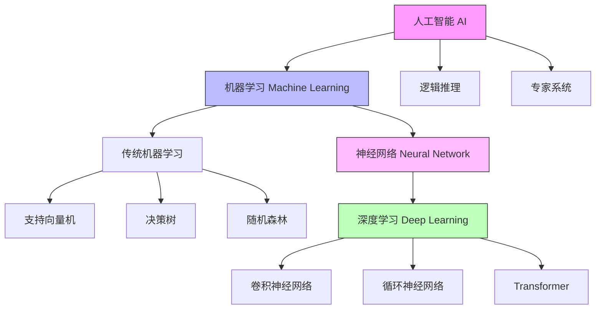

+++
title = 'AI教程'
subtitle = ""
date = 2024-05-24T10:16:53+08:00
draft = false
toc = true
tags = []
+++

[toc]

## 名词关系网



## 数学基础

### 微积分

#### 导数的定义

导数用于描述函数在**某一点**的变化率或斜率。对于一个单变量函数 \( f(x) \)，导数表示为：
\[
f'(x) = \lim_{\Delta x \to 0} \frac{f(x + \Delta x) - f(x)}{\Delta x}
\]
这个表达式表示当 \( \Delta x \) 无限趋近于零时，函数值的变化率，即函数的瞬时变化速率。

导数可以理解为函数在某一点的切线斜率，用来表示函数的变化趋势。导数的值可以是正的、负的或零，分别对应函数的上升、下降或平稳状态。

#### 导数的常见规则

- **常数的导数**：\( f(x) = c \)，其中 \( c \) 是常数，则 \( f'(x) = 0 \)。
- **幂函数的导数**：\( f(x) = x^n \)，则 \( f'(x) = nx^{n-1} \)。
- **和的导数**：\( f(x) = g(x) + h(x) \)，则 \( f'(x) = g'(x) + h'(x) \)。
- **乘积的导数**：\( f(x) = g(x) \cdot h(x) \)，则 \( f'(x) = g'(x) \cdot h(x) + g(x) \cdot h'(x) \)。
- **链式法则**：如果 \( f(x) = g(h(x)) \)，则 \( f'(x) = g'(h(x)) \cdot h'(x) \)。

#### 偏导数的定义

偏导数表示一个多元函数对**某个自变量**的变化率，其余自变量保持不变。假设有一个多元函数 \( f(x, y) \)，则偏导数表示为：
\[
\frac{\partial f}{\partial x} \quad \text{和} \quad \frac{\partial f}{\partial y}
\]
分别表示在 \( y \) 固定时，\( f \) 随 \( x \) 的变化率，以及在 \( x \) 固定时，\( f \) 随 \( y \) 的变化率。

##### 偏导数的例子

假设有一个函数：
\[
f(x, y) = x^2 + 3xy + y^2
\]

- 计算 \( f \) 对 \( x \) 的偏导数（保持 \( y \) 不变）：
  \[
  \frac{\partial f}{\partial x} = 2x + 3y
  \]

- 计算 \( f \) 对 \( y \) 的偏导数（保持 \( x \) 不变）：
  \[
  \frac{\partial f}{\partial y} = 3x + 2y
  \]

在这些计算中，我们分别只对 \( x \) 或 \( y \) 进行求导，将另一个变量看作常数。

#### 梯度的定义

梯度是由**所有偏导数组成的一个向量**，用来表示多元函数在某一点处的变化方向和速率。对于一个多元函数 \( f(x, y) \)，梯度用符号 \( \nabla f \) 表示，定义为：
\[
\nabla f = \left( \frac{\partial f}{\partial x}, \frac{\partial f}{\partial y} \right)
\]
梯度向量的方向是函数值增加最快的方向，梯度的大小（模）表示函数沿着该方向的变化速率。

#### 小结

| 名词          | 概念                                                                                             |
| ------------- | ------------------------------------------------------------------------------------------------ |
| 导数          | 描述单变量函数（即一个自变量的函数）的变化率                                                     |
| 偏导数        | 描述多变量函数（即多个自变量的函数）的变化率, 函数在某一个方向上的变化率                         |
| 梯度 Gradient | 偏导数的集合, 梯度向量的方向是函数值增加最快的方向，梯度的大小（模）表示函数沿着该方向的变化速率 |

它们都是表示函数值对自变量的敏感程度


### 线性代数

#### 数据类型

TODO:

| 名词 | 应用场景 | 纬度 |
| ---- | -------- | ---- |
| 标量 | 点       |      |
| 向量 | 线       | 1    |
| 矩阵 | 面       | 2    |
| 张量 | 体       | 多   |

#### 基本运算

#### 元素乘法

```python
# 独立事件的概率相乘
p1 = np.array([0.3, 0.5, 0.8])  # 事件A的概率
p2 = np.array([0.4, 0.6, 0.7])  # 事件B的概率
joint_p = p1 * p2  # 联合概率
```


#### 矩阵乘法相关


##### 点积 Dot Product

点积的计算例子:

例如，给定向量 \( \mathbf{a} = [1, 2, 3] \) 和 \( \mathbf{b} = [4, 5, 6] \)，它们的点积为：
\[
1 \times 4 + 2 \times 5 + 3 \times 6 = 4 + 10 + 18 = 32
\]


```python
sum(X*Y)
X @ Y
```

##### 矩阵乘法

如果 A, B是两个矩阵, **A行和B列**之间进行**点积**操作, 得到矩阵乘法的结果

这个规则保证了所有元素的运算顺序与维度一致，使得结果矩阵代表了两个线性变换的组合效果。

**点积**其实就是**一纬的矩阵乘法**

线性变换和向量空间的运算

```python
import numpy as np

# 创建两个矩阵
A = np.array([[1, 2, 3],
              [4, 5, 6]])

B = np.array([[7, 8],
              [9, 10],
              [11, 12]])

# 使用矩阵乘法运算符
C = A @ B

# 结果是
# [[58, 64],
#  [139,154]]

"""
计算原理:
C[0,0] = 1×7 + 2×9 + 3×11 = 58
C[0,1] = 1×8 + 2×10 + 3×12 = 64
C[1,0] = 4×7 + 5×9 + 6×11 = 139
C[1,1] = 4×8 + 5×10 + 6×12 = 154
"""

```
$$
\text{out}_{i} = \frac{1}{\sqrt{\text{input}_{i}}}
$$

$$
\text{out}_{i} = \sqrt{\text{input}_{i}}
$$

#### 小结

| 名词     | 应用场景                     |
| -------- | ---------------------------- |
| 元素乘法 | 特征遮掩, 图像处理           |
| 矩阵乘法 | 图像处理, 线性变换, 特征转换 |

#### norm

范数一种度量，通常用来衡量向量或矩阵的“大小”或“长度”
分为 l1, l2, 最大norm

l1: 定义为向量各元素绝对值的和：||x||₁ = |x₁| + |x₂| + ... + |xₙ|
诞生了MAE

l2: 定义为向量各元素平方和的平方根：||x||₂ = √(x₁² + x₂² + ... + xₙ²)
  诞生了MSE , 最常用


MSE被称为L2损失——它本质上是基于L2范数的损失函数，只是为了计算和优化的便利性，省略了平方根操作并进行了平均


## pytorch入门

**数据, 模型, 损失函数, 优化器**

### 数据

#### Tensor

张量

神经网络的基础单元

| tensor          | 概念                       | 特点                                                  |
| --------------- | -------------------------- | ----------------------------------------------------- |
| leaf tensor     | 直接创建的张量             | grad_fn 为 None, 在反向传播后会保留 .grad 属性        |
| non-leaf tensor | 通过操作其他张量生成的张量 | grad_fn 为 操作函数 , 在反向传播时不会保留 .grad 属性 |

forward: leaf -> root
backward: root -> leaf

```python
# 增删改查

# 升降纬度
torch.squeeze()
torch.unsqueeze()
torch.permute() # 指定纬度顺序
```

#### Dataset 和 DataLoader

DataLoader 提供灵活加载Dataset的设置

数据划分

| 数据集                   | 作用                                                         | 占比    |
| ------------------------ | ------------------------------------------------------------ | ------- |
| 训练集（Training Set）   | 模型通过训练集学习特征和模式                                 | 70%-80% |
| 验证集（Validation Set） | 用于调整超参数、选择模型结构和监控模型在未见过的数据上的表现 | 10%-15% |
| 测试集（Test Set）       | 用于评估模型的最终性能                                       | 10%-15% |


#### 批量处理

神经网络的损失函数通常是一个非凸函数,也就是说它可能存在多个局部最优解

批量处理的随机性有助于模型跳出局部最小值，找到全局最小值。
减少内存占用

鞍点

噪声较大

### 模型前置知识

#### 神经网络基础

神经网络是一种模仿人类大脑结构的机器学习模型.

通过模拟人脑的学习方式，具有强大的数据拟合和特征学习能力，是深度学习的重要支柱

##### 基本概念

| 概念       | 类比              | 功能                                         | 数学表示                                      | 常见类型/示例 |
| ---------- | ----------------- | -------------------------------------------- | --------------------------------------------- | ------------- |
| **神经元** | 生物神经元        | 信息处理的基本单元                           | output = activation(∑(weight * input) + bias) | -             |
|            | **权重** 连接强度 | 决定输入对输出的影响                         | w                                             | -             |
|            | **偏置** 阈值     | 调整神经元输出                               | b                                             | -             |
|            | **激活函数** 开关 | 引入非线性                                   | **Sigmoid, Tanh, ReLU, LeakyReLU, ELU**等     | -             |
| **层**     | 楼层              | 信息处理的层次                               | 输入层、隐藏层、输出层                        | -             |
|            | 输入层            | 接收外界数据，作为神经网络的输入             |                                               |               |
|            | **隐藏层**        | 对输入数据进行复杂的**非线性变换，提取特征** |                                               |               |
|            | 输出层            | 输出神经网络的预测结果                       |                                               |               |

###### 网络层 layer

对于 隐藏层的数量 和 各个隐藏层的节点数: 常见策略是逐层减少节点数

通常，我们选择2的若干次幂作为层的宽度。
因为内存在硬件中的分配和寻址方式，这么做往往可以在计算上更高效。


| 层         | 名称           | 作用                                                                         | 概念                                                |
| ---------- | -------------- | ---------------------------------------------------------------------------- | --------------------------------------------------- |
| 全连接层   | nn.Linear      | 每个神经元与上一层的所有神经元相连。它用于提取特征和进行非线性变换。         | 它的每一个输入都通过矩阵-向量乘法得到它的每个输出。 |
| 激活层     | nn.ReLU        | 引入非线性变换                                                               |                                                     |
| 批归一化层 | nn.BatchNorm2d | 对每个批次的输入数据进行标准化，减小不同特征的偏差，帮助加速训练并稳定网络。 |                                                     |
| dropout层  | nn.Dropout     | 随机将一部分神经元的输出设为0                                                |                                                     |

| 层         | 名称           | 作用                                                                                                 |
| ---------- | -------------- | ---------------------------------------------------------------------------------------------------- |
| 卷基层     | nn.Conv2d      | 通过卷积核对输入数据进行卷积操作，提取局部特征                                                       |
| 池化层     | nn.MaxPool2d   | 用于下采样操作，可以减少特征图的尺寸，减少计算量，并防止过拟合。最常见的池化操作是最大池化和平均池化 |
| 循环层     | nn.RNN         | 保留历史信息                                                                                         |
| 自注意力层 | nn.Transformer | 捕捉输入数据中长距离依赖关系                                                                         |


### 模型 model

一个模型由1个或多个layer 组成.

#### sequential

```python
from torch import nn

model = nn.Sequential(
    nn.Conv2d(1,20,5),
    nn.ReLU(),
    nn.Conv2d(20,64,5),
    nn.ReLU()
)
```

#### 自定义复杂逻辑

```python
from torch import nn

class FCNet(nn.Module):
    def __init__(self, input_size, hidden_size, num_classes):
        super(FCNet, self).__init__()
        self.fc1 = nn.Linear(input_size, hidden_size)
        self.relu = nn.ReLU()
        self.fc2 = nn.Linear(hidden_size, num_classes)

    def forward(self, x):
        out = self.fc1(x)
        out = self.relu(out)
        out = self.fc2(out)
        return out
```


#### 模型参数

```python
# 查看参数
model.state_dict()

for name, param in model.named_parameters():
    print(name, param.size())

```

模型参数初始化

```python
nn.init.zeros_
nn.init.constant_
nn.init.normal_
```


### 损失函数

作用: 计算模型准确度的工具, (预测结果与真实值之间的差异)

不同任务类型的需求：

- 分类问题通常使用交叉熵损失Cross-Entropy Loss）:

  softmax: (0,1), 和为1
  $\text{Softmax}(x_{i}) = \frac{\exp(x_i)}{\sum_j \exp(x_j)}$

- 回归问题常用 均方误差（Mean Squared Error, MSE, L2损失）或 平均绝对误差（Mean Absolute Error, MAE, L1损失）

- 推荐系统可能使用排序损失等


### 优化器

autograd 和 Computation Graph

Computation Graph是一种有向无环图（DAG），用于表示张量之间的数学运算关系. 记录了张量之间的操作和依赖关系，支持自动求导功能

多次计算梯度时, 需要设置 retain_graph=True


更新模型参数

### 常见操作步骤

#### 模型训练流程

| 概念         | 类比         | 功能                                                                     | 数学表示                                        | 常见类型/示例 |
| ------------ | ------------ | ------------------------------------------------------------------------ | ----------------------------------------------- | ------------- |
| **前向传播** | 信息流动     | 从输入到输出的计算过程                                                   | -                                               | -             |
| **损失函数** | 误差衡量     | 衡量预测值与真实值之间的差异, 训练的目标是**最小化损失函数**             | 均方误差(MSE), 交叉熵损失(Cross-Entropy Loss)等 | -             |
| **反向传播** | 计算梯度     | 应用链式法则进行求导的过程, 最终目的是计算出**损失函数对每层参数的梯度** | -                                               | -             |
| **优化器**   | 参数更新工具 | 根据梯度**更新参数**                                                     | **SGD, Adam, RMSprop, Adagrad**等               | -             |


前向传播,得出结果 -> 对比答案, 计算损失 -> 反向传播, 获得梯度 -> 使用optimizer, 更新模型参数 

```python
model = Net()
optimizer = optim.Adam(model.parameters())

for epoch in range(epochs):
    # 1. 前向传播
    output = model(data)
    loss = criterion(output, target)
    
    # 2. 清零梯度
    optimizer.zero_grad()
    
    # 3. 反向传播: 计算梯度
    loss.backward()  
    # output.backward(torch.ones_like(output))
    
    # 4. 优化器: 更新参数
    optimizer.step()
```

##### gpu训练

```python
net = Net()
if torch.cuda.is_available():
    net = net.cuda()

loss_fn = nn.CrossEntropyLoss()
if torch.cuda.is_available():
    loss_fn = loss_fn.cuda()


if torch.cuda.is_available():
    inputs = inputs.cuda()
    labels = labels.cuda()


torch.cuda.device_count()

```

#### 模型保存加载

```python
import torch
import torchvision

# method1
vgg16 = torchvision.models.vgg16(weights=True)
torch.save(vgg16, '/app/output/vgg16.pth')

model = torch.load('/app/output/vgg16.pth', weights_only=False)
print(model)

# method2
torch.save(net.state_dict(), 'mlp.params')

clone = MLP()
clone.load_state_dict(torch.load('mlp.params'))
```


## 模型细化


### 常见领域

- NLP
- CV
- TTS
- ASR

### 常见的神经网络架构

| 神经网络架构                        | 定义与特点                                                                     | 应用场景                               |
| ----------------------------------- | ------------------------------------------------------------------------------ | -------------------------------------- |
| CNN（Convolutional Neural Network） | 适合处理图像数据，通过卷积层提取局部特征，池化层降采样，全连接层用于分类或回归 | 图像分类（如手写数字识别）             |
|                                     |                                                                                | 物体检测（如 YOLO）                    |
|                                     |                                                                                | 图像分割（如 U-Net）                   |
| RNN（Recurrent Neural Network）     | 适合处理序列数据，能记住历史信息，处理时间序列；梯度消失/爆炸问题需注意        | - 自然语言处理（如机器翻译、文本生成） |
|                                     | LSTM、GRU 作为改进版本，分别引入门机制，解决梯度问题                           | - 时间序列预测（如股票预测）           |
|                                     |                                                                                | - 手写体识别                           |
| Transformer                         | 基于注意力机制的架构，可并行处理序列中的各个位置                               | - 自然语言处理（如 BERT、GPT）         |
|                                     |                                                                                | - 图像处理（如 Vision Transformer）    |
| GAN（生成对抗网络）                 | 由生成器和判别器对抗组成，用于生成逼真的数据                                   | - 图像生成（如高分辨率照片生成）       |
|                                     |                                                                                | - 风格迁移（图像风格转换）             |
|                                     |                                                                                | - 数据增强（生成合成数据）             |
| Autoencoder（自编码器）             | 无监督学习算法，用于数据降维和特征提取，包括编码器和解码器                     | - 数据降维（高维数据可视化）           |
|                                     |                                                                                | - 图像去噪（恢复清晰图像）             |
|                                     |                                                                                | - 异常检测（检测异常样本）             |
| MLP（多层感知机）                   | 最基本的前馈神经网络，由**多个全连接层**组成，适合处理结构化数据               | - 分类和回归任务                       |
|                                     |                                                                                | - 数据特征学习（深度学习基础结构）     |


### CNN

卷积层
池化层

### RNN


### 注意力机制


| 注意力类型                                   | 主要特点                                                                                             | 应用场景                                        |
| -------------------------------------------- | ---------------------------------------------------------------------------------------------------- | ----------------------------------------------- |
| **加性注意力（Bahdanau）**                       | 使用可学习的权重矩阵和非线性激活函数（如 tanh）计算注意力得分，适用于**查询和键维度不同**的情况。    | 早期的神经机器翻译模型，处理变长输入序列。      |
| 乘性注意力（Luong）                          | 通过点积计算注意力得分，计算效率高，适用于**查询和键维度相同**的情况。                               | 神经机器翻译、文本摘要等任务。                  |
| **缩放点积注意力(scaled dot-product attention)** | 在点积注意力的基础上引入缩放因子，防止梯度消失，提升训练稳定性。  适用于**查询和键维度相同**的情况。 | Transformer 模型中的核心注意力机制。            |
| **自注意力（Self-Attention）**                   | **查询、键、值来自同一序列**，捕捉序列中元素之间的全局依赖关系。                                         | Transformer 编码器和解码器，BERT、GPT 等模型。  |
| **多头注意力（Multi-Head）**                     | 将注意力机制分成多个头，捕捉不同子空间的信息，提高模型的表达能力。                                   | Transformer 架构中的关键组成部分。              |
| 交叉注意力（Cross-Attention）                | 查询来自一个序列，键和值来自另一个序列，实现信息的交互融合。                                         | 编码器-解码器结构，如图像字幕生成、跨模态任务。 |
| 掩码注意力（Masked Attention）               | 对未来的信息进行屏蔽，确保模型只能访问当前或过去的信息。                                             | 自回归模型中的解码器，如 GPT 系列。             |
| 通道注意力（Channel Attention）              | 关注特征图的通道维度，增强重要通道的响应。                                                           | 图像分类、目标检测等计算机视觉任务。            |
| 空间注意力（Spatial Attention）              | 关注特征图的空间维度，突出关键区域的信息。                                                           | 图像分割、目标定位等视觉任务。                  |


在注意力机制中，计算查询（Query, Q）与所有键（Key, K）的点积之所以能得到相似度得分，是因为点积在数学上衡量了两个向量之间的相似性。具体而言，点积值越大，表示两个向量的方向越接近，即它们在向量空间中的相似度越高。

用户输入为 Q, 查询相似的K对应的V. 
计算注意力得分 


### transformer

利用自注意力机制捕捉文本中的长距离依赖关系


注意力机制的核心思想是：在处理一个元素时，模型可以动态地关注输入序列中的其他部分，从而聚焦于与当前任务最相关的信息。

- 查询（Query）：当前处理的元素。
- 键（Key）和值（Value）：输入序列中的所有元素。

通过**点积（Dot Product）**计算**查询与键**, 来评估序列中不同位置的相关性或重要性，得到注意力权重，然后用这些权重对值进行加权求和，生成当前元素的表示


自注意力机制是一种特殊的注意力机制，其中查询、键和值都来自同一个序列。
作用：捕捉序列内部元素之间的依赖关系。

在Transformer模型中，多头注意力机制是其核心组件

Normalization: 对数据进行重新中心化和重新缩放的调整


| 模块名称                                         | 所在位置       | 主要功能描述                                                                                     |
| ------------------------------------------------ | -------------- | ------------------------------------------------------------------------------------------------ |
| Self-Attention（自注意力）                       | 编码器和解码器 | 使模型在处理每个词时，能够关注序列中所有其他位置的词，以捕捉词与词之间的依赖关系。               |
| Encoder-Decoder Attention（编码器-解码器注意力） | 解码器         | 在解码过程中，允许模型根据编码器的输出，动态地关注输入序列的不同部分，从而有效地利用上下文信息。 |
| Add & Normalize（残差连接与层归一化）            | 所有子层之后   | 通过残差连接缓解梯度消失问题，并通过层归一化稳定训练过程，加速模型收敛。                         |
| Feed Forward（前馈神经网络）                     | 编码器和解码器 | 为每个位置的表示引入非线性变换，增强模型的表达能力。                                             |


### embedding

embedding 是将文本、图像等非数值数据转化为**数值向量**的一种技术。
Word2Vec、GloVe 和 BERT 等模型通过神经网络或统计方法将词语映射为 ****高维实数向量, 也就是一个数组**（例如 100 维、300 维）。这些向量的本质是 **语义的数学表示**

embedding的特点:

- 语义表达能力强:

Embedding 可以捕捉词汇和句子的语义信息。
相似的词语和句子在向量空间中也会相近。**余弦相似性**


- 模型输入优化:

大多数机器学习模型需要数值型输入,Embedding 可以将文本转换为合适的输入格式。


- 计算效率提升:

Embedding 可以大幅压缩文本信息,降低计算复杂度。
基于向量运算的模型计算效率更高。

### 多模态


| 名词   | 概念                                                                     |
| ------ | ------------------------------------------------------------------------ |
| 分词器（Tokenizer）|  将Prompt拆分为离散的Token |
| embedding |     将Token转换为高维向量                 |
| 编码器  |       提取深层语义特征               |
| 解码器  |       逐步预测下一个Token（如使用 Top-k采样 或 束搜索 或 贪心搜索）               |

贪心搜索：选择概率最高的Token（速度快但可能陷入局部最优）；
束搜索：保留多个候选序列（平衡质量与速度）；
采样方法（如Top-k、核采样）：引入随机性提升多样性


模型优化:
- 模型压缩：
  - 参数剪枝：通过去除神经网络中不重要的连接或神经元，减少模型的参数量，从而在不影响模型性能的情况下，提高模型的计算效率和响应速度。
  - 量化：将模型中的高精度参数（如32位浮点数）转换为低精度参数（如8位或16位整数），降低模型的存储需求和计算复杂度，加速模型的推理过程。
- 知识蒸馏：将大型复杂模型（教师模型）的知识迁移到小型简单模型（学生模型）中。学生模型在学习过程中模仿教师模型的输出或中间表示，从而在保持较高性能的同时，具有更快的推理速度，适合在资源受限的环境下快速响应用户请求。

Embedding 是多模态的基石

映射表的大小取决于词汇表的大小和 embedding 向量的维度


通过V × D 的矩阵，用来把 token id → 高维向量


- 每种模态（图像/音频/视频/文本）都需要专门的“编码器”把原始信号映射到一个或一系列 d 维的向量 Token。
- 这些向量不是“随便一组随机数”，而是通过预训练（自监督、对比、分类、生成等）得到的，能够保留该模态在语义/时序/空间上的关键信息。

对齐与融合是多模态理解的核心

- 对齐（Alignment）：让不同模态的 Embedding 落到同一个可比的“共享空间”里，常用 Contrastive Loss 让相同语义的多模态对更相似。
- 融合（Fusion）：文本的 embedding 与图像的 embedding 拼接, 通过 Cross-Attention、拼接、联合 Transformer 等方式，让信息互相交融，捕捉更丰富的多模态关联。

图像/音频/视频三者差异与融合思路

- 图像：静态二维信息，常用 CNN/ViT → Patch/全局 Vector；
- 音频：时序一维波形 → Mel-Spectrogram → 声学 Encoder → 时序 Token 序列或全局 Vector；
- 视频：既有时序又有空间，或者“逐帧 + 时序建模”，或直接用 3D Conv/Tubelet → 获得时空特征。

融合策略可以根据任务需求决定：是“图像+文本”对齐做检索，还是“视频+音频+文本”做问答、多模态对话，都用同一个思路：先各自嵌入 → 再对齐 / 融合 → 最终下游 Head 推理或生成。


### 时间

在深度学习中，Temporal Resolution（时间分辨率） 指的是模型在时间维度上处理数据的精细程度，即模型在多大程度上能够捕捉和解析时间序列数据中的细节变化。​这在处理视频、音频、传感器数据等时间相关的数据时尤为重要。


### 模型性能优化

问答 -> 用户反馈
SFT

包 peft

合并模型

- 参数调优
- 性能评估

### 模型压缩


### 模型量化

将模型的参数（如权重和激活值）从高精度转换为低精度的过程

llama.cpp
转gguf

### 模型蒸馏

大模型指导小模型

优化效果很明显:

在NLP领域，知识蒸馏可以用于提升小模型的推理性能，同时减少模型的参数量，提高模型的运行速度。例如，DistilBERT与BERT相比减少了40%的参数，同时保留了BERT 97%的性能，但提高了60%的速度


### 思维链...

预训练: 通常是在大规模无标注数据上通过自监督学习得到的，它们具有对一般自然语言结构的良好理解能力

微调: 针对具体下游任务（如文本分类、问答系统、命名实体识别等），使用相对较小规模但**有标签的目标数据集**对该模型的**部分或全部参数**进行进一步的训练。


在 prompt 中添加“Let’s think step by step”或“请一步步推理”等指令，无需示例也能触发内生的分步生成。

大模型一旦超越某规模阈值，链式推理成功率呈指数级跃升


DeepSeek通过**思维链技术**将复杂问题**拆解**为一系列连贯的中间推理步骤

(1) 强化学习的作用
- 目标：通过GRPO算法，模型学习生成更详细、更合理的推理步骤（长CoT）以提高奖励（如答案正确性）。
- 机制：训练时生成多个候选答案，奖励信号不仅评估最终答案正误，还隐式鼓励逻辑连贯的推理路径（如通过格式奖励）。


奖励模型（Reward Model）: 使用奖励模型替代奖励函数,模拟人类偏好, 用来优化别的模型

对于复杂的数学问题、逻辑推理或者需要多步操作的任务而言，链式思考提示尤为有效

### 记忆功能

...

### 模型微调

微调是 迁移学习（Transfer Learning）的一种实践形式

LoRA: 旨在在不修改预训练模型主体参数的情况下，利用低秩矩阵对模型进行适应性调整，从而大幅减少训练所需的参数量和计算资源

低秩矩阵

指令微调:
数据集通常包含了丰富的指令样本以及对应的期望输出.
通过训练，模型得以学习不同指令与适当行动之间的**映射关系**，即使未曾见过完全相同的指令也能通过泛化能力来处理类似的新指令


### MOE

路由器（Router） + n个专家

可扩展性：添加更多专家可扩展模型能力，无需重新训练整个网络。
灵活性：动态适配不同任务需求（如NLP、CV、语音识别）。


中电九天的LoRA-MoE专利通过任务嵌入矩阵和线性转换层生成专家权重，需联合微调门控网络和专家参数。


## 常见问题

### 欠拟合: 训练集误差大. 

处理方法:

- 使用复杂的模型
- 特征工程
- 修改optim

### 过拟合: 训练集误差小, 测试集误差大. 

处理方法:

- 增加数据
  - 数据增强
- 降低模型复杂度
  - dropout: 随机丢弃神经网络中的神经元，防止过拟合
  - 对损失函数, 正则化
- early stopping?


Dropout: `nn.Dropout` 通过随机丢弃神经元来强制模型学习鲁棒特征，主要适用于深度神经网络。

正则化:（尤其是L1和L2）通过在损失函数中添加惩罚项来限制模型复杂度，有效地防止模型过拟合，提高模型的泛化能力, 适用于广泛的机器学习模型。


梯度消失：参数更新过小，在每次更新时几乎不会移动，导致模型无法学习。

使用ReLU等激活函数

梯度爆炸：参数更新过大，破坏了模型的稳定收敛；

梯度裁剪

### 避免陷入局部极小值

- 参数初始化
- 更换好的优化器
  - 动量梯度下降


为了打破对称性，实践中常采用随机初始化的方法为每个神经元分配不同的初始权重。例如，Xavier/Glorot初始化、He初始化等方法都是基于不同的理论基础来随机初始化权重，以确保每个神经元从训练开始就具有一定的独特性，促进更有效的学习

## 其他名词

| 名词   | 概念                                                                     |
| ------ | ------------------------------------------------------------------------ |
| 鲁棒性 | 指的是模型对数据中的噪声、异常值或分布变化的抵抗能力                     |
| 对称性 | 指的是神经网络中不同神经元之间由于参数初始化相同而导致的相似或相同的行为 |
| 最大路径长度（Maximum Path Length）| 指的是在网络中，从序列的一个位置到另一个位置传递信息所需经过的最大步骤数。这一指标反映了**模型捕获长距离依赖关系的效率** |
| 词元（Token）| 模型可处理文本的最小单元, 包括 单词, 子词(词根root),字符等 |
| 词元化(Tokenization) | 把文本分解成 单词,字符的过程 |
| 正则化（Regularization）| 防止过拟合，提高模型泛化能力; 调整**损失函数**来控制**模型参数** |
| 激活值（Activation Value）| 是指每个神经元在接收到输入信号后，经过加权求和和激活函数处理后产生的输出值 |
| 归一化（Normalization）| 加快训练速度; 调整 输入数据或神经网络的激活值的**分布** |
| 原始输出（logits）| 未经过 Sigmoid 激活的输出 |
| predictions  | 输出经过 Sigmoid 激活函数 |


| 方法               | 归一化维度                     | 对批量大小敏感 | 适用场景                         | 备注说明                                                                 |
|--------------------|-------------------------------|----------------|----------------------------------|--------------------------------------------------------------------------|
| Batch Normalization (BN) | 对每个特征在整个批次上归一化       | 是             | 卷积神经网络（CNN）等大批量训练     | 加速训练，减小内部协变量偏移，但在小批量或RNN中效果不佳。 |
| Layer Normalization (LN) | 对每个样本的所有特征归一化         | 否             | 循环神经网络（RNN）、Transformer等 | 对序列建模有效，适用于小批量训练。 |
| Instance Normalization (IN) | 对每个样本的每个通道归一化       | 否             | 图像风格迁移、图像生成等           | 强调图像的风格特征，常用于生成任务。 |
| Group Normalization (GN) | 对每个样本的通道分组归一化         | 否             | 小批量训练的卷积神经网络（CNN）    | 在小批量训练中表现稳定，兼具BN和LN的优点。 |
| Weight Normalization (WN) | 对神经网络的权重向量归一化         | 否             | 各类神经网络                     | 加速训练，减少对初始化的敏感性。 |
| Spectral Normalization (SN) | 对权重矩阵的谱范数归一化         | 否             | 生成对抗网络（GAN）等             | 控制Lipschitz常数，提升训练稳定性。 |


## 番外

### 用摄像头监控员工

这种做法可能会带来一些严重的问题:

- 侵犯隐私：持续摄像监控会严重侵犯员工的隐私权。
- 破坏信任：这表明公司不信任员工，会极大损害员工与管理层之间的关系。
- 增加压力：被持续监视会给员工带来巨大的精神压力，可能导致工作效率下降和健康问题。
- 法律风险：在许多地方,这种做法可能违反劳动法和隐私法。
- 误判问题：简单的视频监控很难准确判断一个人是否在工作。思考、讨论等看似"不工作"的行为可能是工作过程的重要组成部分。
- 士气低落：这种管理方式会严重打击员工积极性,可能导致优秀员工离职。

