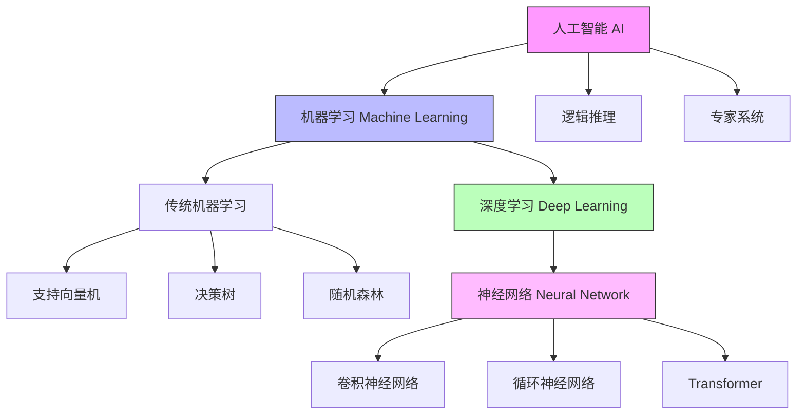

+++
title = 'AI教程'
subtitle = ""
date = 2024-05-24T10:16:53+08:00
draft = false
toc = true
tags = []
+++

[toc]

## 名词关系网



## 数学基础

### 微积分

#### 导数的定义

导数用于描述函数在**某一点**的变化率或斜率。对于一个单变量函数 \( f(x) \)，导数表示为：
\[
f'(x) = \lim_{\Delta x \to 0} \frac{f(x + \Delta x) - f(x)}{\Delta x}
\]
这个表达式表示当 \( \Delta x \) 无限趋近于零时，函数值的变化率，即函数的瞬时变化速率。

导数可以理解为函数在某一点的切线斜率，用来表示函数的变化趋势。导数的值可以是正的、负的或零，分别对应函数的上升、下降或平稳状态。

#### 导数的常见规则

- **常数的导数**：\( f(x) = c \)，其中 \( c \) 是常数，则 \( f'(x) = 0 \)。
- **幂函数的导数**：\( f(x) = x^n \)，则 \( f'(x) = nx^{n-1} \)。
- **和的导数**：\( f(x) = g(x) + h(x) \)，则 \( f'(x) = g'(x) + h'(x) \)。
- **乘积的导数**：\( f(x) = g(x) \cdot h(x) \)，则 \( f'(x) = g'(x) \cdot h(x) + g(x) \cdot h'(x) \)。
- **链式法则**：如果 \( f(x) = g(h(x)) \)，则 \( f'(x) = g'(h(x)) \cdot h'(x) \)。

#### 偏导数的定义

偏导数表示一个多元函数对**某个自变量**的变化率，其余自变量保持不变。假设有一个多元函数 \( f(x, y) \)，则偏导数表示为：
\[
\frac{\partial f}{\partial x} \quad \text{和} \quad \frac{\partial f}{\partial y}
\]
分别表示在 \( y \) 固定时，\( f \) 随 \( x \) 的变化率，以及在 \( x \) 固定时，\( f \) 随 \( y \) 的变化率。

##### 偏导数的例子

假设有一个函数：
\[
f(x, y) = x^2 + 3xy + y^2
\]

- 计算 \( f \) 对 \( x \) 的偏导数（保持 \( y \) 不变）：
  \[
  \frac{\partial f}{\partial x} = 2x + 3y
  \]

- 计算 \( f \) 对 \( y \) 的偏导数（保持 \( x \) 不变）：
  \[
  \frac{\partial f}{\partial y} = 3x + 2y
  \]

在这些计算中，我们分别只对 \( x \) 或 \( y \) 进行求导，将另一个变量看作常数。

#### 梯度的定义

梯度是由**所有偏导数组成的一个向量**，用来表示多元函数在某一点处的变化方向和速率。对于一个多元函数 \( f(x, y) \)，梯度用符号 \( \nabla f \) 表示，定义为：
\[
\nabla f = \left( \frac{\partial f}{\partial x}, \frac{\partial f}{\partial y} \right)
\]
梯度向量的方向是函数值增加最快的方向，梯度的大小（模）表示函数沿着该方向的变化速率。

#### 小结

| 名词 | 概念 |
| --- | --- |
| 导数 | 描述单变量函数（即一个自变量的函数）的变化率 |
| 偏导数 | 描述多变量函数（即多个自变量的函数）的变化率, 函数在某一个方向上的变化率 |
| 梯度 Gradient | 偏导数的集合, 梯度向量的方向是函数值增加最快的方向，梯度的大小（模）表示函数沿着该方向的变化速率 |

它们都是表示函数值对自变量的敏感程度


### 线性代数

#### 数据类型

TODO:

| 名词 | 应用场景 | 纬度 |
| --- | --- | --- |
| 标量 | 点 |  |
| 向量 | 线 | 1 |
| 矩阵 | 面 | 2 |
| 张量 | 体 | 多 |

#### 基本运算

#### 点积 Dot Product

点积的计算例子:

例如，给定向量 \( \mathbf{a} = [1, 2, 3] \) 和 \( \mathbf{b} = [4, 5, 6] \)，它们的点积为：
\[
1 \times 4 + 2 \times 5 + 3 \times 6 = 4 + 10 + 18 = 32
\]

```python
sum(X*Y)
```

#### 元素乘法

```python
# 独立事件的概率相乘
p1 = np.array([0.3, 0.5, 0.8])  # 事件A的概率
p2 = np.array([0.4, 0.6, 0.7])  # 事件B的概率
joint_p = p1 * p2  # 联合概率
```

#### 矩阵乘法

如果 A, B是两个矩阵, A行和B列之间进行点积操作, 得到矩阵乘法的结果

这个规则保证了所有元素的运算顺序与维度一致，使得结果矩阵代表了两个线性变换的组合效果。

线性变换和向量空间的运算

```python
import numpy as np

# 创建两个矩阵
A = np.array([[1, 2, 3],
              [4, 5, 6]])

B = np.array([[7, 8],
              [9, 10],
              [11, 12]])

# 使用矩阵乘法运算符
C = A @ B

# 结果是
# [[58, 64],
#  [139,154]]

"""
计算原理:
C[0,0] = 1×7 + 2×9 + 3×11 = 58
C[0,1] = 1×8 + 2×10 + 3×12 = 64
C[1,0] = 4×7 + 5×9 + 6×11 = 139
C[1,1] = 4×8 + 5×10 + 6×12 = 154
"""

```
$$
\text{out}_{i} = \frac{1}{\sqrt{\text{input}_{i}}}
$$

$$
\text{out}_{i} = \sqrt{\text{input}_{i}}
$$

#### 小结

| 名词 | 应用场景 |
| --- | --- |
| 元素乘法 | 特征遮掩, 图像处理 |
| 矩阵乘法 | 图像处理, 线性变换, 特征转换 |

#### norm

范数一种度量，通常用来衡量向量或矩阵的“大小”或“长度”
分为 l1, l2, 最大norm

l1: 定义为向量各元素绝对值的和：||x||₁ = |x₁| + |x₂| + ... + |xₙ|
诞生了MAE

l2: 定义为向量各元素平方和的平方根：||x||₂ = √(x₁² + x₂² + ... + xₙ²)
  诞生了MSE , 最常用


MSE被称为L2损失——它本质上是基于L2范数的损失函数，只是为了计算和优化的便利性，省略了平方根操作并进行了平均


## pytorch梳理

### 数据

#### Tensor

张量

神经网络的基础单元

| tensor | 概念 | 特点 |
|---|---|---|
| leaf tensor | 直接创建的张量 | 在反向传播时会保留 .grad 属性 |
| non-leaf tensor | 通过操作其他张量生成的张量 | 在反向传播时不会保留 .grad 属性 |

#### Dataset 和 DataLoader

DataLoader 提供灵活加载Dataset的设置

数据划分

| 数据集 | 作用 | 占比 |
|---|---|---|
| 训练集（Training Set） | 模型通过训练集学习特征和模式 | 70%-80% |
| 验证集（Validation Set） | 用于调整超参数、选择模型结构和监控模型在未见过的数据上的表现 | 10%-15% |
| 测试集（Test Set） | 用于评估模型的最终性能 | 10%-15% |


#### 批量处理

神经网络的损失函数通常是一个非凸函数,也就是说它可能存在多个局部最优解

批量处理的随机性有助于模型跳出局部最小值，找到全局最小值。
减少内存占用

鞍点

噪声较大

### 模型

#### 神经网络基础

神经网络是一种模仿人类大脑结构的机器学习模型.

通过模拟人脑的学习方式，具有强大的数据拟合和特征学习能力，是深度学习的重要支柱

##### 基本概念

| 概念 | 类比 | 功能 | 数学表示 | 常见类型/示例 |
|---|---|---|---|---|
| **神经元** | 生物神经元 | 信息处理的基本单元 | output = activation(∑(weight * input) + bias) | - |
|  | **权重** 连接强度 | 决定输入对输出的影响 | w | - |
|  | **偏置** 阈值 | 调整神经元输出 | b | - |
|  | **激活函数** 开关 | 引入非线性 | **Sigmoid, Tanh, ReLU, LeakyReLU, ELU**等 | - |
| **层** | 楼层 | 信息处理的层次 | 输入层、隐藏层、输出层 | - |
|  | 输入层 | 接收外界数据，作为神经网络的输入 |  |  |
|  | 隐藏层 | 对输入数据进行复杂的非线性变换，提取特征 |  |  |
|  | 输出层 | 输出神经网络的预测结果 |  |  |

###### 网络层

对于 隐藏层的数量 和 各个隐藏层的节点数: 常见策略是逐层减少节点数

通常，我们选择2的若干次幂作为层的宽度。
因为内存在硬件中的分配和寻址方式，这么做往往可以在计算上更高效。


| 层 | 名称 | 作用 | 概念 |
|---|---|---|---|
| 全连接层 | nn.Linear | 每个神经元与上一层的所有神经元相连。它用于提取特征和进行非线性变换。| 它的每一个输入都通过矩阵-向量乘法得到它的每个输出。 |
| 激活层 | nn.ReLU | 引入非线性变换 | |
| 批归一化层 | nn.BatchNorm2d | 对每个批次的输入数据进行标准化，减小不同特征的偏差，帮助加速训练并稳定网络。 | |
| dropout层 | nn.Dropout | 随机将一部分神经元的输出设为0 | |

| 层 | 名称 | 作用 |
|---|---|---|
| 卷基层 | nn.Conv2d  | 通过卷积核对输入数据进行卷积操作，提取局部特征 |
| 池化层 | nn.MaxPool2d  | 用于下采样操作，可以减少特征图的尺寸，减少计算量，并防止过拟合。最常见的池化操作是最大池化和平均池化 |
| 循环层 | nn.RNN | 保留历史信息 |
| 自注意力层 | nn.Transformer | 捕捉输入数据中长距离依赖关系 |


| MLP |


##### Sequential 

对各个网络层封装在一个类

#### 神经网络架构

| 神经网络架构       | 定义与特点       | 应用场景    |
|--------------------|------------------|-------------|
| CNN（Convolutional Neural Network） | 适合处理图像数据，通过卷积层提取局部特征，池化层降采样，全连接层用于分类或回归 |  图像分类（如手写数字识别）                |
|                    |                                                            |  物体检测（如 YOLO）                      |
|                    |                                                            |  图像分割（如 U-Net）                     |
| RNN（Recurrent Neural Network） | 适合处理序列数据，能记住历史信息，处理时间序列；梯度消失/爆炸问题需注意       | - 自然语言处理（如机器翻译、文本生成）       |
|                    | LSTM、GRU 作为改进版本，分别引入门机制，解决梯度问题       | - 时间序列预测（如股票预测）               |
|                    |                                                            | - 手写体识别                               |
| Transformer    | 基于注意力机制的架构，可并行处理序列中的各个位置           | - 自然语言处理（如 BERT、GPT）             |
|                    |                                                            | - 图像处理（如 Vision Transformer）        |
| GAN（生成对抗网络） | 由生成器和判别器对抗组成，用于生成逼真的数据          | - 图像生成（如高分辨率照片生成）           |
|                    |                                                            | - 风格迁移（图像风格转换）                 |
|                    |                                                            | - 数据增强（生成合成数据）                 |
| Autoencoder（自编码器） | 无监督学习算法，用于数据降维和特征提取，包括编码器和解码器         | - 数据降维（高维数据可视化）               |
|                    |                                                            | - 图像去噪（恢复清晰图像）                 |
|                    |                                                            | - 异常检测（检测异常样本）                 |
| MLP（多层感知机）  | 最基本的前馈神经网络，由多个全连接层组成，适合处理结构化数据             | - 分类和回归任务                            |
|                    |                                                            | - 数据特征学习（深度学习基础结构）         |

### 损失函数

作用: 计算模型准确度的工具, (预测结果与真实值之间的差异)

不同任务类型的需求：

- 分类问题通常使用交叉熵损失Cross-Entropy Loss）:

  softmax: (0,1), 和为1
  $\text{Softmax}(x_{i}) = \frac{\exp(x_i)}{\sum_j \exp(x_j)}$

- 回归问题常用 均方误差（Mean Squared Error, MSE, L2损失）或 平均绝对误差（Mean Absolute Error, MAE, L1损失）

- 推荐系统可能使用排序损失等


### 优化器

autograd 和 Computation Graph

Computation Graph是一种有向无环图（DAG），用于表示张量之间的数学运算关系. 记录了张量之间的操作和依赖关系，支持自动求导功能

多次计算梯度时, 需要设置 retain_graph=True


更新模型参数

## 常见操作步骤

### 模型训练流程

| 概念 | 类比 | 功能 | 数学表示 | 常见类型/示例 |
|---|---|---|---|---|
| **前向传播** | 信息流动 | 从输入到输出的计算过程 | - | - |
| **损失函数** | 误差衡量 | 衡量预测值与真实值之间的差异, 训练的目标是**最小化损失函数** | 均方误差(MSE), 交叉熵损失(Cross-Entropy Loss)等 | - |
| **反向传播** | 计算梯度 | 应用链式法则进行求导的过程, 最终目的是计算出**损失函数对每层参数的梯度** | - | - |
| **优化器** | 参数更新工具 | 根据梯度**更新参数** | SGD, Adam, RMSprop, Adagrad等 | - |


前向传播,得出结果 -> 对比答案, 计算损失 -> 反向传播, 获得梯度 -> 使用optimizer, 更新模型参数 

```python
model = Net()
optimizer = optim.Adam(model.parameters())

for epoch in range(epochs):
    # 1. 前向传播
    output = model(data)
    loss = criterion(output, target)
    
    # 2. 清零梯度
    optimizer.zero_grad()
    
    # 3. 反向传播: 计算梯度
    loss.backward()  
    # output.backward(torch.ones_like(output))
    
    # 4. 优化器: 更新参数
    optimizer.step()
```

#### gpu训练

```python
net = Net()
if torch.cuda.is_available():
    net = net.cuda()

loss_fn = nn.CrossEntropyLoss()
if torch.cuda.is_available():
    loss_fn = loss_fn.cuda()


if torch.cuda.is_available():
    inputs = inputs.cuda()
    labels = labels.cuda()
```

### 模型保存加载

```python
import torch
import torchvision

vgg16 = torchvision.models.vgg16(weights=True)

torch.save(vgg16, '/app/output/vgg16.pth')

model = torch.load('/app/output/vgg16.pth', weights_only=False)
print(model)
```

### 模型性能优化

问答 -> 用户反馈
SFT

包 peft

合并模型

- 参数调优
- 性能评估

### 模型量化

是将模型的参数（如权重和激活值）从高精度（通常是32位浮点数）转换为低精度表示（如8位整数或更低位数）的过程

llama.cpp
转gguf


## 常见问题

1. 欠拟合: 训练集误差大. 

  处理方法:

  - 使用复杂的模型
  - 特征工程
  - 修改optim

2. 过拟合: 训练集误差小, 测试集误差大. 

  正则化

  通过在 损失函数中加入正则化项 ，我们可以有效地防止模型过拟合，提高模型的泛化能力

  类型:

  - l1
  - l2
  - dropout

  处理方法:

  - 增加数据
    - 数据增强
  - 降低模型复杂度
    - dropout: 随机丢弃神经网络中的神经元，防止过拟合
    - 对损失函数, 正则化
  - early stopping?

梯度消失：使用ReLU等激活函数
梯度爆炸：梯度裁剪

3. 避免陷入局部极小值

## 其他名词

| 名词 | 概念 |
| --- | --- |
| 鲁棒性 | 指的是模型对数据中的噪声、异常值或分布变化的抵抗能力 |


## 番外

### 用摄像头监控员工

这种做法可能会带来一些严重的问题:

- 侵犯隐私：持续摄像监控会严重侵犯员工的隐私权。
- 破坏信任：这表明公司不信任员工，会极大损害员工与管理层之间的关系。
- 增加压力：被持续监视会给员工带来巨大的精神压力，可能导致工作效率下降和健康问题。
- 法律风险：在许多地方,这种做法可能违反劳动法和隐私法。
- 误判问题：简单的视频监控很难准确判断一个人是否在工作。思考、讨论等看似"不工作"的行为可能是工作过程的重要组成部分。
- 士气低落：这种管理方式会严重打击员工积极性,可能导致优秀员工离职。

