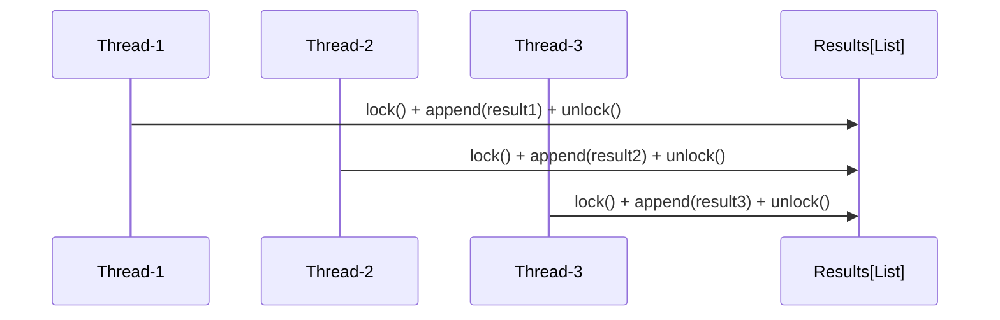
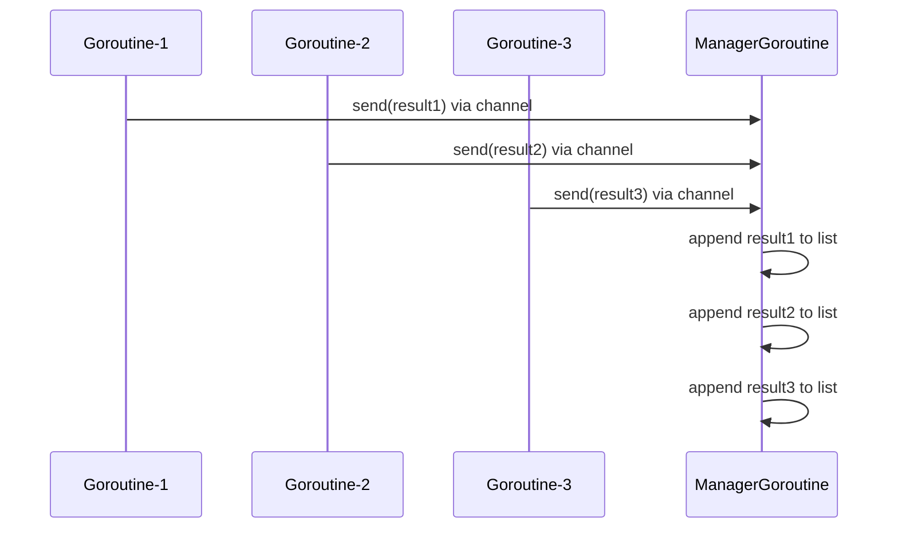
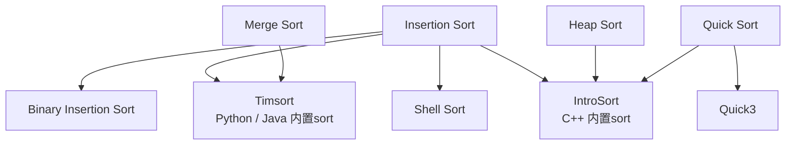
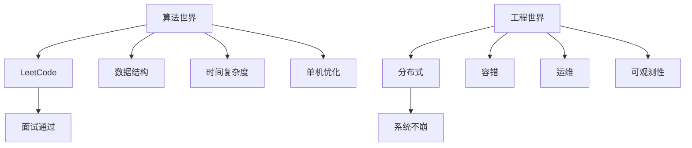

+++
title = 'Algorithm'
subtitle = ""
date = 2024-12-24T11:08:01+08:00
draft = false
toc = true
series = ['python']
+++

# 数据结构和算法

[toc]

## 重要性

面试需要: 公司不在乎False Negative（漏才）：他们有无限备选，宁可错杀1000，不愿放过1个“潜在隐患”。

## 时间复杂度

大O表示法 (Big O notation): 会忽略常数项、低阶项和系数。例如，一个算法的执行次数是 3n² + 2n + 5，其时间复杂度为 O(n2)


| 结构类型           | 代码示例                                        | 复杂度     | 口诀                      |
| ------------------ | ----------------------------------------------- | ---------- | ------------------------- |
| 常数操作           | `return arr[0]`                                 | O(1)       | 直接返回 → 常数时间       |
| 两指针线性扫       | `i`, `j` 向前推进一次                           | O(n)       | 每元素访问一次            |
| 单层循环           | `for i in range(n)`                             | O(n)       | 一层遍历 → 线性           |
| 双层循环           | 嵌套两层循环                                    | O(n²)      | 二层嵌套 → 平方           |
| 三层循环           | 嵌套三层循环                                    | O(n³)      | 三层嵌套 → 立方           |
| 二分查找           | `while left < right: mid = (left + right) // 2` | O(log n)   | 每次折半 → 对数           |
| 分治算法（如快排） | 递归 T(n)=2T(n/2)+O(n)                          | O(n log n) | 分治递归 → n log n        |
| 递归（斐波那契）   | `fibonacci(n)`                                  | O(2ⁿ)      | 每次分支翻倍 → 指数时间   |
| 全排列             | `permute(nums)`                                 | O(n!)      | 每个元素都排列一次 → 阶乘 |


## 空间复杂度

## 数据结构

### 数组

字符串:

- 回文: 回文的倒序等于回文
- 子串(substring): 连续的
- 子序列(subsequence): 不连续，但相对顺序要保持一致

### 队列

```python
# 算法题
from collections import deque


# 单机
from queue import Queue # 同一个进程内（多线程）
from multiprocessing import Queue # 同一台机器内（多进程）

# 多服务器, 分布式, 可视化管理界面: RabbitMQ、Redis
```
deque 来自 collections 模块，是一个 双端队列，支持：
两端都能高效插入/删除（O(1)）
底层用双向链表实现。
支持索引，但中间插入/删除效率低（O(n)）。


- 当主要在 两端操作（队列、滑动窗口） 时 → 用 deque
- 当主要是 随机访问、排序、索引 时 → 用 list


####  番外: 并发逻辑

共享资源修改 = 串行；并行修改 = 数据竞态 = 不安全。

python

多人同时编辑文档，需要锁



go 

只有一个人编辑，别人写信告诉他

结果管理者 goroutine 串行处理消息

**其余步骤是并发的,结果写入是串行**




### 哈希表

key -> **哈希函数** -> 哈希值 确定**寻址表**的存储位置
哈希表的 key 必须是“可哈希”的（即能够生成哈希值）。


哈希函数的常用方法:

* 除留余数法
    * 对寻址表长度取余
    * 对最大的质数取余
        * 减少偶数的哈希冲突
    * 直接定址法
        * 关键字分步均匀的情况下使用
    * 数字分析法
* 平方取中法

哈希冲突: 得到的地址是重复的
解决方法:

* 开链表法
    * 出现哈希冲突就添加节点
    * java的hashmap
* 开放寻址法
    * 线性探测
        * i+1,i+2...
        * 查找效率低下
        * 删除需要逻辑删除，不能置空
    * 平方探测
        * 1^2, -1^2，2^2， -2^2， 3^2， -3^2...
        * 出现哈希冲突就把地址加上平方数，继续哈希函数处理
        * 需要寻址表的长度是4i+3
    * 双重哈希
        * 再来一次哈希
            
```python
from collections import Counter # 统计元素频率
from collections import OrderedDict # 保持插入顺序的字典

```

```python
from collections import defaultdict # 给 dict 提供默认值

# list 作为默认值
s = [('yellow', 1), ('blue', 2), ('yellow', 3), ('blue', 4), ('red', 1)]
d = defaultdict(list)
for k, v in s:
    d[k].append(v)

sorted(d.items())


# int 作为默认值
s = 'mississippi'
d = defaultdict(int)
for k in s:
    d[k] += 1

sorted(d.items())

```

自定义hashable的类

```python
from dataclasses import dataclass
"""
功能,说明
自动生成 __init__,根据字段自动创建初始化方法
自动生成 __repr__,好看的打印输出
自动生成 __eq__,按字段内容比较相等
自动生成 __hash__（仅当 frozen=True）,使对象可哈希（可用于 dict key / set）
禁止修改属性,任何 obj.x = 1 都会报错
"""
@dataclass(frozen=True)
class MyKey:
    id: int
    name: str
    # 自动可哈希 + 不可变


# 加上 order=True 还能支持 <, >, sorted() 等！
@dataclass(frozen=True, order=True)  # order=True 还支持比较大小
class Point:
    x: int
    y: int

```

### 链表
### 树

遍历方式


| 中文名称 | 英文标准名称          | 别名/常见写法           | 访问顺序     |
| :------- | :-------------------- | :---------------------- | :----------- |
| 前序遍历 | Pre-order Traversal   | Preorder Traversal      | 根 → 左 → 右 |
| 中序遍历 | In-order Traversal    | Inorder Traversal       | 左 → 根 → 右 |
| 后序遍历 | Post-order Traversal  | Postorder Traversal     | 左 → 右 → 根 |
| 层序遍历 | Level-order Traversal | Breadth-First Traversal | 按层从左到右 |


概念

根：最上层
叶：最下层
上下层关系：子节点，父节点
节点的度：节点的孩子数量
树的度： 最大的节点的度
树的深度： 层级总数
满二叉树: 叶子节点长全了
完全二叉树: 完全二叉树的叶子没长全


二叉搜索树

左<中<右
    中序遍历
        结果为升序数组
节点不重复，唯一性
可以不是完全二叉树
    兄弟节点有排序
作用
    大小有序，便于二分查找，提高查找速度
操作
    创建

    删除节点
        方法
            当节点只有一个孩子
                直接替换
            当节点有两个孩子
                要么用左子树的最右下的节点替换
                要么用右子树最左下的节点替换
查找的效率和树的深度一致
分类
    平衡二叉查找树
        核心算法
            维持树的平衡
        分类
            红黑树
                特点
                    从根到叶，路径差小于2倍
                应用场景
                    数据全部放在内存
                        linux中进程的调度
            avl树
                特点
                    左右子树的深度不能超过1
                维持树的平衡的方法
                    修改最小不平衡子树
                        插入左孩子出现不平衡
                            ll
                                右上旋转
                            rl
                                右上旋加左上旋
                        插入右孩子出现不平衡
                            rr
                                左上旋转
                            lr
                                左上旋加右上旋
    多路查找树
        矮胖型的树
            效率取决于访问磁盘的次数
                深度小，有利于提高效率
            分之多，层数少
            绝对平衡
                子树的深度相同
            b+树
                应用场景
                    数据大部分放在磁盘
                        mysql
                    适合文件搜索系统，数据库系统
                特点
                    结构
                        一个节点的子树和关键字的数量相同
                    叶子节点
                        叶子结点存储的是key
                            用链表连接所有叶子节点
                            通过叶子结点获取值
                    分支节点
                        所有分支节点只包含子节点中关键字的最大值
                        因为分支节点不存储信息，只是索引的作用  ，所以一个节点存储的关键字更多，分支更多，读取磁盘次数越少，效率更高
                两种查找
                    从根节点开始查找
                    头叶子结点的头结点开始遍历
            b树
                特点
                    数据存储在每个节点上
                    查找速度等价于二分查找
                定义
                    多路平衡查找树
                        规定节点是分叉下限和上限【m/2, m】
            2-3树
            2-3-4树


堆

作用
    排序工具
        取最大值最小值的
概念
    子节点>=或<=父节点的完全二叉树
分类
        优先级队列
            操作系统的消息，按照重要级别执行
        二叉堆
            大根堆
                根节点是最大值，可以等于子节点
            小根堆
                根节点是最小值，可以等于子节点
        二项堆
        斐波那契堆
特点
    2p+1
        左子树
    2p+2
        右子树
排序
    步骤
        根节点和最后的节点交换
        根节点下沉


其余相关内容
                                                
redis
    跳表
        链表添加多层索引和边界
            实现二分查找的效果
            log2n层
        插值
            记录节点
            维护指针
        操作
            右移动，
            下移动
哈夫曼树
    特点
        树的节点拥有权重值
        概念
            带权路径长度最小的二叉树
        相关概念
            带权路径长度
                目标结点的权重值*路径长度
            路径长度
                根节点到目标节点的长度
    哈夫曼编码
        只能是叶子节点存储信息


#### 应用

```python
treelib
    Tree()
        create_node()
        paths_to_leaves()
        leaves
        show()
        save2file()
            to_dict()
            to_json()
            to_graphviz()
    Node()
anytree
binarytree
```
### heapq

堆是一棵完全二叉树，满足：
对于任意节点，父节点 ≤ 子节点（最小堆）
关心优先级或Top-K

底层: 基于 list, 使用数组存储完全二叉树。


```python
import heapq

nums = [9, 1, 5, 7, 3, 8]
print(heapq.nsmallest(3, nums))  # [1, 3, 5]

```

### 图


## 算法

### 双指针

同向移动或相向移动

### 栈, 队列

排出n个, 进入m个

### 模拟

没有“算法技巧”，就是把现实过程**翻译成代码**的每一步。一步步再现算法的逻辑、状态变化、和中间过程。

### 递归

通过函数**调用自身**解决

记忆化搜索:递归+记录

### 回溯

剪枝: 提前排除无效递归, 降低状态空间。**先排序**方便剪枝

回溯: 为了**记录所有过程**, 循环的使用递归, 来实现: 选择, 撤销. 

```python

def backtrack():
    res = []
    path = []

    def dfs(idx):
        if ...:
            res.append()
        for i in nums:
            path.append(i)
            dfs(...)
            path.pop()

    dfs(0)
    return res


def backtrack():
    res = []

    def dfs(idx, path):
        if ...:
            res.append()
        for i in nums:
            dfs(..., path + [i]) # 在递归时创建新的, 则不需要用pop()恢复状态. 代码简洁但效率低下

    dfs(0, path)
    return res
```
- N皇后
- 排列组合


```python

from itertools import *

# 排列
permutations() # 不放回，元素不重复
product() # 多组

# 组合
combinations() # 不放回，元素不重复
combinations_with_replacement() # 多组

```

### 动态规划

搜集已知条件, 推理潜在规律, 找到转化方程

将递归问题记忆化，避免重复计算相同子问题，转化为状态转移方程


### 贪心

期望通过局部最优达到全局最优。

### 位运算

常见的 位运算操作：

- 按位与 (&)：两个数字的每一位进行“与”操作。
- 按位或 (|)：两个数字的每一位进行“或”操作。
- 按位异或 (^)：两个数字的每一位进行“异或”操作。
- 按位取反 (~)：对数字的每一位取反。
- 左移 (<<)：将数字的二进制位向左移动。
- 右移 (>>)：将数字的二进制位向右移动。

### 排序 sort

<https://www.toptal.com/developers/sorting-algorithms>
<https://visualgo.net/en>


- insertion
- bubble
- selection

- merge: 合并有序数组
- quick: 分割数组
- quick3: quick
- heap
- shell




```python
def insertion_sort(arr):
    """
    插入排序
    思路：
    - 从第二个元素开始，向前找到它的正确位置插入
    - 类似整理扑克牌
    时间复杂度：O(n^2)
    稳定排序
    """
    n = len(arr)
    
    # 从第 1 个元素开始（下标 0 默认已经有序）
    for i in range(1, n):
        key = arr[i]  # 当前要插入的元素
        j = i - 1

        # 从已排序部分右向左扫描
        while j >= 0 and arr[j] > key:
            arr[j + 1] = arr[j]  # 大于 key 的元素右移
            j -= 1

        # 找到合适位置插入 key
        arr[j + 1] = key

    return arr


def shell_sort(arr):
    n = len(arr)
    gap = n // 2

    while gap > 0:
        for i in range(gap, n):
            temp = arr[i]
            j = i
            while j >= gap and arr[j - gap] > temp:
                arr[j] = arr[j - gap]
                j -= gap
            arr[j] = temp
        gap //= 2

    return arr


def quick_sort(arr):
    """
    快速排序（经典递归版本）
    思路：
    - 选择一个 pivot（基准）
    - 分区：小于 pivot 的放左边，大于 pivot 的放右边
    - 递归对左右子数组排序
    时间复杂度：平均 O(n log n)，最坏 O(n^2)
    不稳定排序
    """
    if len(arr) <= 1:
        return arr  # 已排序或空数组

    pivot = arr[0]  # 选择第一个元素作为基准
    left = [x for x in arr[1:] if x <= pivot]   # 小于等于 pivot 的放左边
    right = [x for x in arr[1:] if x > pivot]   # 大于 pivot 的放右边

    # 递归排序左右子数组，然后合并
    return quick_sort(left) + [pivot] + quick_sort(right)


def quick3_sort(arr):
    """三向快速排序主函数"""
    if len(arr) <= 1:
        return arr.copy()  # 基线条件
    
    # 选择第一个元素作为基准（实际应用中可随机选择优化性能）
    pivot = arr[0]
    
    # 划分为三部分：小于基准、等于基准、大于基准
    less = [x for x in arr[1:] if x < pivot]
    equal = [pivot] + [x for x in arr[1:] if x == pivot]
    greater = [x for x in arr[1:] if x > pivot]
    
    # 递归排序"小于"和"大于"部分，合并结果
    return quick3_sort(less) + equal + quick3_sort(greater)


def merge_sort(arr):
    """归并排序主函数"""
    if len(arr) <= 1:
        return arr.copy()  # 基线条件：空数组或单元素数组无需排序
    
    # 拆分：将数组分为两半
    mid = len(arr) // 2
    left = merge_sort(arr[:mid])  # 递归排序左半部分
    right = merge_sort(arr[mid:])  # 递归排序右半部分
    
    # 合并两个有序子数组
    return merge(left, right)


def merge(left, right):
    """合并两个有序数组为一个有序数组"""
    merged = []
    i = j = 0  # i指向left的当前元素，j指向right的当前元素
    
    # 比较两个子数组的元素，按顺序加入结果
    while i < len(left) and j < len(right):
        if left[i] <= right[j]:  # <= 保证排序稳定性
            merged.append(left[i])
            i += 1
        else:
            merged.append(right[j])
            j += 1
    
    # 处理剩余元素（其中一个子数组已遍历完）
    merged.extend(left[i:])
    merged.extend(right[j:])
    
    return merged

```

### 查找 search

#### 一维

- linear
- binary

#### 二维


概念:

- 有环: 有多条路径能到达同一个格子
- 无环: 有一条路径能到达同一个格子

数据结构分类:

- 树状结构(无环), 不需要去重
- 表格/图搜索中，“重复访问” 其实就是 “环路” 问题；必须记录 visited，避免重复或死循环。


方法:

- dfs
- bfs


| 对比项       | DFS（深度优先搜索）      | BFS（广度优先搜索）                   |
| ------------ | ------------------------ | ------------------------------------- |
| **搜索方式** | 一条路走到黑（递归或栈） | 按层次逐步扩展（队列）                |
| **实现方式** | 通常递归或手动**栈**     | 通常用**队列**（`collections.deque`） |
| **空间占用** | 少（递归深度有限）       | 多（每层都要保存节点）                |
| **代码风格** | 简洁直观                 | 稍显模板化但稳健                      |


### 数论

研究整数性质的数学

- 特殊整数
- 完美数
- 丑数
- 斐波那契数


图论


## 思想

- 从易到难, 动画逐步推理
- 使用合理的数据结构, 事半功倍
- 考虑极限情况, 处理边界
- 逆向推理
- 可以改变输入,作为中间过程的记录. 降低编码复杂度

## 具体细节

### 字符串的 slice range

start stop step

#### slice

负数索引（negative index）

| 索引     | 0   | 1   | 2   | 3   | 4   |
| -------- | --- | --- | --- | --- | --- |
| 倒序索引 | -5  | -4  | -3  | -2  | -1  |
| 元素     | a   | b   | c   | d   | e   |


```python
lst = [1, 2, 3, 4, 5, 6]
print(lst[-3:])     # [4, 5, 6]

lst[-2::-1]   # [5, 4, 3, 2, 1]
```

#### range

range() 的负数不是“倒数第几个”，而是真正的负数值。

```python
range(-3, 3)  # [-3, -2, -1, 0, 1, 2]
```


### while 嵌套的 坑


```python
while l<r:
    while not s[l].isalnum():
        l += 1
    while not s[r].isalnum():
        r -= 1
# bug, 外层不会判断
```
修改方案1: if continue
```python
while l<r:
    if not s[l].isalnum():
        l += 1
        continue
    if not s[r].isalnum():
        r -= 1
        continue
```

修改方案2: while 外层条件 and 内层条件

```python
while l<r:
    while l<r and not s[l].isalnum():
        l += 1
    while l<r and not s[r].isalnum():
        r -= 1
```


### 小数转整数的方式

| 中文名称               | 英文名称               | 5 / 2  | -5 / 2   | 典型使用场景                     |
| ---------------------- | ---------------------- | ------ | -------- | -------------------------------- |
| 向上取整               | Ceiling division       | 3      | -2       | 数学 ceil()                      |
| 向下取整               | Floor division         | 2      | -3       | "Python //, 数学 floor()"        |
| 向零截断               | Truncation toward zero | 2      | -2       | "C, Java, JS, Python //（负数）" |
| 远离零取整             | Round away from zero   | 3      | -3       | 商业统计                         |
| 四舍五入               | Round to nearest       | 3 或 2 | -3 或 -2 | 日常计算                         |
| 向偶数舍入(银行家舍入) | Round half to even     | 2      | -2       | 浮点标准、统计                   |

### 各种统计的数

| 分类 | 统计量名称 | 英文               | Python 示例                                     |
| ---- | ---------- | ------------------ | ----------------------------------------------- |
| 中心 | 平均数     | Mean               | df["x"].mean()                                  |
|      | 中位数     | Median             | df["x"].median()                                |
|      | 众数       | Mode               | df["x"].mode()                                  |
| 极值 | 最大值     | Max                | df["x"].max()                                   |
|      | 最小值     | Min                | df["x"].min()                                   |
| 分散 | 标准差     | Standard Deviation | df["x"].std()                                   |
|      | 方差       | Variance           | df["x"].var()                                   |
|      | 极差       | Range              | df["x"].max() - df["x"].min()                   |
|      | 四分位距   | IQR                | df["x"].quantile(0.75) - df["x"].quantile(0.25) |
| 位置 | 分位数     | Quantile           | df["x"].quantile(0.95)                          |


## 算法题 和 实际项目 差异





数据结构
    一维度
        线性表
                顺序表
                    典型例子
                        列表
                            分离式的元素外置的顺序表
                    类型
                        元素外置顺序表
                            实际存储元素的地址，可以存储任意类型元素
                        一体式的
                            便于查找
                        分离式的
                            便于修改
                链表
                    组成
                        节点
                            数据
                            next
                    存储结构
                        物理存储单元上 非连续，非顺序的
                    可以计算节点个数
                        判断是否为None
                    功能设计
                        设计节点
                        设计链表
                            三种情况
                                0节点
                                1节点
                                多节点
            受限制的
                栈stack,又名堆栈
                    可以理解成往杯子放东西
                    栈顶
                        进出的端口
                            也是最后进来的那个元素
                    实际应用
                        列表
                    扩展
                        共享栈
                        两个栈模拟队列
                队列queue
                    可以理解成排队
                    先进先出，及时排出去，需要计数
                        队尾
                            进入
                        队头
                            出去
                    实际使用
                        from collections import deque
                        列表
                    其他分裂
                        循环队列
                            取余，可以实现循环
        哈希表（散列表）
            
    二维度
        图
            概念
                顶点
                边
                邻接
                    两个顶点有边相连，这两个顶点是邻接关系
                路径
                    从一个顶点到另一个顶点走过的顶点序列
                度
                    一个顶点有多少条边
                    入度
                        多少条边从该顶点指入
                    出度
                        多少条边从该顶点指出
            图的存储
                邻接矩阵
                    就是dataframe
                邻接表
                    就是字典

            拓扑排序
            关键路径
            最小生成树
            二分图
            最大流


复杂类型
    排列组合
        两种思想
            分步加法
                单步可以完成任务
            分步乘法
                需要组合完成任务
        排列
            特点
                有顺序
            Amn
                计算公式
                    n*(n-1)(n-2)...(n-(m-1))
                        n!/(n-m)!
                            数学规定
                                0!=1
                含义
                    从n个元素取出m个，进行排列
                全排列
                    m=n的时候
                        n！
            递归条件
                1
        组合
            特点
                没顺序
            Cmn
                计算公式
                    Amn/Amm
                        n!/(n-m)!m!
                Cmn = C(n-m)n
            递归条件
                0
            插空法
                一起插空
                分步插空
            倍缩法
                除法
                    排列/组合
            填空法
                先填变量，忽略不变
        回溯大法