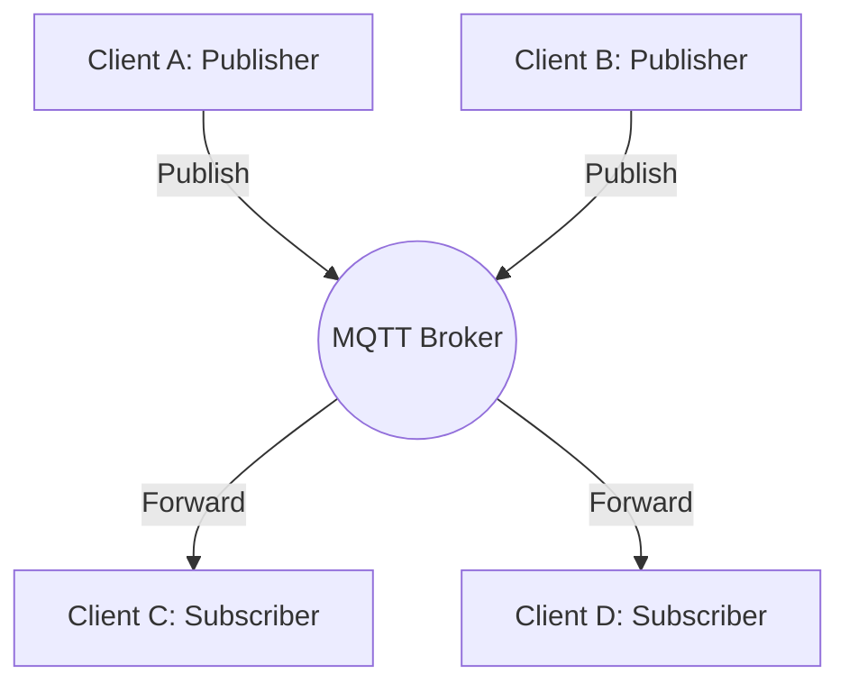
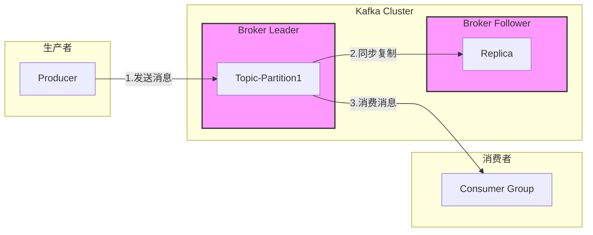
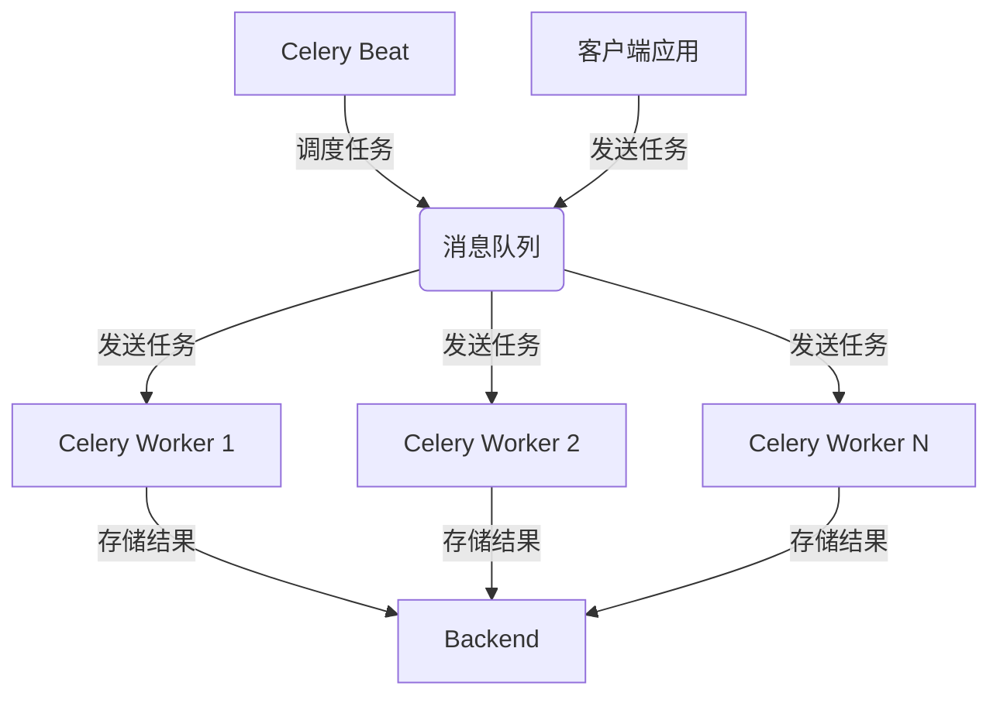

+++
title = 'Django教程'
subtitle = ""
date = 2024-04-30T14:07:14+08:00
draft = false
toc = true
tags = ["web"]
+++

[toc]

## 网站开发逻辑

- 数据
- 页面
- api

## 通信协议

| 层级              | 协议及描述     |
|-------------------|-----------------------------------------------------------|
| **应用层**        | - **HTTP**: 网页浏览的基础协议，用于传输网页内容。        |
|                   | - **HTTPS**: HTTP 的加密版本。                           |
|                   | - **FTP**: 文件传输协议。                                 |
|                   | - **SMTP**: 简单邮件传输协议，用于发送电子邮件。        |
|                   | - **POP3**: 用于接收电子邮件。                            |
|                   | - **IMAP**: 用于同步和管理电子邮件。                      |
|                   | - **DNS**: 将域名解析为 IP 地址。                         |
|                   | - **SSH**: 安全远程管理协议。                             |
|                   | - **Telnet**: 早期的远程登录协议，已被 SSH 取代。        |
|                   | - **WebSocket**: 用于建立持久的双向通信。                |
| **传输层**        | - **TCP**: 面向连接的协议，提供可靠的数据传输。         |
|                   | - **UDP**: 无连接的协议，适用于实时应用。               |
|                   | - **QUIC**: 基于 UDP 的新传输层协议，提供更高的效率。   |
| **网络层**        | - **IP**: 网络层的基本协议，负责数据包的传输。           |
|                   |   - **IPv4**: 使用 32 位地址。                            |
|                   |   - **IPv6**: 使用 128 位地址，解决 IP 地址枯竭问题。   |
|                   | - **ICMP**: 网络诊断信息协议（如 ping）。                |
|                   | - **ARP**: 将 IP 地址解析为物理地址。                     |
| **数据链路层**    | - **Ethernet**: 局域网的有线通信协议。                  |
|                   | - **Wi-Fi**: 无线局域网协议。                             |
|                   | - **PPP**: 点对点协议，用于数据传输。                    |
|                   | - **STP**: 防止网络环路的生成树协议。                    |
| **物理层**        | - **Ethernet（物理层部分）**: 定义电信号如何传输。      |
|                   | - **Wi-Fi（物理层部分）**: 定义无线信号的传输。        |
|                   | - **Bluetooth**: 短距离无线通信协议。                    |
| **会话层、表示层**| - **SSL/TLS**: 提供加密连接，保护数据传输。              |
|                   | - **RPC**: 允许远程过程调用。                             |
| **其他协议**      | - **MQTT**: 轻量级发布/订阅消息协议，适用于物联网。     |
|                   | - **AMQP**: 企业级消息队列协议。                         |
|                   | - **gRPC**: 基于 HTTP/2 的远程过程调用框架。             |
|                   | - **SFTP**: 基于 SSH 的安全文件传输协议。                |


-   HTTP

| 请求方式 | 传参方式                           | 示例                                              |
|----------|------------------------------------|---------------------------------------------------|
| GET      | 查询字符串 (Query Parameters)      | `GET /users?id=123`                               |
|          | 路径参数 (Path Parameters)         | `GET /users/123`                                  |
|          | 请求头 (Headers)                   | `Authorization: Bearer token`                     |
| POST     | 请求体 (Request Body)              | `POST /users`<br>`{ "name": "John", "age": 30 }`  |
|          | 表单数据 (Form Data)               | `POST /users`<br>`name=John&age=30`               |
|          | 请求头 (Headers)                   | `Content-Type: application/json`                  |
| PUT      | 请求体 (Request Body)              | `PUT /users/123`<br>`{ "name": "Jane", "age": 25 }`|
|          | 路径参数 (Path Parameters)         | `PUT /users/123`                                  |
|          | 请求头 (Headers)                   | `Content-Type: application/json`                  |
| PATCH    | 请求体 (Request Body)              | `PATCH /users/123`<br>`{ "age": 31 }`             |
|          | 路径参数 (Path Parameters)         | `PATCH /users/123`                                |
|          | 请求头 (Headers)                   | `Content-Type: application/json`                  |
| DELETE   | 路径参数 (Path Parameters)         | `DELETE /users/123`                               |
|          | 请求头 (Headers)                   | `Authorization: Bearer token`                     |


    -   get
        -   url传参(对数据长度有限制(大约 2048 个字符)
            -   http://example.com/api?k1=v1&k2=v2
    -   post
        -   传参
            -   类型
                -   request header
                    -   Content-Type 指明数据格式
                -   request body
                    -   json
                    -   form-data
                    -   text
            -   url传参 
    -   put
        -   传参同 post, 只是需要对象存在
    -   delete

## 数据获取方式总结

| 方式 | 描述 | 适用场景 | 优点 | 缺点 | 市场占有率 |
|---|---|---|---|---|---|
| 文件系统 | 读取本地或远程文件 | 静态数据存储 | 简单易用 | 访问速度可能较慢 | 极高 |
| 爬虫 | 从网页抓取数据 | 数据采集、信息挖掘 | 获取大量数据 | 可能违反网站的爬虫协议 | 较高，但因法律法规限制而波动 |
| SQL数据库 | 结构化数据存储和查询 | 大量结构化数据的存储和查询 | 数据一致性强、查询灵活 | 可能存在性能瓶颈 | 极高 |
| NoSQL数据库 | 非关系型数据库 | 海量非结构化数据存储 | 灵活扩展、高性能 | 数据模型设计复杂 | 较高，尤其在大数据领域 |
| **HTTP**       | 超文本传输协议，最常用的请求-响应式通信协议。                                                          | Web 应用、API 调用、文件传输等。                                 | 简单、成熟、广泛支持，适用于大多数应用场景。                             | 不支持实时双向通信，高延迟，不适用于需要频繁更新的场景。                  | **极高**（几乎所有 Web 应用都依赖）    |
| **TCP/UDP**    | 低级网络通信协议，允许通过套接字进行直接的数据传输。TCP 提供可靠传输，UDP 提供不可靠但快速的传输。     | 实时视频/音频流、在线游戏、文件传输、自定义协议实现等。           | 低延迟、高灵活性，适用于高性能和实时性要求的应用。                       | 需要手动管理连接和错误处理，开发复杂度高，UDP 不保证数据传输的可靠性。      | **高**（基础通信协议，应用广泛）      |
| **Email/SMS**  | 通过电子邮件或短信发送数据或通知的方式。                                                              | 用户通知、报警系统、验证消息、营销活动等。                       | 覆盖面广、易于使用，适用于发送重要通知和广泛传播信息。                    | 延迟较高，不适合实时性要求高的场景，短信的全球覆盖可能受限。                | **高**（传统通信方式，普及率高）      |
| **MQTT**       | 轻量级的发布/订阅消息传输协议，适用于资源受限设备和不稳定网络环境。                                   | 物联网（IoT）、传感器数据收集、智能家居设备通信等。               | 低带宽开销、实时性好、支持不稳定网络环境。                               | 传输量小，支持较为基础，不适合处理复杂的数据结构或大规模数据。            | **较高**，尤其在IoT领域         |
| **Kafka**      | 分布式流处理平台，用于构建实时数据管道和流应用，基于发布/订阅消息传输模式。                             | 大数据处理、日志聚合、事件流处理、实时分析等。                   | 高吞吐量、高可扩展性、适用于大规模数据流处理。                           | 需要较复杂的部署和维护，学习曲线较陡，延迟可能较高。                        | **较高**，尤其在大数据和流处理领域 |
| **WebSocket**  | 全双工通信协议，允许服务器和客户端之间进行实时双向通信。                                               | 实时聊天、在线游戏、股票行情推送、实时通知等。                   | 实时性强、低延迟、适合需要频繁数据更新的应用。                           | 不适合长时间空闲连接，占用资源多，不适用于传输大数据量的场景。              | 中（实时应用逐渐普及）            |
| **gRPC**       | 高性能、开源的远程过程调用（RPC）框架，基于 HTTP/2 协议，使用 Protocol Buffers 进行数据序列化。        | 微服务架构、分布式系统、移动设备与后端服务通信等。               | 高效、支持多语言、支持双向流式通信、强类型定义。                         | 使用复杂，依赖于 HTTP/2 和 Protocol Buffers，不如 REST API 普及。           | 中（微服务架构中逐渐普及）        |
| AMQP       | 高级消息队列协议，提供消息的安全、可靠传输，支持复杂的消息路由和队列机制。                            | 企业消息系统、分布式应用、金融交易系统、微服务通信等。           | 功能丰富、可靠性高、支持事务和队列，适用于复杂的消息传递需求。           | 协议复杂，学习成本高，部署和维护难度较大。                                 | 中（企业级消息系统使用广泛）      |
| Webhooks   | 基于 HTTP 回调的事件驱动通信方式，当特定事件发生时，一个系统向另一个系统发送通知。                     | 事件通知、第三方服务集成、自动化工作流程等。                     | 简单、即时通知、易于集成，减少轮询需求。                                 | 无法保证消息的送达率或顺序，需要处理重复或丢失的消息。                      | 中（被广泛用于自动化通知）        |
| FTP/SFTP | 文件传输协议 | 文件传输 | 简单易用 | 速度较慢、安全性较低（FTP） | 中等，逐渐被SFTP和更安全的协议替代 |
| NFS | 网络文件系统 | 共享文件系统 | 方便共享文件 | 配置复杂 | 中等，主要用于内部网络 |
| P2P        | 点对点通信方式，设备之间直接连接并交换数据，无需中心服务器。                                          | 文件共享、区块链网络、分布式计算、实时通信应用等。               | 去中心化、可扩展性强、资源利用高效，适用于分布式和去中心化的应用场景。   | 依赖节点的可用性，可能导致数据传输不稳定，网络连接管理复杂。                | 中（去中心化应用领域使用）        |
| XMPP | 即时消息和在线协作协议 | 即时通讯、在线协作 | 功能丰富 | 社区相对较小 | 较低 |
| CoAP       | 专为物联网设备设计的轻量级协议，基于 UDP，类似于精简版的 HTTP。                                        | 低功耗、资源受限的设备通信，如传感器网络、智能城市等。           | 轻量级、低开销、支持组播，适用于受限环境。                               | 基于 UDP 传输，可靠性不如 TCP，适用场景有限，功能较简单。                    | 低（物联网中逐渐普及）            |

### http

requests 同步请求
httpx 异步请求

### 发布/订阅消息传输协议

#### mqtt

核心概念:

| 名词 | 概念 |
|---|---|
| Broker | 消息代理，负责接收、存储和转发消息到订阅者。 |
| Client | 客户端，可以是发布者或订阅者。 |
| Topic | 主题，用于标识消息的分类和路由。 |
| Message | 消息，由发布者发送并由代理转发给订阅者。 |
| Subscription | 订阅，客户端订阅一个或多个主题，以接收相关的消息。 |
| Publication | 发布，客户端发布消息到某个主题。 |


关系流程:



#### kafka

特点: 提供持久性存储

关系流程:



```python
from kafka import KafkaConsumer
import json 

consumer = KafkaConsumer(
    'your_topic_name',
    bootstrap_servers='your_kafka_broker:9092',
    group_id='your_consumer_group',
    value_deserializer=lambda v: json.loads(v.decode('utf-8'))  # Deserialize JSON
)

# 阻塞
for i in consumer:
    ...

# 非阻塞
while 1:
    for topic, msg in consumer.poll():
        ...
```

常见问题:

kafka nobrokersavailable

## 前后端数据交互的类型


### header 请求头:

包含了基本的请求信息, method, url, 协议, 和一些 kv.

常见kv如下:

|key|meaning|
|---|---|
|Accept| 客户端可接受的响应类型 |
|Accept-Language| 客户端可接受的语言 |
|Content-Type| body数据类型 |
|Cookie| 用于用户认证 |
|Host| 请求服务器地址 |
|User-Agent| 客户端信息 |

### body 请求体:

数据类型 在header里的 **Content-Type** 可以查看

有三种数据格式:

- application/json
```json
{
    username: 'john_doe',
    email: 'john@example.com',
    age: 30
}
```
- form
  - application/x-www-form-urlencoded
    - `username=john_doe&email=john@example.com`
  - multipart/form-data
    - 上传文件

### query params:

`/api/users?username=john_doe&email=john@example.com`


## 网站开发逻辑梳理

- 前端
  - template
  - form
- 后端
  - model
  - view
  - url

### 初级阶段，使用 admin 后台快速建站

<https://docs.djangoproject.com/en/5.1/ref/models/fields/#:~:text=ForeignKey>

Field:

```
null=True  # 数据库层面
blank=True  # 表单层面
```

-   model

    -   model 分类
        -   普通的继承
        -   abstruct 抽象基类
        -   proxy 添加额外的方法
    -   模型管理器
        -   objects =
    -   自定义 BaseModel

    ```python
    class BaseModel(models.Model):
        """为模型类补充字段"""
        create_time = models.DateTimeField(verbose_name='创建时间', auto_now_add=True)
        update_time = models.DateTimeField(verbose_name='更新时间', auto_now=True)

        class Meta:
            # 说明是抽象模型类
            abstract = True
    ```

    ```python
    class ProjectModel(BaseModel):
        """项目"""
        user = models.ForeignKey(User, verbose_name='用户', on_delete=models.CASCADE)

        name = models.CharField(verbose_name='项目名', max_length=30)
        what = models.TextField(verbose_name='项目描述')
        why = RichTextUploadingField(verbose_name='项目意义')
        priority_choices = ((0, '不重要不紧急'), (1, '不重要紧急'), (2, '重要不紧急'), (3, '重要紧急'))
        priority = models.IntegerField(verbose_name='优先级', default=0, choices=priority_choices)
        public = models.BooleanField(verbose_name='是否公开', default=False)

        start_date = models.DateField(verbose_name='计划开始日期')
        end_date = models.DateField(verbose_name='计划完成日期')

        # how = RichTextUploadingField(verbose_name='执行步骤', config_name='default')
        how = MDTextField(verbose_name='执行步骤')

        attachments = models.FileField(verbose_name='附件', upload_to='attachments/%Y/%m/%d/', null=True, blank=True)
        status = models.BooleanField(verbose_name='是否完成', default=False)
        think = models.TextField(verbose_name='项目感想', null=True, blank=True)

        class Meta:
            verbose_name = '项目'
            verbose_name_plural = verbose_name

        def __str__(self):
            return self.name
    ```

-   admin 后台管理

    -   管理模型类

        -   添加模型类到 admin
            ```python
            # 直接添加
            admin.site.register(ProjectModel)
            ```
        -   自定义模型类的功能页面

            ```python
            # 自定义模型类的admin
            class ProjectModelAdmin(admin.ModelAdmin):
                # list页面
                list_display = ['user', 'name', 'what', 'priority', 'end_date', 'duration', 'status']
                list_filter = ['user', 'status', 'priority', 'end_date']
                search_fields = ['name', 'what', 'why', 'how', 'think']
                ordering = ['status', '-priority', 'end_date']
                # detail页面
                readonly_fields = ['user']  # 只读字段，不能编辑

            # 添加自定义的ProjectModelAdmin
            admin.site.register(ProjectModel, ProjectModelAdmin)
            ```

    -   ## 邮件重置密码

### 直接编写后台逻辑和前台模板页面

<https://python.plainenglish.io/building-a-basic-crud-using-django-b218d6859206>

-   url
    -   include()
        -   name
        -   namespace
    -   view 中访问
        -   reverse()
    -   基本格式
        -   ''
        -   create/
        -   \<int:pk\>/
        -   \<int:pk\>/update/
        -   \<int:pk\>/delete/
    -   传参数
        -   使用<>来传参
    -   ## 嵌套的 url
-   view

    - 概念：处理请求， 返回响应。通常会操作数据库
    -   请求和响应
        -   https://docs.djangoproject.com/zh-hans/5.0/ref/request-response/
        -   HttpRequest
            -   可以在中间件中设置各种需要的属性
            -   GET
            -   POST
            -   body
        -   HttpResponse
            -   分类
                -   HttpResponse
                -   JsonResponse / drf 的 Response
                -   render
                -   redirect
    -   数据库操作
        -   https://docs.djangoproject.com/en/5.0/ref/models/querysets/#get
            ```python
            from django.db.models import Q
            
            # 查询
            Book.objects.filter(**dct)
            Entry.objects.order_by("blog__name", "headline")
            Poll.objects.get(
                Q(question__startswith="Who"),
                Q(pub_date=date(2005, 5, 2)) | Q(pub_date=date(2005, 5, 6)),
            )

            # 增改删
            Book.objects.create(**dct)
            Book.objects.update_or_create(**dct)
            Book.objects.filter(**dct).delete()
            ```

            ```python
            # update_or_create
            defaults = {"first_name": "Bob"}
            create_defaults = {"first_name": "Bob", "birthday": date(1940, 10, 9)}
            try:
                obj = Person.objects.get(first_name="John", last_name="Lennon")
                for key, value in defaults.items():
                    setattr(obj, key, value)
                obj.save()
            except Person.DoesNotExist:
                new_values = {"first_name": "John", "last_name": "Lennon"}
                new_values.update(create_defaults)
                obj = Person(**new_values)
                obj.save()

            obj, created = Person.objects.update_or_create(
                first_name="John",
                last_name="Lennon",
                defaults={"first_name": "Bob"},  # 更新的数据
                create_defaults={"first_name": "Bob", "birthday": date(1940, 10, 9)},  # 创建的数据
            )

            # 分组
            from django.db.omdels import Count
            # [{'type1': xxx, 'type2': xxx, 'id': xxx}]
            type1_lst = MyModel.objects.values('type1', 'type2').annotate(count=Count('id'))
            ```
    -   FBV
        -   很直观，完全自主可控的写法
    -   CBV
        -   django提供了一些类来作为view, 不是很好用
    -   状态码
        |代码|含义|
        | --- | --- |
        | 200 | ok |
        | 400 | bad request |
        | 401 | auth fail |
        | 403 | permission |
        | 404 | not found |
        | 500 | server error |
    -   中间件， 钩子
        -   概念：在HttpRequest到达view的前后，自定义额外的处理逻辑

-   template

    -   页面的主要类型
        -   list
        -   detail
        -   delete_confirm
    -   语法
        -   tags
            -   常用语法
                -    **必须在 html 的最开头**
                -    **每个模板页都要 load 自己使用的 tag， 而不能通过 extend 继承**
                -   
                -    
                -   
            -   自定义 tag
                -   在 app 内创建 templatetags/demo.py
                -   
        -   variables
            -   {{ var1 }}
        -   filters
        -   comments
    -   overwrite
        -   模板加载顺序 DIRS -> APP_DIRS -> others

-   form
    -   Form: 灵活设置需要的字段
    -   ModelForm：针对模型，添加了数据的验证和保存的功能

## 具体功能

### 认证 jwt

jwt存储方式:

- cookie
  - 优点
    - 可设置 HttpOnly 属性： 可以设置 HttpOnly 属性，防止客户端 JavaScript 访问 Cookie，提高安全性，防止 XSS 攻击。
    - 可设置 Secure 属性： 可以设置 Secure 属性，只允许在 HTTPS 连接中发送 Cookie，防止中间人攻击。
    - 可设置 SameSite 属性： 可以设置 SameSite 属性，防止 CSRF 攻击
    - 自动发送
  - 缺点
    - 不能跨域, 需要 cors
    - 大小有限制, 通常为4KB

jwt基础流程:

登录 -> 前端存储 -> 请求 -> 后端验证 -> 返回

JWT 续期:

1. 前端检测到 JWT 过期，使用刷新 token 请求新 JWT。
2. 后端验证刷新 token，生成并返回新 JWT。
3. 如果token也过期，则需要用户重新登录
4. 设置 HttpOnly, Secure, SameSite 属性


认证类型:
- Bearer: 通过 Authorization 请求头传递 JWT 令牌
- Basic Authentication: 使用 Base64 编码的用户名和密码
- Digest Authentication: 基于哈希签名的认证
- OAuth 2.0 Authorization Bearer Token: 用于 OAuth 2.0 框架中的访问令牌
- Hawk Authentication: 基于签名的认证，用于高安全性场景


### 用户和邮箱

新项目的用户模型

```python
# app/models.py
from django.contrib.auth.models import AbstractUser


class User(AbstractUser):
    pass

# project/settings.py
settings.AUTH_USER_MODEL = 'appname.User'

# app.admin.py
from django.contrib.auth.admin import UserAdmin


class CustomUserAdmin(UserAdmin):
    ...
    fieldsets = UserAdmin.fieldsets + ((None, {"fields": ["custom_field"]}),)
    add_fieldsets = UserAdmin.add_fieldsets + ((None, {"fields": ["custom_field"]}),)
```

老项目的用户模型

使用OneToOneField, **可以多个 OneToOneField**
```python
from django.contrib.auth.models import User


class Employee(models.Model):
    user = models.OneToOneField(User, on_delete=models.CASCADE)
    department = models.CharField(max_length=100)
```


### 权限

-   RBAC： 基于角色控制访问
-   权限分类
    -   retrieve list
    -   retrieve detail
    -   create
    -   update detail
    -   delete detail

### 异步任务和定时任务

Celery 是一个分布式任务队列系统，广泛用于处理异步任务和定时任务。

<https://docs.celeryq.dev/en/stable/index.html>

| 组件 | 功能描述 | 示意图 |
|---|---|---|
| **worker** | 执行任务 | 负责从消息队列中获取任务并执行。 |
| **beat** | 任务调度器 | 定期检查任务并将其添加到消息队列中。 |
| **broker** | 消息中间件 | 存储待执行的任务，是 worker 和 beat 之间的桥梁。常见的有 RabbitMQ、Redis、Amazon SQS 等。 |
| **backend** | 结果存储 | 存储任务执行的结果。常见的有 SQLAlchemy、Redis、MongoDB 等。 |




常用命令
```bash
# 启动worker, 异步处理 耗时任务
celery -A djangoProject worker -l INFO -P eventlet
# 启动beat, 调用定时任务
celery -A djangoProject beat -l INFO
```

#### 定时任务

```python
# 5点执行
@periodic_task(run_every=crontab(hour="5"))
def func1():
    ...

# 每5小时执行
@periodic_task(run_every=crontab(hour="*/5"))
def func1():
    ... 
```
常见api:

- 查所有
- 增
- 查 状态,结果
- 删

前端获取结果的方式:

- 前端轮循
- websocket

### 缓存

### 查询优化

<https://docs.djangoproject.com/en/5.1/ref/models/querysets/#select-related>

```python
# select_related(): foreign key and one-to-one
books = Book.objects.select_related('author').all()
for book in books:
    print(book.author.name)  # 这里不会触发额外的查询，因为作者信息已经被预取

# prefetch_related(): 支持多对多和反向关系
articles = Article.objects.prefetch_related('tags').all()

for article in articles:
    print(article.title, [tag.name for tag in article.tags.all()])  # 不会触发额外查询
```


## 前后端分离

TODO:
### api

前后端 通过api来进行交互

优秀api的规范

- restful
  - 大多数现代 RESTful API 都使用`-`作为分隔符
- 文档
- 验证

#### DRF

- <https://q1mi.github.io/Django-REST-framework-documentation/>
- <https://q1mi.github.io/Django-REST-framework-documentation/api-guide/serializers_zh/>

概念: 对 django 框架进一步封装的第三方包，以便于写出 restfulAPI

##### Serializer

REST framework中的serializers与Django的Form和ModelForm类非常像。

作用: 简化view函数的实现, 数据库的数据转json. json转数据, 加数据验证

| Django | DRF | 特点 |
|---|---|---|
| Form | Serializer | 灵活,定制化 |
| ModelForm | ModelSerializer | 固定, 方便 |

```python

# 定义

from rest_framework import serializers

class CommentSerializer(serializers.Serializer):
    email = serializers.EmailField()
    content = serializers.CharField(max_length=200)
    created = serializers.DateTimeField()

    def create():
        ...

    def update():
        ...

    def save():
        ...

    def validate():
        # 重写 对象 验证逻辑
        ...

    def validate_xxxx():
        # 重写 field 验证逻辑
        ...
    def to_representation():
        # 重写序列化逻辑
        ...

```

```python
# 嵌套 nest
from django.db import models

class Website(models.Model):
    name = models.CharField(max_length=255, verbose_name='网站名称')
    url = models.URLField(verbose_name='网站URL')

    def __str__(self):
        return self.name

class Audio(models.Model):
    website = models.ForeignKey(Website, on_delete=models.CASCADE, related_name='audios', verbose_name='所属网站')
    title = models.CharField(max_length=255, verbose_name='音频标题')
    file_path = models.FileField(upload_to='audio_files/', verbose_name='音频文件路径')

    def __str__(self):
        return self.title


from rest_framework import serializers
from .models import Website, Audio

class AudioSerializer(serializers.ModelSerializer):
    class Meta:
        model = Audio
        fields = ['id', 'title', 'file_path']

class WebsiteSerializer(serializers.ModelSerializer):
    audios = AudioSerializer(many=True, read_only=True)  # 附带

    class Meta:
        model = Website
        fields = ['id', 'name', 'url', 'audios']

```

```python

# 使用
@csrf_exempt
def snippet_detail(request, pk):
    """
    获取，更新或删除一个 code snippet。
    """
    try:
        snippet = Snippet.objects.get(pk=pk)
    except Snippet.DoesNotExist:
        return HttpResponse(status=404)

    if request.method == 'GET':
        serializer = SnippetSerializer(snippet)
        return JSONResponse(serializer.data)

    elif request.method == 'PUT':
        data = JSONParser().parse(request)
        serializer = SnippetSerializer(snippet, data=data)
        if serializer.is_valid():
            serializer.save()
            return JSONResponse(serializer.data)
        return JSONResponse(serializer.errors, status=400)

    elif request.method == 'DELETE':
        snippet.delete()
        return HttpResponse(status=204)
```

##### Viewset
  
| 类 | 特点 |
| --- | --- |
| View |  |
| `APIView` | View+ authentication_classes, throttle_classes, permission_classes |
| GenericAPIView | `APIView`+ pagination_class, filter_backends, serializer_class |
| ViewSet | `APIView`+ DefaultRouter |
| `GenericViewSet` | GenericAPIView+ DefaultRouter |
| ModelViewSet | `GenericViewSet`+ mixin |
    
```python
class CreateListRetrieveViewSet(mixins.CreateModelMixin,
                                mixins.ListModelMixin,
                                mixins.RetrieveModelMixin,
                                viewsets.GenericViewSet):
    """
    A viewset that provides `retrieve`, `create`, and `list` actions.
    """
    queryset = Account.objects.all()
    serializer_class = AccountSerializer


class AccountViewSet(viewsets.ReadOnlyModelViewSet):
    """
    A simple ViewSet for viewing accounts.
    """
    queryset = Account.objects.all()
    serializer_class = AccountSerializer
```


```python
from rest_framework.decorators import action
from rest_framework.filters import SearchFilter, OrderingFilter
# django_filters
from django_filters.rest_framework import DjangoFilterBackend, FilterSet
# drf-dynamic-fields


class UserFilter(FilterSet):
    username = filters.CharFilter(field_name="username", lookup_expr='icontains')  # 模糊匹配用户名

    class Meta:
        model = Account
        fields = ['username', 'email']

class AccountViewSet(viewsets.ModelViewSet):
    """
    
    """
    queryset = Account.objects.all()
    serializer_class = AccountSerializer

    # 自定义各种配置

    # 权限
    authentication_classes = [] # 1
    permission_classes = [] # 2
    throttle_classes = [] # 3

    # 功能
    filter_backends = [SearchFilter, OrderingFilter, DjangoFilterBackend]

    # GET /mymodels/?search=example
    search_fields = ['name', 'description']  # 指定搜索字段

    # GET /mymodels/?ordering=-created_at
    ordering_fields = ['created_at', 'name']  # 指定排序字段
    ordering = ['-created_at']  # 默认排序规则
    
    # DjangoFilterBackend
    # GET /mymodels/?username=xxxx
    filterset_fields = ['username', 'email']  # 可以过滤的字段
    # filter_class = UserFilter

    pagination_class = MyPageClass

    @action(methods=['get'], detail=False)
    def my_method(self):
        ...

```

##### Filter

| 过滤后端     | 功能描述       | 示例代码片段         |
|-----------|-------------|---------------------------|
| `SearchFilter`        | 全文搜索       | `filter_backends = [SearchFilter]`  |
| `OrderingFilter`      | 排序           | `filter_backends = [OrderingFilter]`         |
| `DjangoFilterBackend` | 复杂条件过滤    | `filter_backends = [DjangoFilterBackend]`    |
| 自定义过滤后端         | 实现个性化过滤逻辑   | 继承 `BaseFilterBackend`              |

##### Pagination

<https://q1mi.github.io/Django-REST-framework-documentation/api-guide/pagination_zh/>

```python
# PageNumberPagination
?page=4&page_size=100
# LimitOffsetPagination
?limit=100&offset=300
# CursorPagination
```

##### drf 源码逻辑

```python

class APIView(View):

    # The following policies may be set at either globally, or per-view.
    renderer_classes = api_settings.DEFAULT_RENDERER_CLASSES
    parser_classes = api_settings.DEFAULT_PARSER_CLASSES
    authentication_classes = api_settings.DEFAULT_AUTHENTICATION_CLASSES
    throttle_classes = api_settings.DEFAULT_THROTTLE_CLASSES
    permission_classes = api_settings.DEFAULT_PERMISSION_CLASSES
    content_negotiation_class = api_settings.DEFAULT_CONTENT_NEGOTIATION_CLASS
    metadata_class = api_settings.DEFAULT_METADATA_CLASS
    versioning_class = api_settings.DEFAULT_VERSIONING_CLASS

    # Allow dependency injection of other settings to make testing easier.
    settings = api_settings

    schema = DefaultSchema()

    def initial(self, request, *args, **kwargs):
        ...

        # Ensure that the incoming request is permitted
        self.perform_authentication(request)
        self.check_permissions(request)
        self.check_throttles(request)
```


TODO: 源码设计优劣

django flask


-   APIView
    -   Request
        -   data
        -   query_params
    -   Response
        -   status.xxx
    -   顺序
        -   as_view()
            -   dispatch()
                -   Authentication
                -   Permission
                -   Throttling
        -   view func
-   Router
-   CORS 报错
    -   pip install django-cors-headers
    -   https://www.cnblogs.com/WiseAdministrator/articles/11488681.html
-   VUE

## 网站部署

### 公共服务, 一起安装起来

```bash
pythono manage.py check --deploy
```

使用docker compose 配置 uwsgi 或者 gunicore

### 端口管理：

只需要暴露Nginx的80和443端口到主机。
Django应用和数据库的端口不需要对外暴露

| ip | 作用 |
|---|---|
| 80 |  HTTP服务 |
| 443 |  HTTPS服务 |
| 22 |  SSH服务 |

### nginx配置

proxy_pass 实际服务地址

```bash
proxy_pass http://127.0.0.1:8080;
proxy_pass http://127.0.0.1:8081;
```

#### nginx配置多个项目

- location 不同路径 

```bash
location /project1/
location /project2/
```

- server_name 不同域名

```bash
server_name project1.localhost;
server_name project2.localhost;
```

- listen 不同端口 

```bash
listen 8080;
listen 8081;
```

## django 源码风格

广泛使用 Minin 和 decorator

## 相关文档

-   [Django Doc](https://docs.djangoproject.com/zh-hans/5.0/)
-   [DRF Doc](https://www.django-rest-framework.org/tutorial/quickstart/)


## 常见问题

### CORS

在前后端分离开发时, 经常遇到

CORS 浏览器的同源策略: 是一个重要的安全机制. 默认禁止不同源访问. 允许服务器声明哪些源可以访问它的资源。这需要**服务器设置response来允许跨域**。


源由协议、域名和端口号组成, 例如 

- `http://127.0.0.1:8000`
- `ws://127.0.0.1:8000`


设置response来允许跨域:

```python
from django.utils.deprecation import MiddlewareMixin

class CorsMiddleware(MiddlewareMixin):
    def process_response(self, request, response):
        # 主要是response 设置三个值, 统配设置
        response["Access-Control-Allow-Origin"] = "*"
        response["Access-Control-Allow-Headers"] = "*"
        response["Access-Control-Allow-Methods"] = "GET, POST, PUT, PATCH, DELETE, OPTIONS"
        return response

    def process_response(self, request, response):
        # 主要是response 设置三个值, 具体设置
        
        origin = f'{request.scheme}://{request.get_host()}'
        if origin in ['origin1', 'origin2', 'origin3']:
            response["Access-Control-Allow-Origin"] = origin

        response["Access-Control-Allow-Headers"] = "Authorization, Content-Type"
        response["Access-Control-Allow-Methods"] = "GET, POST, PUT, PATCH, DELETE, OPTIONS"
        return response
```


### CSRF

是一种攻击方式，攻击者利用已登录的session进行攻击, 因此使用一个token来二次验证

默认情况下，Django 的 CsrfViewMiddleware 会对所有非安全请求（如 POST、PUT、DELETE 等）进行 CSRF 验证.

drf auth跳过方式:

SessionAuthentication 改为 TokenAuthentication
或自定义 `authentication_classes`

