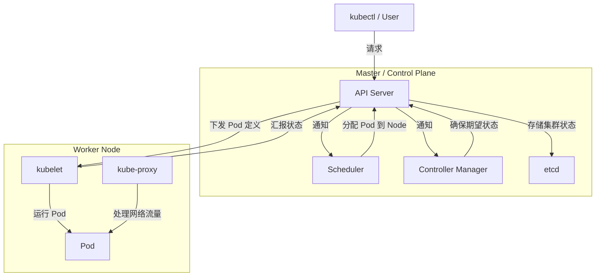

+++
title = 'Docker指南'
subtitle = ""
date = 2024-01-09T00:04:35+08:00
draft = false
toc = true
tags = ["docker", "tools"]
+++

[toc]

## docker介绍

- Docker Desktop <https://docs.docker.com/desktop/>
  - Docker Engine
    - Docker Daemon（dockerd）<https://docs.docker.com/engine/>
    - REST API
    - Docker CLI
  - scout
  - Compose
  - k8s

## why use docker?

- 环境一致性, 让开发和部署保持一致, DevOps 真正落地
- 适合构建微服务架构

## 安装

docker engine 推荐安装
docker desktop 可以不安装

把自己加入 docker 组
```bash
getent group docker
sudo usermod -aG docker $USER

```


## 相关教程

-   <https://docker-practice.github.io/zh-cn/introduction/>
-   <https://juejin.cn/post/7154437479955693598>

## 快速入门

**概念 -> 操作方法 -> 使用Container**

### Docker 基本概念

Container是实际使用的实例, 主要通过以下两种方法生成:

**Repository -> Image -> Container**
**Dockerfile -> Image -> Container**

Volume: 存储数据
Network: 容器网络通信
宿主机: 本人使用的电脑


| 概念 | 描述 |
|---|---|
| **Image** |  一个只读的模板，包含了运行容器所需的全部内容，包括代码、运行时、系统工具、系统库等等。可以把它看作是一个root文件系统。 |
| **Container** |  镜像的一个运行实例，可以启动、停止、删除。容器是完全使用沙箱机制，相互之间不会有任何接口。 |
| **Repository** |  用来保存镜像的一个目录。可以将其理解为一个仓库，里面存放着许多个镜像。 |
| **Dockerfile** |  一个文本文件，里面包含了一条条指令，告诉Docker如何一步一步地构建一个镜像。 |
| **Volume** |  持久化数据的一种方式，可以将容器中的数据保存到宿主机上。 |
| **Bind Mount** | 主机文件系统中指定路径与容器中路径的挂载，适用于共享或持久化特定文件或目录。                 |
| **Network** |  Docker提供了多种网络模式，用于容器之间的通信和与宿主机之间的通信。 |
| **Compose**    | Docker Compose，定义和管理多容器应用的工具，使用 `docker-compose.yaml` 文件描述服务。        |
| Swarm    | Docker Swarm，是 Docker 的原生集群管理和编排工具，用于管理多个 Docker 主机。               |
| Kubernetes | 用于容器编排和管理的开源平台，支持自动化部署、扩展和管理应用程序。                           |
| Service  | 在 Swarm 模式下，定义了如何部署和管理一组容器实例。                                         |
| Stack    | 在 Docker Swarm 或 Compose 中定义的一组相关服务和资源。                                      |
| Dangling 镜像    | 是指没有标签（tag）且不被任何容器使用的镜像                                      |
| Dangling 卷    | 是指没有标签（tag）且不被任何容器使用的卷                                      |

#### Repository

- dockerhub
  - 自动build 需要付费
- ghcr

##### ghcr

相关教程:
- <https://docs.github.com/zh/packages/working-with-a-github-packages-registry/working-with-the-container-registry>
- <https://medium.com/@deepak1812002/get-started-with-github-ghcr-an-alternative-of-dockerhub-f7d5b2198b9a>
- <https://gist.github.com/yokawasa/841b6db379aa68b2859846da84a9643c>

token设置地址:
- <https://github.com/settings/tokens>


### 操作docker的方法

1. 可视化工具

- portainer (第三方web工具, 推荐)
- docker desktop

2. docker cli命令


- 查阅命令

```bash
docker --help
```

```bash
Usage:  docker [OPTIONS] COMMAND

A self-sufficient runtime for containers

Common Commands:
  run         Create and run a new container from an image
  exec        Execute a command in a running container
  ps          List containers
  build       Build an image from a Dockerfile
  pull        Download an image from a registry
  push        Upload an image to a registry
  images      List images
  login       Log in to a registry
  logout      Log out from a registry
  search      Search Docker Hub for images
  version     Show the Docker version information
  info        Display system-wide information

Management Commands:
  builder     Manage builds
  buildx*     Docker Buildx
  compose*    Docker Compose
  container   Manage containers
  context     Manage contexts
  debug*      Get a shell into any image or container
  desktop*    Docker Desktop commands (Alpha)
  dev*        Docker Dev Environments
  extension*  Manages Docker extensions
  feedback*   Provide feedback, right in your terminal!
  image       Manage images
  init*       Creates Docker-related starter files for your project
  manifest    Manage Docker image manifests and manifest lists
  network     Manage networks
  plugin      Manage plugins
  sbom*       View the packaged-based Software Bill Of Materials (SBOM) for an image
  scout*      Docker Scout
  system      Manage Docker
  trust       Manage trust on Docker images
  volume      Manage volumes

Swarm Commands:
  swarm       Manage Swarm

Commands:
  attach      Attach local standard input, output, and error streams to a running container
  commit      Create a new image from a container's changes
  cp          Copy files/folders between a container and the local filesystem
  create      Create a new container
  diff        Inspect changes to files or directories on a container's filesystem
  events      Get real time events from the server
  export      Export a container's filesystem as a tar archive
  history     Show the history of an image
  import      Import the contents from a tarball to create a filesystem image
  inspect     Return low-level information on Docker objects
  kill        Kill one or more running containers
  load        Load an image from a tar archive or STDIN
  logs        Fetch the logs of a container
  pause       Pause all processes within one or more containers
  port        List port mappings or a specific mapping for the container
  rename      Rename a container
  restart     Restart one or more containers
  rm          Remove one or more containers
  rmi         Remove one or more images
  save        Save one or more images to a tar archive (streamed to STDOUT by default)
  start       Start one or more stopped containers
  stats       Display a live stream of container(s) resource usage statistics
  stop        Stop one or more running containers
  tag         Create a tag TARGET_IMAGE that refers to SOURCE_IMAGE
  top         Display the running processes of a container
  unpause     Unpause all processes within one or more containers
  update      Update configuration of one or more containers
  wait        Block until one or more containers stop, then print their exit codes

Global Options:
      --config string      Location of client config files (default "/home/zhenda/.docker")
  -c, --context string     Name of the context to use to connect to the daemon (overrides DOCKER_HOST env var and default context set with "docker context use")
  -D, --debug              Enable debug mode
  -H, --host list          Daemon socket to connect to
  -l, --log-level string   Set the logging level ("debug", "info", "warn", "error", "fatal") (default "info")
      --tls                Use TLS; implied by --tlsverify
      --tlscacert string   Trust certs signed only by this CA (default "/home/zhenda/.docker/ca.pem")
      --tlscert string     Path to TLS certificate file (default "/home/zhenda/.docker/cert.pem")
      --tlskey string      Path to TLS key file (default "/home/zhenda/.docker/key.pem")
      --tlsverify          Use TLS and verify the remote
  -v, --version            Print version information and quit

Run 'docker COMMAND --help' for more information on a command.

For more help on how to use Docker, head to https://docs.docker.com/go/guides/
```

```bash
docker compose --help
```

```bash
Usage:  docker compose [OPTIONS] COMMAND

Define and run multi-container applications with Docker

Options:
      --all-resources              Include all resources, even those not used by services
      --ansi string                Control when to print ANSI control characters ("never"|"always"|"auto") (default "auto")
      --compatibility              Run compose in backward compatibility mode
      --dry-run                    Execute command in dry run mode
      --env-file stringArray       Specify an alternate environment file
  -f, --file stringArray           Compose configuration files
      --parallel int               Control max parallelism, -1 for unlimited (default -1)
      --profile stringArray        Specify a profile to enable
      --progress string            Set type of progress output (auto, tty, plain, quiet) (default "auto")
      --project-directory string   Specify an alternate working directory
                                   (default: the path of the, first specified, Compose file)
  -p, --project-name string        Project name

Commands:
  attach      Attach local standard input, output, and error streams to a service's running container
  build       Build or rebuild services
  config      Parse, resolve and render compose file in canonical format
  cp          Copy files/folders between a service container and the local filesystem
  create      Creates containers for a service
  down        Stop and remove containers, networks
  events      Receive real time events from containers
  exec        Execute a command in a running container
  images      List images used by the created containers
  kill        Force stop service containers
  logs        View output from containers
  ls          List running compose projects
  pause       Pause services
  port        Print the public port for a port binding
  ps          List containers
  pull        Pull service images
  push        Push service images
  restart     Restart service containers
  rm          Removes stopped service containers
  run         Run a one-off command on a service
  scale       Scale services 
  start       Start services
  stats       Display a live stream of container(s) resource usage statistics
  stop        Stop services
  top         Display the running processes
  unpause     Unpause services
  up          Create and start containers
  version     Show the Docker Compose version information
  wait        Block until the first service container stops
  watch       Watch build context for service and rebuild/refresh containers when files are updated

Run 'docker compose COMMAND --help' for more information on a command.
```


- 常用命令

```bash
# 创建 context
docker context create desktop-linux --description "Docker Desktop" --docker "host=unix:///home/YOUR_USER_NAME/.docker/desktop/docker.sock"

# create files
docker init

# repo
docker pull username/image_name:tag_version
docker push username/image_name:tag_version

# image
docker images
docker built -t username/image_name:tag_version .
docker tag old_image_name new_image_name
docker rmi image_id
# 删除 dangling image
docker image prune

# container
docker ps
docker ps -a
docker run -d -p local_ip:container_ip username/image_name:tag_version
# exec, exit退出此模式
docker exec -it container_id /bin/bash
docker rm container_id
docker stop container_id

# run时添加volume
docker run -d -v volume_name:container_folder_path username/image_name:tag_version
docker run -d -v local_folder_path:container_folder_path username/image_name:tag_version

# --restart string                   Restart policy to apply when a container exits (default "no")
docker run --restart  username/image_name:tag_version
```

### Dockerfile

#### 作用

Dockerfile 的目的是构建一个可复用的镜像

#### 官方文档

-   <https://docs.docker.com/get-started/>
-   <https://docs.docker.com/reference/dockerfile/>
-   <https://docs.docker.com/develop/dev-best-practices/>
-   <https://docs.docker.com/develop/develop-images/instructions/>
-   <https://docs.docker.com/storage/>

#### Dockerfile 关键字

| Instruction | Description |
| --- | --- |
| ADD	| Add local or remote files and directories. |
| ARG	| Use build-time variables. |
| CMD	| Specify default commands. |
| COPY	| Copy files and directories. |
| ENTRYPOINT	| Specify default executable. |
| ENV	| Set environment variables. |
| EXPOSE	| Describe which ports your application is listening on. |
| FROM	| Create a new build stage from a base image. |
| HEALTHCHECK	| Check a container's health on startup. |
| LABEL	| Add metadata to an image. |
| MAINTAINER	| Specify the author of an image. |
| ONBUILD	| Specify instructions for when the image is used in a build. |
| RUN	| Execute build commands. |
| SHELL	| Set the default shell of an image. |
| STOPSIGNAL	| Specify the system call signal for exiting a container. |
| USER	| Set user and group ID. |
| VOLUME	| Create volume mounts. |
| WORKDIR	| Change working directory. |

##### WORKDIR

| 常用路径 | 特点 |
| --- | --- |
| /app	| 简单,快捷 |
| /usr/local	| python和python包的默认安装路径,  |
| /var/www	| 用于托管静态网站 |

#### 基础镜像

- 轻量级的 Linux 发行版
  - slim(下载工具apt 300MB)
    - apt install xxx
    - apt remove xxx
  - alpine(下载工具apk 8MB)
    - apk add xxx
    - apk del xxx
  - busybox(4MB)

#### Dockerfile示例

```bash
# 开发容器时, 为了防止容器挂掉, 可以使用以下两个命令
tail -f /dev/null
sleep infinity
# 例如:
docker run -d image_name tail -f /dev/null
```

1. python项目的Dockerfile

```Dockerfile
FROM python:3

WORKDIR /usr/src/app

COPY requirements.txt ./
RUN pip install --no-cache-dir -r requirements.txt

COPY . .
# ENTRYPOINT 是容器的默认启动文件(执行一系列命令), CMD 是容器的默认启动命令, CMD 给 ENTRYPOINT 传递参数
# ENTRYPOINT ["sh", "./entrypoint.sh"]
CMD ["sh", "-c", "tail -f /dev/null"]
# CMD [ "python", "./your-daemon-or-script.py" ]
```

2. python项目的entrypoint.sh文件

```bash
#!/bin/bash

echo "start sh!!!!!!!"

# pip freeze > requirements.txt
# django-admin startproject pj1

python manage.py migrate
python manage.py collectstatic --noinput

# python manage.py runserver 0.0.0.0:8000
gunicorn -c gunicorn_conf.py pj1.wsgi

# 执行传入的命令或默认命令
exec "$@"

```

3. 运行Dockerfile

```bash
# 有了Dockerfile后 需要build, run
docker build -t username/image_name:tag_version .
docker run -d -p local_ip:container_ip username/image_name:tag_version
```

4. Docker Scout (优化Dockerfile)

检查image漏洞的工具, 通常在build之后检查image

5. Multi-stage builds 多阶段构建

python还是推荐使用slim版本, alpine各种报错

<https://docs.docker.com/build/building/multi-stage/>

```Dockerfile
FROM xxx_big AS builder
# build...
FROM xxx_small AS final
COPY --from=builder path1 path1
COPY --from=builder path2 path2
# run...
```

##### 多个port绑定的作用

- 不同服务
- 负载均衡
- debug和测试
- 尽量少的绑定端口, 外部不使用时,不绑定

### Volume 和 Bind Mount

Docker 不允许直接将一个容器目录同时挂载到宿主机目录和 Docker volume

- Bind Mount
  - 本地文件夹:容器文件夹
  - 本地文件:容器文件
- Volume
  - volume_name:容器文件夹

TODO:
```yaml
volumes:
  - ./frontend:/app        # 将主机的 frontend 目录挂载到容器的 /app
  - /app/node_modules     # 将容器内的 /app/node_modules 作为独立卷
```

作用
1. 使用**共享卷**同步各个容器的数据
2. 使用卷同步本地和容器的数据


#### user 和 权限

挂载目录时, 常常会遇到**权限问题**

1. 设置compose
  ```yaml
  user: 1000:1000
  ```

  即使设置了 user: 1000:1000, 可能还是会遇到权限问题. **最好手动创建文件夹**, 然后运行docker.

  Docker 默认是 root，是因为它需要访问很多内核级别的功能
  挂载目录是在容器运行之前就准备好的
  指定的 user 是容器启动之后才生效的！
  创建宿主机目录这个动作，是 Docker 守护进程（默认是 root）在做的，和设置的容器用户没关系！


2. 修改文件权限
  ```bash
  sudo chown -R $(id -u):$(id -g) .
  ```


#### Volume的数据迁移

<https://docs.docker.com/desktop/use-desktop/volumes/>

| 命令 | 特点 |
|----------|-----|
| scp      | 简单的文件复制, 适合一次性的数据copy |
| rsync      | 增量传输, 断点续传, 适合持续的数据同步 |

假设想把 old_volume 改称 new_volume


```bash
# bk
# --rm 一次性的容器, 停止会销毁
sudo docker run --rm -v immich_model-cache:/data -v $(pwd):/backup busybox tar cvf /backup/data.tar /data

```
```bash

# 1. old_volume -> old_volume.tar.gz
docker run --rm -v old_volume:/volume -v $(pwd):/backup busybox tar -czvf /backup/old_volume.tar.gz -C /volume .
# 2. copy tar.gz的两种方式
scp old_volume.tar.gz username@IP:/home/username/
# rsync -avz volume1.tar.gz volume2.tar.gz username@IP:/home/username/
# 3. create new_volume
docker volume create new_volume
# 4. old_volume.tar.gz -> new_volume
docker run --rm -v new_volume:/volume -v $(pwd):/backup busybox tar -xzvf /backup/old_volume.tar.gz -C /volume
```

## 进阶使用

### Container Networking

相关文档:

- <https://docs.docker.com/engine/network/>
- <https://docs.docker.com/engine/network/drivers/>
- <https://docs.docker.com/desktop/features/networking/>

如果两个容器位于同一网络上，它们可以相互通信。如果他们不是，他们就不能

网络Drivers:

| Driver   | Description                                                                                   |
|----------|----------------------------------------------------------------------------------------|
| `bridge` | The default network driver.                           |
| `host`   | **Remove network isolation** between the container and the Docker host.  |
| `none`   | **Completely isolate** a container from the host and other containers.   |
| `overlay`| Overlay networks connect **multiple Docker daemons** together.        |
| `ipvlan` | IPvlan networks provide full control over both IPv4 and IPv6 addressing.  |
| `macvlan`| Assign a **MAC address** to a container.                     |

```bash
# 首先创建一个外部网络
docker network create web_network

# 查看网络详情
docker network inspect web_network

# 测试容器间连接
docker exec nginx-container ping site1-web

# 用户删除网络
docker network rm web_network
```

```yaml
# nginx的 docker-compose.yaml
services:
  nginx:
    image: nginx:alpine
    networks:
      - web_network

networks:
  web_network:
    external: true    # 声明这是一个外部网络
```

#### 网络解析

容器访问主机的ip: `http://host.docker.internal`

Docker 会使用默认的 bridge 网络, 容器默认连接到这个网络

默认 bridge 网络：
- 当你直接用 docker run 启动容器时
- 容器自动连接到 bridge 网络
- IP 地址在 172.17.0.0/16 范围内
- 没有自动的 DNS 解析（容器间不能用名字互相访问）

自定义网络（如我们的 api-network）：
- 使用 docker-compose 或手动创建的网络
- 有自动的 DNS 解析
- 可以看到有 Aliases（别名）列表
- IP 地址在不同的范围（192.168.32.0/20）


默认 bridge：只能用 IP 地址通信
自定义网络：可以用服务名通信

Docker DNS 会将服务名(service name)解析到对应的容器
如果服务有多个实例，会自动负载均衡


### Docker Compose

#### 作用

docker-compose.yaml 的目的是编排多个服务(container)

#### 官方文档

-   <https://docs.docker.com/reference/compose-file/>
-   <https://docs.docker.com/compose/compose-file/05-services/#simple-example>
-   开发 <https://docs.docker.com/compose/how-tos/file-watch/#use-watch>
-   生产 <https://docs.docker.com/compose/how-tos/production/>
  
#### yaml文件

##### 书写规则
- 缩进 两个空格表示一个层级的
- 字典 k:v
- 列表 -

##### 坑

YAML 有隐式类型推断
👉 不同解析器行为还可能不一致

YAML 看起来像配置，实际上是“弱脚本语言”


```yaml
enabled: yes     # 是 true
version: 1.10    # 可能被当成 1.1
time: 2025-01-01 # 自动变成 date
```

##### yaml对比json

| **特性**             | **YAML**      | **JSON**      |
|----------|-----|------|
| 文件扩展名      | `.yaml` or `.yml`                                     | `.json`                                                  |
| **可读性**          | 高，可读性强，类似自然语言                             | 适中，结构较为严谨，但大量标点符号可能降低可读性          |
| **语法复杂度**      | 简洁，使用缩进表示层级，不需要引号、逗号、括号         | 语法严格，必须使用大括号 `{}`、方括号 `[]` 和逗号 `,`    |
| **注释支持**        | 支持（使用 `#`）                                      | 不支持                                                  |
| **数据类型支持**    | 原生支持布尔值、整数、浮点数、字符串、列表、字典等    | 支持类似数据类型，但字符串需要用引号包裹                 |
| **兼容性**          | 需要专门的解析器                                     | 原生支持 JavaScript，对其他语言也很友好                  |
| **用途**            | 常用于配置文件（如 Docker Compose、Kubernetes 等）   | 常用于数据交换、API 响应等                               |
| 文件大小        | 相对较小，由于省略了大量标点，文件内容通常更少        | 相对较大，因标点符号和引号较多而显得冗长                 |
| **复杂数据结构支持** | 非常灵活，可以轻松表示复杂的嵌套数据结构              | 适中，但可能在嵌套层级较多时显得冗长                      |
| **学习曲线**        | 需要一定学习时间，特别是处理复杂场景时               | 学习难度较低，语法简单明确                                |
| **主要应用场景**    | 配置文件、数据序列化、模板等                          | 数据交换、配置文件、Web API、存储对象等                  |

多行写法 TODO:

```bash
>-

|-
```


#### compose.yaml的书写规则

- 顶级元素
  - services
  - network
  - volumes
  - configs
  - secrets

#### 环境变量

相关文档

- <https://docs.docker.com/compose/environment-variables/set-environment-variables/>
- <https://docs.docker.com/compose/environment-variables/variable-interpolation/>


```text
# comments...
AA=1
BB=2
```

```dockerfile
services:
  web:
    image: nginx
    depends_on:
      - api
    # 在 env_file 属性中指定的 .env 文件的路径是相对于 compose.yml 文件的位置的, 优先级< environment, 文件中所有定义的变量都传给service
    env_file:
      - .env
      - .env.dev
    environment:
      - API_URL=http://api:8080  # 直接使用服务名 api 作为主机名, 服务名称会自动解析为对应的容器 IP 地址
      - AA=${AA} # compose文件自动读取.env的变量
      - BB=${BB}
      - DEBUG=${DEBUG:-false} # 默认值为false

  api:
    image: api-service
    ports:
      - "8080:8080"
```

##### .env书写格式


字符串键值对. 

环境变量只能是**字符串类型**

代码中 需要进一步类型转换和判断

```.env
# mysql
MYSQL_ROOT_PASSWORD=111
MYSQL_DATABASE=mydb
MYSQL_USER=user1
MYSQL_PASSWORD=444

# web
DB_HOST=db
```

#### 查看实际运行的配置文件(预览 docker compose)

```bash
docker compose config
```

#### 创建 compose.yaml

```yaml
services:
  redis:
    image: redis
    volumes:
      - redis-data:/data
    ports:
      - '6379:6379'
  web1:
    restart: on-failure
    build: ./web
    hostname: web1
    ports:
      - '81:5000'
  web2:
    restart: on-failure
    build: ./web
    hostname: web2
    ports:
      - '82:5000'
volumes:
  redis-data:
```

command 覆盖 Dockerfile 中的 CMD，适用于特定服务的启动配置。

#### 常用命令

```bash
docker compose --help
# 生成image, container, build 作用: 重新构建image
docker compose up --build
# 后台运行，可以重复运行！ Docker Compose 会自动检测变化，并只重新构建和启动有变化的服务
docker compose up --build -d
# 停止container
docker compose stop
# 更新container
docker compose pull
# 具体服务
docker compose restart service_name
docker compose stop service_name
docker compose start service_name
# 销毁container， network
docker compose down
docker compose down --remove-orphans
# 销毁container， network, volume
docker compose down -v
# 开发环境,查看实时变化, 需要在compose.yaml添加 develop, watch
docker compose watch
# 交互调试, exit退出此模式
docker compose exec service_name /bin/bash
# 查看实际运行的配置文件
docker compose config
# 指定环境变量文件
docker compose --env-file .env.production up -d
# 指定compose文件
docker compose -f docker-compose.yml.withdb up -d
```

tips:

有时候`docker compose up` 运行报错：  ERROR [internal] load metadata for docker.io/library/xxxxx
手动拉image可以解决大部分问题 `docker pull xxxx`.

#### restart

Restart policies only apply to containers.

<https://docs.docker.com/engine/containers/start-containers-automatically/>

| Flag | Description |
|----------|-----|
| no      | Don't automatically restart the container. (Default) |
|       | 不自动重启容器。（默认） |
| on-failure[:max-retries]      | Restart the container if it exits due to an error, which manifests as a non-zero exit code. Optionally, limit the number of times the Docker daemon attempts to restart the container using the :max-retries option. The on-failure policy only prompts a restart if the container exits with a failure. It doesn't restart the container if the daemon restarts |
|       | 仅当容器因失败而退出时，失败策略才会提示重新启动。 |
| always      | 	Always restart the container if it stops. If it's manually stopped, it's restarted only when Docker daemon restarts or the container itself is manually restarted. (See the second bullet listed in restart policy details) |
|       | 	重启容器 |
| unless-stopped      | Similar to always, except that when the container is stopped (manually or otherwise), it isn't restarted even after Docker daemon restarts. |
|       | Docker 守护进程重启后它不会重启 |


#### healthcheck

TODO:

#### deploy, replicas 服务高可用


- 本地开发时，你可以用 --scale，随意增减副本
- 生产时，把副本写在 yml 里，结合 Swarm 或 Kubernetes 管理更稳
- scale 多了也会占用更多内存，开发测试 2-3 个副本足够


```yaml
deploy:
      replicas: 2
```

```bash
# 构建镜像
docker compose build

# 启动服务并模拟高可用
docker compose up -d --scale fastapi=2 --scale celery=2

```
#### volumes

```yaml
driver_opts
```

### Docker Contenxt

本地机器上可以切换 为使用远程电脑的docker. 据说比ssh 好用

### 更新

```bash

docker pull nginx:latest
docker stop 容器名
docker rm 容器名
docker run ...

docker compose pull && docker compose up -d

```

## 项目目录结构推荐

每个服务都有自己的 **Dockerfile 和 .dockerignore**

构建服务上下文是根据这两个文件来进行

```bash
myproject/
│
├── .git/                 # Git repository metadata
├── .gitignore            # Git ignore file
├── docker-compose.yml    # Docker Compose configuration file
├── web/                  # Web服务（如Django）的目录
│   ├── Dockerfile        # Web服务的Dockerfile
│   ├── .dockerignore         # Docker ignore file
│   ├── requirements.txt  # Python依赖文件
│   ├── manage.py         # Django管理脚本
│   └── myproject/        # Django项目目录
│       ├── __init__.py
│       ├── settings.py
│       ├── urls.py
│       └── wsgi.py
├── db/                   # 数据库服务的目录（可选）
│   ├── Dockerfile        # 数据库服务的Dockerfile（如自定义配置）
│   ├── .dockerignore         # Docker ignore file
│   └── init.sql          # 初始化数据库的SQL脚本（可选）

```


## CI/CD

### 主要构成

- 持续集成（Continuous Integration，CI）, 执行 testcase
- 持续交付（Continuous Delivery，CD）, 生成 docker image
- 持续部署（Continuous Deployment，CD）, 使用ssh, 登录服务器, 更新代码和image, 启动服务

### 工作流

git push -> run testcase -> build image -> ssh deploy -> 自动监控 -> 自动回滚

### 原理

触发一系列命令, 执行自定义逻辑

### 分类

- github actions
- gitlab ci/cd
- jenkins

### 手动推送到repo

1. 登录

```bash
export CR_PAT=YOUR_TOKEN
echo $CR_PAT | docker login ghcr.io -u USERNAME --password-stdin
```

2. 命令
```bash

docker tag xxxx ghcr.io/github_id/image_name:tag_name
docker push ghcr.io/github_id/image_name:tag_name
```

### docker 标签

方便image版本回退

### 为image设置时间辍

```bash
$(date -u +"")
```

### 使用github actions来实现CI/CD的实际操作

1. 编写yaml文件定义逻辑

  github actions yaml文件demo
  ```yaml
  name: dp gpt

  on:
      push:
          branches: [ "master" ]
      pull_request:
          branches: [ "master" ]

  jobs:
    build:
      runs-on: ubuntu-latest

      steps:
        - name: Checkout code
          uses: actions/checkout@v4

        # - name: Set up Docker Buildx
        #   uses: docker/setup-buildx-action@v2

        - name: Login to Docker Hub
          uses: docker/login-action@v3
          with:
            username: ${{ secrets.DOCKER_USERNAME }}
            password: ${{ secrets.DOCKER_PASSWORD }}

        - name: Login to ghrc
          uses: docker/login-action@v3
          with:
            registry: ghcr.io
            username: zhenda-hub
            password: ${{ secrets.GHCR_PASSWORD }}
            
        - name: Build and push Docker image
          uses: docker/build-push-action@v5
          with:
            context: ./pj1
            push: true
            tags: |
              zzdnb/docker_django_demo:${{ github.sha }}
              zzdnb/docker_django_demo:latest
              ghcr.io/zhenda-hub/docker_django_demo:${{ github.sha }}
              ghcr.io/zhenda-hub/docker_django_demo:latest

    deploy:
      needs: build
      runs-on: ubuntu-latest

      steps:
        
        - name: Deploy to Tencent Cloud
          uses: appleboy/ssh-action@master
          with:
            host: ${{ secrets.TENCENT_HOST }}
            username: ${{ secrets.TENCENT_USERNAME }}
            key: ${{ secrets.TENCENT_PRI_SSH_KEY }}
            # password: ${{ secrets.TENCENT_PASSWORD }}
            script: |
              cd /www/wwwroot/docker-django-demo
              git pull
              sudo docker compose up --build -d

  ```

2. 服务器中设置ssh
   ```bash
   ssh-keygen -t rsa
   cat ~/.ssh/id_rsa.pub >> ~/.ssh/authorized_keys
   # 最后在secret中设置私钥
   ```
3. 在github的代码仓库中, 设置很多的secret

## 其余内容

### Buildx

Buildx 是 Docker 的一个 CLI 插件，扩展了 docker build 命令的功能。它支持多平台构建、构建缓存、并行构建等高级功能

### Docker Swarm

要将应用部署到多个节点（服务器），实现分布式部署

通常需要多个服务器!!! 才可以体现出其高可用性和扩展性

### k8s

K8s 负责把 Pod 分配到 Node 上，实现负载均衡和高可用 


| 功能      | Compose | Kubernetes                  |
| ------- | ------- | --------------------------- |
| 多节点部署   | ❌       | ✅ 可跨**多台服务器**运行容器               |
| 自动调度    | ❌       | ✅ 根据资源情况自动调度容器              |
| 自动扩缩容   | ❌       | ✅ **根据负载自动**增加/减少副本             |
| 高可用     | ❌       | ✅ 节点或容器挂了自动迁移/重启            |
| 滚动更新    | ❌       | ✅ 可以**无停机更新**容器版本               |
| 服务发现    | ❌       | ✅ 内置 DNS、Service 让容器互相访问更稳定 |
| 日志/监控集成 | ❌       | ✅ 与 Prometheus、ELK 等完全集成    |
| 网络策略    | ❌       | ✅ 可以控制 Pod 之间的访问权限          |





### 关于 Docker Desktop 的使用

#### 使用 windows WSL2

<https://learn.microsoft.com/en-us/windows/wsl/wsl-config#configure-global-options-with-wslconfig>

配置WSL防止内存过大

1. 创建 C:\Users\username\.wslconfig
2. 写入以下内容

    ```
    [wsl2]
    # 配置 WSL 的核心数
    processors=2
    # 配置 WSL 的内存最大值
    memory=2GB
    # 配置交换内存大小，默认是电脑内存的 1/4
    swap=8GB
    # 关闭默认连接以将 WSL 2 本地主机绑定到 Windows 本地主机
    localhostForwarding=true
    # 设置临时文件位置，默认 %USERPROFILE%\\AppData\\Local\\Temp\\swap.vhdx
    # swapfile=D:\\\\temp\\\\wsl-swap.vhdx
    ```

#### docker engine 配置

~/.docker/daemon.json

```json
{
  "builder": {
    "gc": {
      "defaultKeepStorage": "20GB",
      "enabled": true
    }
  },
  "experimental": false,
  "log-driver": "json-file",
  "log-opts": {
    "max-size": "10m",
    "max-file": "3"
  }
}
```

#### 报错 disk is full

```bash
# 查看占用情况
docker system df
# 清除所有
docker system prune -a --volumes -f

```

设置 Virtual disk limit

### 更换安装位置到别的盘

<https://stackoverflow.com/questions/40465979/change-docker-native-images-location-on-windows-10-pro>

### 换源

#### apt换国内源

```Dockerfile
# debian12 替换 APT 源为国内源
RUN sed -i 's@deb.debian.org@mirrors.tuna.tsinghua.edu.cn@g' /etc/apt/sources.list.d/debian.sources && \
    sed -i 's@deb.debian.org@mirrors.ustc.edu.cn@g' /etc/apt/sources.list.d/debian.sources && \
    sed -i 's@deb.debian.org@mirrors.aliyun.com@g' /etc/apt/sources.list.d/debian.sources && \
    sed -i 's@deb.debian.org@mirrors.cloud.tencent.com@g' /etc/apt/sources.list.d/debian.sources
    
# 更新, 安装所需的软件包（这里仅为示例）, 最后清理apt-get缓存
RUN apt-get update && \
    apt-get install -y --no-install-recommends \
    curl \
    git \
    && \
    apt-get clean && rm -rf /var/lib/apt/lists/*
```

#### pip换国内源

```Dockerfile
# 设置 pip 源为阿里云源和其他国内源
RUN pip config set global.index-url https://pypi.tuna.tsinghua.edu.cn/simple/ && \
    pip config set global.extra-index-url https://mirrors.aliyun.com/pypi/simple/ && \
    pip config set global.extra-index-url https://mirrors.cloud.tencent.com/pypi/simple/ && \
    pip config set install.trusted-host pypi.tuna.tsinghua.edu.cn && \
    pip config set install.trusted-host mirrors.aliyun.com && \
    pip config set install.trusted-host mirrors.cloud.tencent.com
```

#### docker换国内源

```bash
sudo nano /etc/docker/daemon.json
```

```json
{
    "registry-mirrors": [
        "https://docker.m.daocloud.io", 
        "https://noohub.ru", 
        "https://huecker.io",
        "https://dockerhub.timeweb.cloud",
        "https://mirror.ccs.tencentyun.com",
        "https://registry.docker-cn.com",
        "http://docker.mirrors.ustc.edu.cn",
        "http://hub-mirror.c.163.com"
    ]
}
```

#### windows access permission


an attempt was made to access a socket in a way forbidden by its access permissions

```powershell
ipconfig /flushdns
netsh winsock reset
```


### Image测试平台

<https://labs.play-with-docker.com/>

可以在这个平台, 测试镜像是否符合预期


### 常见错误

Get "https://registry-1.docker.io/v2/": context deadline exceeded


网络问题:


```bash
sudo nano /etc/docker/daemon.json
```

```json
{
  "registry-mirrors": [
    "https://docker.1panel.live",
    "https://dockerproxy.net",
    "https://hub.rat.dev",
    "https://docker.m.daocloud.io", 
    "https://noohub.ru", 
    "https://huecker.io",
    "https://dockerhub.timeweb.cloud"
  ],
  "max-concurrent-downloads": 10,            // 同时下载 10 个 layer，速度翻倍
  "max-concurrent-uploads": 10,
  "dns": ["8.8.8.8", "1.1.1.1", "114.114.114.114"]
}
```

```bash
sudo systemctl daemon-reload
sudo systemctl restart docker
```
