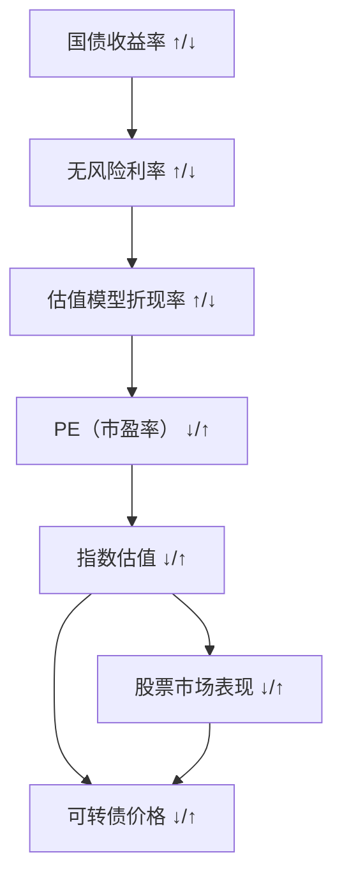

+++
title = 'Invest'
subtitle = ""
date = 2025-08-28T00:12:11+08:00
draft = false
toc = true
tags = []
+++

## 关系图

## 经济周期与投资策略简化总结表

| 经济周期阶段 | 关键特征（增长/通胀/政策）       | 最优资产          | 次优资产         | 规避资产         | 推荐行业                 | 风险提示                   |
| ------------ | -------------------------------- | ----------------- | ---------------- | ---------------- | ------------------------ | -------------------------- |
| **衰退期**   | 增长↓ 通胀↓ 政策：宽松（降息）   | 债券（国债为主）  | 现金（货币基金） | 商品、高风险股票 | 公用事业、医疗保健       | 警惕企业盈利下滑、违约风险 |
| **复苏期**   | 增长↑ 通胀稳 政策：维持宽松      | 股票（权益类）    | 债券（短债）     | 现金             | 金融、可选消费、信息技术 | 避免过度追高早期波动股     |
| **过热期**   | 增长顶 通胀↑ 政策：紧缩（加息）  | 商品（能源/金属） | 周期股（资源类） | 长期债券         | 能源、材料、工业         | 防范通胀超预期、政策加码   |
| **滞胀期**   | 增长↓ 通胀↑ 政策：两难（控通胀） | 现金、黄金        | 必选消费（食品） | 股票、普通债券   | 必选消费、黄金相关       | 警惕“股债双杀”、购买力缩水 |