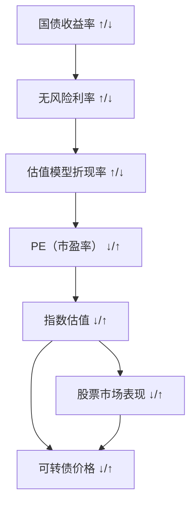

+++
title = 'Invest'
subtitle = ""
date = 2025-08-28T00:12:11+08:00
draft = false
toc = true
tags = []
+++

## 基础概念

📌 指数（Index）

定义：指数是一种 指标，用来反映某一市场、行业或一篮子股票的整体表现。

特点：
- 不能直接买卖（它只是一个数字/公式）。
- 常见的指数：沪深300、标普500、纳斯达克100、中证500等。
- 由一组成分股加权计算得出。
- 代表市场或行业走势，用来衡量市场情绪和整体收益情况。

📌 基金（Fund）

定义：基金是 投资工具，由基金公司募集资金，交给基金经理来投资。
种类：
- 主动型基金：基金经理主动选股择时，试图跑赢市场。
- 被动型基金（指数基金、ETF）：跟踪某个指数，尽量复制指数表现。

特点：
- 你可以买卖基金（ETF可像股票一样交易，公募基金则T+1赎回）。
- 有一定的管理费、托管费。
- 投资门槛低（几十元甚至几元就能买）。

## 关系图

## 经济周期与投资策略简化总结表

| 经济周期阶段 | 关键特征（增长/通胀/政策）       | 最优资产          | 次优资产         | 规避资产         | 推荐行业                 | 风险提示                   |
| ------------ | -------------------------------- | ----------------- | ---------------- | ---------------- | ------------------------ | -------------------------- |
| **衰退期**   | 增长↓ 通胀↓ 政策：宽松（降息）   | 债券（国债为主）  | 现金（货币基金） | 商品、高风险股票 | 公用事业、医疗保健       | 警惕企业盈利下滑、违约风险 |
| **复苏期**   | 增长↑ 通胀稳 政策：维持宽松      | 股票（权益类）    | 债券（短债）     | 现金             | 金融、可选消费、信息技术 | 避免过度追高早期波动股     |
| **过热期**   | 增长顶 通胀↑ 政策：紧缩（加息）  | 商品（能源/金属） | 周期股（资源类） | 长期债券         | 能源、材料、工业         | 防范通胀超预期、政策加码   |
| **滞胀期**   | 增长↓ 通胀↑ 政策：两难（控通胀） | 现金、黄金        | 必选消费（食品） | 股票、普通债券   | 必选消费、黄金相关       | 警惕“股债双杀”、购买力缩水 |

## CPI的 通胀 vs 通缩：经济影响对比表

通过cpi判断

| 指标/影响    | 适度通胀（CPI≈2%）   | 高通胀              | 通缩（负通胀）          |
| -------- | ----------- | ---------------- | ---------------- |
| **消费行为** | 正常消费，预期稳定   | 提前消费（担心未来更贵）     | 推迟消费（预期未来更便宜）    |
| **企业盈利** | 健康增长，利润稳定   | 原材料/人工成本上升，利润被压缩 | 产品卖不出去，利润下降      |
| **债务负担** | 可控，随收入增长可消化 | 债务实际价值下降（对债务人有利） | 债务实际价值上升（对债务人不利） |
| **货币政策** | 政策空间充足      | 可能被迫加息，紧缩流动性     | 降息效果有限，易陷入流动性陷阱  |
| **资本市场** | 股债平衡，资金合理分配 | 资金避险，股市承压，债市抛售   | 债市上涨（避险），股市低迷    |
| **长期影响** | 有利于稳定增长     | 经济过热，可能硬着陆       | 经济低迷，可能长期停滞（如日本） |

---

✅ **一句话总结**：

* **适度通胀**：经济健康，正向循环。
* **高通胀**：货币贬值，经济过热。(21-22美)
* **通缩**：钱变“值钱”，但经济缺乏活力，可能陷入衰退。(23-24中)

## 行业板块, 概念板块

行业板块 → 长期配置

- 适合**中长期投资**，抓住经济发展趋势。
- 例子：
  - 中国长期政策支持新能源 → 电动车、光伏行业值得长期跟踪。
  - 美国科技创新周期 → 芯片、云计算、半导体。
- 策略：通过行业比较（估值、ROE、政策支持度），决定配置哪些行业。

概念板块 → 波段操作
- 适合**短期/中期交易**，跟随市场情绪和政策风口。
- 例子：
  - ChatGPT 概念一出，人工智能板块大涨。
  - “数字货币”消息，相关股炒一波。
- 策略：捕捉新闻、政策、资金流入，做波段操作，但要注意风险（来得快，去得也快）。

