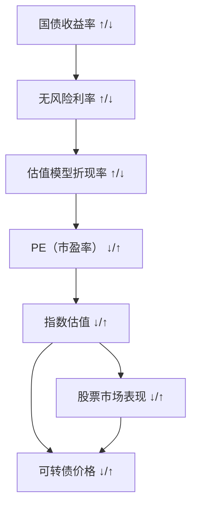

+++
title = 'Invest'
subtitle = ""
date = 2025-08-28T00:12:11+08:00
draft = true
toc = true
tags = []
+++

```mermaid
flowchart TD
    A[国债收益率 ↑/↓] --> B[无风险利率 ↑/↓]
    B --> C[估值模型折现率 ↑/↓]
    C --> D[PE（市盈率） ↓/↑]
    D --> E[指数估值 ↓/↑]
    E --> F[股票市场表现 ↓/↑]
    E --> G[可转债价格 ↓/↑]
    F --> G

    %% 注释：
    %% 国债收益率上升 → 无风险利率上升 → 折现率上升 → PE下跌 → 指数承压 → 可转债价格下跌。
    %% 反之亦然。

```