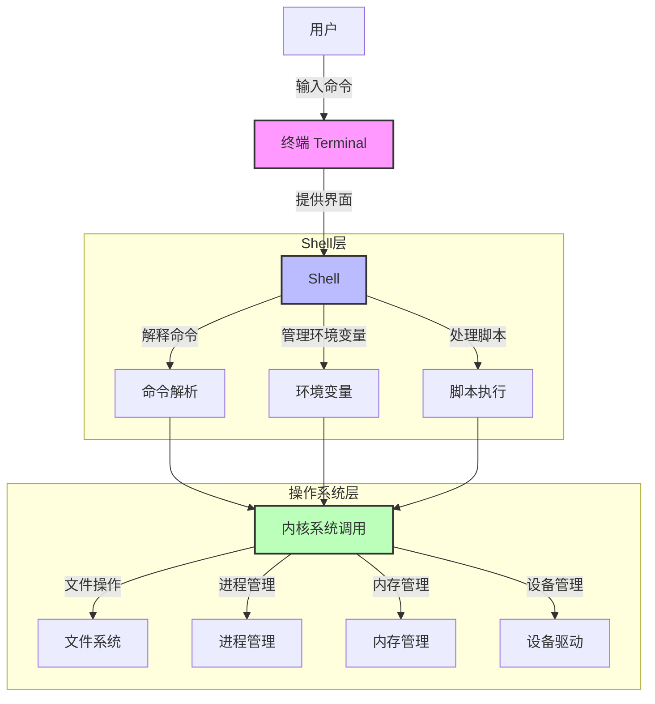

+++
title = 'Linux系统教程'
date = 2023-11-25T11:29:37+08:00
draft = false
toc = true
tags = ["linux"]
+++

[toc]

## 文章目的

希望 linux 初学者可以通过本章内容，快速入门 linux。文章引用了菜鸟教程的优秀文章，以及网络上的一些图片

## linux 的必要性

linux 是一个稳定， 安全， 开源，免费的操作系统内核。 支持多用户同时使用。成为了各大公司服务器的首选。

掌握 Linux 可以提高技术就业竞争力。许多 IT 岗位将熟练使用 Linux 作为必备技能。

## 基于 linux 内核的主流发行版

| 发行版                          | 基础        | 特点描述                                                                                     | 适合用户类型                           | 软件安装工具             |
|---------------------------------|-------------|----------------------------------------------------------------------------------------------|----------------------------------------|--------------------------|
| **Debian**                          | 独立        | 强调自由软件，非常稳定，是许多其他发行版的基础。                                             | 需要高度稳定性的用户                   | `apt`, `apt-get`, `dpkg` |
| **Ubuntu**                          | Debian      | 易于使用，提供桌面和服务器版本，有长期支持版本（LTS）。                                       | 广泛应用于个人电脑、服务器及云计算     | `apt`, `snap`            |
| Fedora                          | 独立        | 包含最新开源软件包和技术，由Red Hat赞助，强调创新和技术领先性。                               | 追求新技术特性的高级用户               | `dnf`                    |
| Red Hat Enterprise Linux (RHEL) | 独立        | 面向企业的付费发行版，提供高度的安全性和稳定性，适合关键业务应用。                           | 企业级用户                             | `yum` / `dnf`            |
| SUSE Linux Enterprise (SLE)     | 独立        | 企业级发行版，在欧洲市场流行，openSUSE为社区版本，提供Leap（稳定）和Tumbleweed（滚动发布）。 | 需要企业级服务和支持的用户             | `zypper`                 |
| **Arch Linux**                      | 独立        | 滚动发布，适合喜欢自己动手定制系统的高级用户，始终获得最新的软件包。                         | 技术爱好者和高级用户                   | `pacman`                 |
| **Manjaro**                         | Arch Linux  | 提供更友好的安装过程和默认设置，基于Arch Linux但对新手更加友好。                             | 新手及希望体验Arch Linux的用户         | `pacman`                 |
| **Linux Mint**                      | Ubuntu      | 提供更加传统的桌面体验，默认带有媒体编解码器等实用工具，非常适合从Windows过渡过来的新手用户。 | Windows用户迁移或寻求简单易用的用户   | `apt`                    |
| Elementary OS                   | Ubuntu      | 受macOS启发的设计风格，美观且直观的桌面环境，旨在提供简洁高效的计算体验。                    | 寻求美观高效界面的用户                 | `apt`                    |


```bash
# 查看发行版
cat /etc/os-release
```

## 初级阶段

### systemd服务管理器

systemd 是 Linux 系统中一个强大的初始化系统和服务管理器

systemctl 是 systemd 的一个命令行工具，用于管理 systemd 系统和服务。通过 systemctl，我们可以方便地控制系统和服务的启动、停止、重启、查看状态等

以mysql为例子

```bash
# 查看所有服务
systemctl list-units --type=service
systemctl status mysql
systemctl start mysql
systemctl stop mysql
systemctl restart mysql
systemctl reload mysql
# 开机自动启动
systemctl enable mysql
systemctl disable mysql

```

### 用户与 Linux 系统交互的基本原理

用户使用终端（Terminal）通过**命令或脚本**与 Shell 进行通信， shell 与操作系统进行通信




相关概念总结:

| 名称  | 作用                                                                                                                 |
| ----- | -------------------------------------------------------------------------------------------------------------------- |
| 终端  | 一个供用户输入的黑框                                                                                                 |
| shell | 一个命令解释器，它不仅仅是提供了**命令解释**的功能，还**允许用户编写脚本**，将多个命令组合在一起以完成更复杂的任务。 |
| 命令  | 操作系统中提供的工具（可执行文件），供用户使用。                                                                     |

### shell相关知识

1. 常见的 linux shell 包括： bash(默认 shell), zsh, fish, csh, dash

2. bash 的配置文件:

| 状态                      | 文件路径                                   |
| ------------------------- | ------------------------------------------ |
| 非登录(子shell)           | ~/.bashrc                                  |
| 登录(首次登录系统的shell) | ~/.bash_profile, ~/.bash_login, ~/.profile |

加载配置文件的配置到当前 bash： source ~/.bashrc

3. shell启动和退出时加载的文件

| 文件路径                          | 描述                                                     | 设置内容      |
| --------------------------------- | -------------------------------------------------------- | ------------- |
| `/etc/profile`                    | 所有用户的默认环境设置                                   |               |
| `/etc/bash.bashrc`                | 全局 Bash 配置文件                                       |               |
| `~/.bash_profile`                 | 用户级的 登录Shell(首次登录系统的shell) 配置文件         |               |
| `~/.profile`                      | 没有 `~/.bash_profile` 时被读取, 通常会调用  `~/.bashrc` | 环境变量, bin |
| `~/.bashrc`                       | 用户级的 非登录Shell(子shell) 配置文件                   | alias, 函数   |
| `~/.bash_logout`                  | 用户注销时执行的脚本                                     |               |
| `~/.inputrc`                      | 配置 readline 库的行为                                   |               |
| `~/.Xresources` 或 `~/.Xdefaults` | 配置 X11 环境                                            |               |
| `~/.xsession` 或 `~/.xinitrc`     | 启动图形界面会话时读取的文件                             |               |


### 命令

命令学习手册： man 命令。 可以查看命令的作用和相关参数

命令的优势

-   相比于图形界面 GUI，命令可以更方便的通过脚本，自动化执行一系列的操作
-   输入命令，完成各种操作，比图形界面 GUI 更高效

### 环境变量

1. 概念 

操作系统提供给程序的一种配置机制, 以键值对存储，它可以存储系统和用户自定义的配置信息。通过设置环境变量，我们可以灵活地配置程序的行为，提高系统的可配置性和可移植性。

2. 重要的环境变量

| 名称  | 作用                                                                               |
| ----- | ---------------------------------------------------------------------------------- |
| PATH  | 指定了可执行文件的搜索路径，使得在命令行中可以直接运行这些程序，而无需输入完整路径 |
| USER  | 当前用户                                                                           |
| HOME  | 家目录                                                                             |
| SHELL | 当前shell类型                                                                      |

3. 增删改查

```bash
# 查
env
env | grep path

# 增改

# 仅终端设置, 关闭终端后, 设置的环境变量失效
export AAA=111
# 用户级别设置, 影响所有后续登录的终端
echo 'export AAA=111' >> ~/.bashrc
source ~/.bashrc

# 删除
unser AAA

```

### ssh

ssh 是一种**安全的网络协议**。 可以安全的远程连接电脑。

远程连接的意义

-   方便随时随地的查看状态，处理故障
-   可以远程连接多个地区的服务器，统一管理
    可以看出 远程连接服务器的优势： **高效，安全**

相关命令

-   ssh 用户名@服务器IP地址

### scp

```bash
scp localfile.txt username@remoteip:/directory
scp username@remoteip:/file.txt /local_directory

scp -r localfiles username@remoteip:/directory
scp -r username@remoteip:/directory /local_directory

```

### sftp

```bash

```

### 文件管理

linux 中 一切皆文件

linux 目录结构：<https://www.runoob.com/linux/linux-system-contents.html>

文件类型:
- 文件 f
- 文件夹 d
- 符号链接 l

文件路径分类

-   绝对路径
    -   从根目录/开始
-   相对路径
    -   . 当前路径
    -   .. 当前路径的上级路径

相关命令

-   最基本命令
    -   pwd ：当前绝对路径
    -   cd 路径：移动
    -   ls ：查看当前文件夹内容
        -   `ls -1 | wc -l`: 查看文件夹内的文件数量
    -   tree： 以树形结构查看当前文件夹内容
        -   `tree -L 2`:  查看两层深度
-   文件文件夹相关

    -   mkdir 文件夹名： 创建文件夹
        -   mkdir -p fold1/{subfold1,subfold2}
    -   touch 文件名：创建文件
    -   rm 文件名： 删除文件或文件夹
    -   mv 文件名 移动位置： 移动文件或文件夹
    -   cp 文件名 新文件名：复制文件或文件夹
    -   cat 文件名：查看文件
    -   tail 文件名：查看文件末尾


#### 文件共享

/tmp：

通常用于存放临时文件，可能位于磁盘或内存中，具体取决于系统配置。
适合存放需要在系统重启后仍然保留的临时数据。

/dev/shm：

专为共享内存设计，位于 RAM 中，访问速度更快。
适合存放需要高速访问且不需要持久化的数据。


#### 打包和压缩

| 属性             | tar(打包)+gzip(压缩, 大小约为打包文件的 1/7) | zip                          |
| ---------------- | -------------------------------------------- | ---------------------------- |
| 文件后缀         | `.tar.gz` 或 `.tgz`                          | `.zip`                       |
| 多文件支持       | 使用 `tar` 打包多个文件并压缩                | 原生支持多文件和目录结构     |
| 压缩率           | 高，适合大文件和数据集                       | 一般，适合较小的文件或目录   |
| 兼容性           | Linux/Unix 中常用工具，Windows 较少用        | Windows、Mac、Linux 全面支持 |
| 是否支持加密     | 不支持，需借助其他工具                       | 支持基本密码加密             |
| 是否支持分卷压缩 | 不支持                                       | 支持                         |

命令:

```bash
# tar
tar -czvf xxx.tar.gz f1 f2 f3
tar -xzvf xxx.tar.gz

# zip
zip -r xxx.zip f1 f2
unzip xxx.zip -d xxx
```

#### Shell 通配符模式（Glob Pattern）

Glob Pattern (Shell 通配符模式): 是一种用于**匹配文件名**的模式匹配工具，广泛应用于 Unix 和类 Unix 操作系统（如 Linux 和 macOS）的命令行界面中

regex: 更适合细致或复杂的文本分析

字符集功能:

在 ASCII 编码中：

数字字符（0-9）按顺序排列。
小写字母（a-z）按顺序排列。
大写字母（A-Z）按顺序排列。


```bash
# * 匹配任意数量的任意字符
*.jpg
*report*

**/*.txt

# ? 匹配任意单个的任意字符

?.txt

# []
[1-9].jpg
[a-z].jpg
[A-Z].jpg

# [!]
[!A].jpg # 匹配除了A的其他字符

```

#### find 删除


仅用于文件名匹配

文本处理


```bash
# yeshi duocengji?
find . -name "*your-regex-pattern*" -print
find . -name "*your-regex-pattern*" -delete

# 多层级
find . -wholename "./**/*4eaG8*"

# # 正则
# find . -maxdepth 1 -regex ".*your-regex-pattern.*" -print
# find . -maxdepth 1 -regex ".*your-regex-pattern.*" -delete
```

#### diff比较

```bash
# 比较文件
diff file1/ file2/

# 比较文件夹
diff -r dir1/ dir2/
```

### 编辑配置 ~/.xxxrc file settings

-   ~/.bashrc

    ```bash
    # auto ls
    function cd {
        builtin cd "$@" && ls
    }

    # alias
    alias ls='ls --time-style=long-iso'
    alias ll='ls -alFh'
    
    # browser
    alias edge='microsoft-edge'
    alias chrome='google-chrome'

    ```
- ~/.profile
    ```bash

    ```
-   ~/.vimrc

    ```bash
    syntax on
    set autoindent
    set tabstop=4
    set shiftwidth=4
    set cursorline
    set backup
    set backupdir=~/.vim/undo
    ```

-   ~/.nanorc

    ```bash
    include "/usr/share/nano/*.nanorc"
    set tabsize 4
    set backup
    ```

### nano编辑

快捷键用如下方式进行表示：
控制键序列使用一个“^”符号标记，它可以用 Ctrl键或按 Esc 键两次的方式进行输入。
Meta 键序列使用“M-”符号标记，它可以用Alt、Cmd 或 Esc 键输入，具体取决于您的键盘设置。

| 快捷键 | 功能描述 |
|--------|----------|
| ^G     (F1)   |   显示帮助 |
| ^X     (F2)   |   关闭当前缓冲区 / 离开 nano |
| M-U           |   撤销上次操作 |
| M-E           |   重做撤销的操作 |
| M-Q           |   向后搜索下一个出现位置 |
| M-W           |   向前搜索下一个出现位置 |
| ^D     (Del)  |   删除游标之下的字符 |
| M-Del         |   去除当前行（或者标记的行） |


### vi/vim 编辑

配置文件 ~/.vimrc

三种模式

-   命令模式
    -   操作
        -   查找： / 关键字 ， 之后按 n 找下一个匹配， 按 N 找上一个匹配
-   编辑模式
    -   进入方式
        -   a 增加的方式进入编辑模式
        -   i 插入的方式进入编辑模式
        -   o 另起一行的方式进入编辑模式
    -   退出方式
        -   esc
-   末行模式
    -   进入方式
        -   : 进入末行模式
    -   退出方式
        -   enter 退出末行模式
    -   操作
        -   退出保存 wq
        -   退出不保存 q!
        -   

### 磁盘管理

相关命令

-   `df -h` ：检查pc的磁盘空间占用情况
-   `du -hd 1 | sort -rh` ：查看各文件大小, 有些文件看不到
-   `du -sh * | sort -rh` ：查看各文件大小

### 软件安装

如果下载很慢的话，需要**切换下载源**

相关命令

-   ubuntu
    -   sudo apt update && sudo apt upgrade : 更新
    -   sudo apt install xxx : 下载
    -   sudo apt remove xxx : 卸载
-   centos
    -   yum update : 更新
    -   yum install xxx : 下载
    -   yum remove xxx : 卸载

## 中级阶段


### 文件权限和用户管理

> linux 系统支持**多用户同时使用**。可以为每个用户设置群组， 通过群组间接进行权限控制. 
> 组的主要作用是简化权限管理.
> 超级用户 root, 拥有最高权限. 
> 普通用户, 拥有有限的权限. 
> sudo 命令 提升权限 visudo.  `sudo -i`

用户 和 组 是 多对多的关系

文件信息

-   /etc/passwd 用户的信息文件
-   /etc/group 用户组的信息文件   


#### FilePermission

[Linux 文件基本属性 | 菜鸟教程 (runoob.com)](https://www.runoob.com/linux/linux-file-attr-permission.html)

权限分类

-   r 4 读权限(read)
-   w 2 写权限(write)
-   x 1 执行权限(execute)

常用权限

-   755： 自己可读可写可执行，用户组和其他人可读可执行，不可写
-   700： 自己可读可写可执行，用户组和其他人没有任何权限


文件权限的设置

```bash
# 查看权限 
ls -l

chown -R newowner:newgroup filename
chown :newgroup filename
chmod -R 775 filename
```


#### Group

组的增删改查

```bash
getent group
groupadd 组名
groupmod -n 新组名 旧组名
groupdel 组名
```

#### User

组中 用户的增删改查

```bash
# 组内用户
getent group 组名
# 组内用户
id 用户名


gpasswd -a 用户名 组名
gpasswd -d 用户名 组名
```


### 进程管理

相关概念

-   进程：操作系统进行资源分配的基本单位
-   线程：进程中最小的执行单位
-   协程：用户态线程

进程分类

-   孤儿进程
-   僵尸进程

相关命令

-   top ：查看进程，内存，交换空间等， 相当于 windows 的 任务管理器
-   htop：top 的彩色加强版， 需要安装
-   glances: top 的彩色加强版 plus，需要安装
-   ps ：查看进程
-   kill -9 pid：杀死进程

 htop, ppid
 ps -p 4155167 -o pid,ppid,cmd

#### shell 后台作业

一个shell 可以同时运行多个进程. 有的可见, 有的不可见. 就像桌面, 多窗口切换

```bash
# 暂停前台任务，将其放到后台
ctrl+z
# 终止指定的后台任务
kill %<job_id>

# 后台关闭也始终运行
# 默认输出 nohup.out
nohup 命令 &
# 指定文件输出
nohup 命令 > output.log 2>&1 &
```

## 高级阶段

### 网络管理

常用命令

-   ifconfig
-   ping
-   curl
    ```bash
    # 网上文件下载
    curl httpaddr -o filename
    # 发送post请求
    curl -X POST "http://xxxxx" -H "" -d'{"k1":"v1", "k2":"v2"}'
    ```

- wget
```bash
wget -O docker-compose.yml https://github.com/immich-app/immich/releases/latest/download/docker-compose.yml
```

#### 查看port

本机

```bash
netstat -tulnp | grep :3306
ss -tulnp | grep 3306
lsof -i:3306

kill -9 3306
```

远程机器

```bash
curl ip:port
```
### 防火墙

常用命令

-   iptables

### shell 脚本

概念： 在文件中，按照语法规则，编写一系列的能够被 shell 解释的**shell 命令**，供操作系统执行， 这个文件就是 shell 脚本。 通常命名为\*.sh

shell 脚本的优势：

-   **自动化执行一系列操作**，无需手动一个一个命令的执行
-   可以设置定时执行
-   学习难度不大

主要学习内容：

-   编写范式
-   判断
-   条件
-   循环
-   函数
-   debug

学习 link： https://wangdoc.com/bash/intro

```bash
# 查看系统已经配置的shell
cat /etc/shells
```

示例shell:

- 首行, 指明文件类型
- 设置安全检查

```bash
#!/bin/sh
set -eu

```

#### 安全检查工具

shellcheck


### 文件服务

```bash
cd target_path
python -m http.server 8080
```

局域网访问文件


### 路径跳转

- autojump


autojump 会根据你访问目录的频率来“记住”你常去的路径, 智能模糊匹配, 

安装:

```bash
apt install autojump

# 在 ~/.bashrc 添加
[[ -s /usr/share/autojump/autojump.sh ]] && source /usr/share/autojump/autojump.sh


source ~/.bashrc

```

```bash
# 路径导航
j xxx
# 查看权重
j -s 
```

- alias

命令缩写

```bash
alias ll='cd /aa/bb/cc'
```

查看 alias
```bash
alias
```

