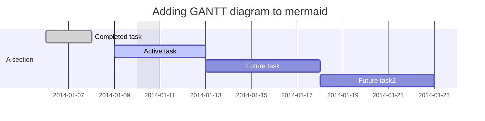
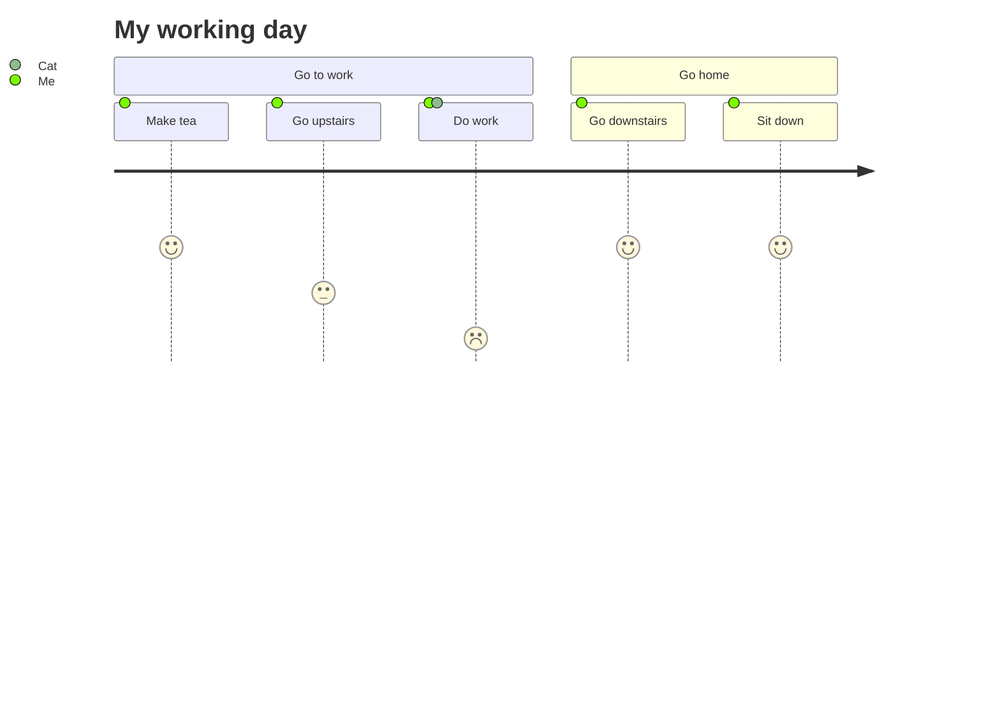
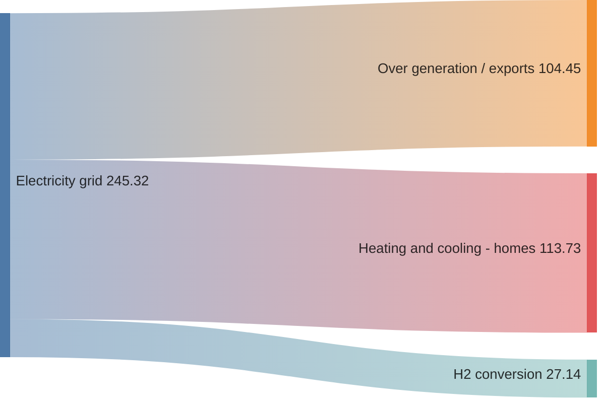
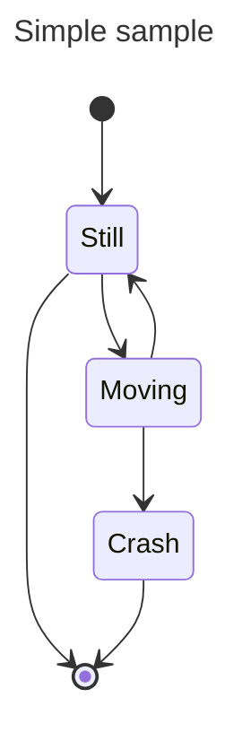
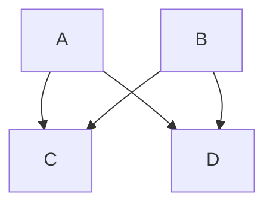
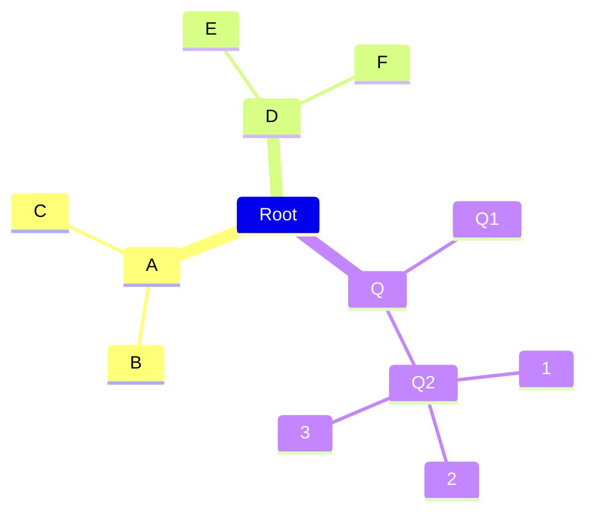

+++
title = 'Markdown'
subtitle = ""
date = 2024-05-25T15:47:33+08:00
draft = false
toc = true
tags = ['tools']
+++

<!-- [TOC] -->

## 参考链接

-   https://markdown.com.cn/basic-syntax/headings.html
-   https://mermaid.js.org/intro/

## 基础

-   标题
    -   # title
-   ## 无序列表
    -
    *
-   分割线
    -   ***
-   有序列表
    1. aaa
    1. bbb
-   取消 markdown 语法
    -   代码块
        -   多行代码
            ```python
            print('hello')
            ```
        - 单行代码 `cmd`
    -   转义
        -   \
-   字体
    - **字体加粗**
    - _斜体_
    - **_粗斜体_**
-   引用块
    > 法斯蒂芬森地方
    > 法斯蒂芬森地方
    > 法斯蒂芬森地方
    >> sdfsdfsdf
    >> sdfsdfsdf
    >>> sdfsdfsdf
-   换行
    -   <br>
-   注释
    -   <!--  fdgdfgfdgdf -->

## 进阶

-   图片
    -   
-   超链接地址
    -   [link1](地址)
    -   <a href="">link2</a>
-   表格
    | 左对其 | 居中 | 右对其 |
    | --- | :---: | ---: |
    | top1 | 1222222 | 2212 |
    |  | 6565 | 656565656 |
    | top2 | 6565 | 656565656 |
    |  | 6565 | 656565656 |
-   html
    -   设置各种 css 颜色
-   勾选框
    - [x] 添加停用词配置
    - [ ] 预览 背景混乱
-   数学公式
    -   $E = mc^2$
    -   $$E = mc^2$$

## 高级

Mermaid Diagram













