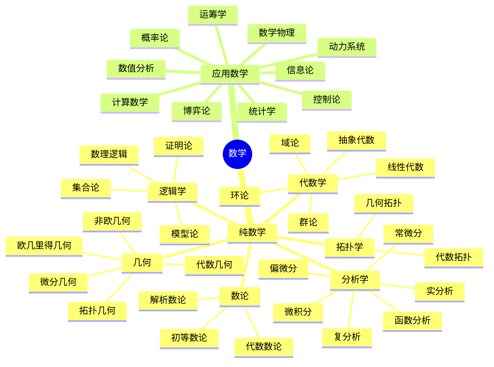

+++
title = 'Math'
subtitle = ""
date = 2025-11-11T14:47:44+08:00
draft = true
toc = true
series = []
+++

* root((数学))
    * 纯数学
      * 数论
        * 初等数论
        * 代数数论
        * 解析数论
      * 代数学
        * 抽象代数
        * 群论
        * 环论
        * 域论
        * 线性代数
      * 几何
        * 欧几里得几何
        * 非欧几何
        * 微分几何
        * 代数几何
        * 拓扑几何
      * 拓扑学
        * 代数拓扑
        * 几何拓扑
      * 分析学
        * 微积分
        * 实分析
        * 复分析
        * 函数分析
        * 常微分
        * 偏微分
      * 逻辑学
        * 数理逻辑
        * 集合论
        * 模型论
        * 证明论
    * 应用数学
      * 概率论
      * 统计学
      * 运筹学
      * 数值分析
      * 动力系统
      * 控制论
      * 信息论
      * 计算数学
      * 博弈论
      * 数学物理

