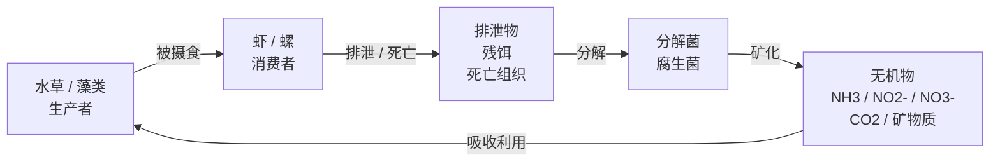

+++
title = 'My Sys'
subtitle = ""
date = 2025-12-28T22:33:38+08:00
draft = false
toc = true
series = ['life']
+++

## 生态系统构建

所有生态系统都遵循：

能量单向流动，物质循环

### 控制光照

光 是能量的起点

太阳光 = 强 + 随机 + 不可控

- 水草灯
- 全光谱植物灯
- CRI 高的 LED

植物光合作用： 光能 + CO₂ + 水 → 有机物 + 氧气

### 补水（不是频繁换水）

纯净水 / RO 水 / 蒸馏水

### 稳定的生物层级

生产者：水草
初级消费者：虾、螺
分解者：细菌、真菌

👉 没有顶级捕食者

### 分类

- 淡水生态
- 半水半陆湿地系统
- 陆地微生态系统 昆虫 光和湿度是核心

### 虾缸

先养系统

前 7–14 天：什么都别放

#### 水草：

- 莫丝（核心）
- 小榕
- 水榕
- 迷你椒草

#### 樱花虾 / 米虾（红、黄、蓝都行）

10–15 只起步
喂食：一周 1–2 次

#### 螺

生态辅助，不是主角

推荐：

- 角螺
- 洋葱螺

不建议：

苹果螺（繁殖太快）

### 新缸

氨 → 目标0
亚硝酸盐 → 目标0
硝酸盐 → 目标<20ppm

（靠换水+加硝化细菌+植物控制）

### 过滤

作用：

- 水流动，让水质均匀，氧气充足
- 让水“看起来”清
- 对水体稳定很友好

进水口一定要加海绵

过滤里会住满硝化细菌
洗过滤器（用鱼缸换出来的旧水冲洗，别用自来水，避免杀死硝化细菌）

建立硝化系统：过滤盒里加入「硝化细菌滤材」（陶瓷环、石英球、生化棉，优先铺在过滤中层 / 下层），然后倒入瓶装硝化细菌（按说明书剂量，新手建议加倍）。

### 工具

- 用吸管吸走
- 镊子
- 渔网
- 定时插座
- 加热棒

### 虾缸升级鱼缸

先养好草，再养鱼
植物量 > 动物量

让系统重新回到“植物主导”。

小型群游鱼

- 米鱼
- 斑马鳉

饲料：
30 秒内吃完

接受鱼的生老病死

买了一个鱼缸35×21×23 cm ,配有灯，过滤. 养了 1条银河潜艇鼠， 4条孔雀鱼，8条斑马鱼，5条极火虾，6条蓝宝石虾.

- 上层：灯鱼 / 孔雀鱼（少量）
- 中层：群游鱼活动区
- 底层：虾 + 螺
- 基质：微生物 + 细菌
- 植物：水草 + 藻

35×21×23 cm 缸， 17升小缸

“养鱼先养水”是铁律。“养水”的核心是建立硝化系统：

#### 换水

新缸前 2 周：
2 天换 1/3

稳定后：
一周 1 次 1/3

换水工具：

吸砂面上方 1～2 cm

温度 ph值

#### 灯光控制（防爆藻）

每天 6～7 小时

| 事项     | 频率              | 要点与目的                                            |
| :------- | :---------------- | :---------------------------------------------------- |
| 喂食     | 每天1次或每2天1次 | 鱼粮：30秒内吃完为佳。可偶尔喂煮熟的菠菜/虾粮。       |
| 换水     | 每周1次           | 换约1/4晾晒过的水，用软管抽走底部残渣。绝对不要全换！ |
| 清洗滤棉 | 每月1-2次         | 仅用原缸水轻轻漂洗，保留大部分硝化细菌。              |

#### TODO

优先重植被+虾为主。

水草覆盖底面积 ≥ 50%

加莫斯、水榕 、皇冠草、金鱼藻

至少一大块莫斯（强烈建议）

用镊子 斜着插
插进去后 轻轻往上提 0.5 cm
不要把茎埋进砂里（会烂）

莫斯
极火 / 蓝：10 只

角螺（首选）1～2 只
蜜蜂螺 2 只
 

再减少 2-3 条斑马鱼（斑马鱼群游，最少保留 5 条即可）。
6～8 条（总数） 

### 常见问题

水浑（喂多了或硝化系统没建立）、
鱼浮头（缺氧，检查过滤或换水）、
虾死亡（水质不好或被攻击）、
鱼生病（隔离治疗）。

