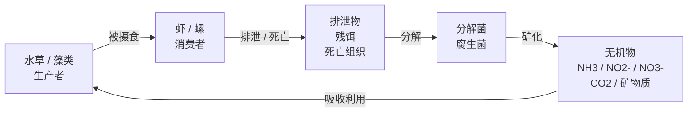

+++
title = 'My Sys'
subtitle = ""
date = 2025-12-28T22:33:38+08:00
draft = false
toc = true
series = ['life']
+++

## 生态系统构建

所有生态系统都遵循：

能量单向流动，物质循环

### 控制光照

光 是能量的起点

太阳光 = 强 + 随机 + 不可控

- 水草灯
- 全光谱植物灯
- CRI 高的 LED

植物光合作用： 光能 + CO₂ + 水 → 有机物 + 氧气

### 补水（不是频繁换水）

纯净水 / RO 水 / 蒸馏水

### 稳定的生物层级

生产者：水草
初级消费者：虾、螺
分解者：细菌、真菌

👉 没有顶级捕食者

### 分类

- 淡水生态
- 半水半陆湿地系统
- 陆地微生态系统 昆虫 光和湿度是核心

### 虾缸

先养系统

前 7–14 天：什么都别放

#### 水草：

- 莫丝（核心）
- 小榕
- 水榕
- 迷你椒草

#### 樱花虾 / 米虾（红、黄、蓝都行）

10–15 只起步
喂食：一周 1–2 次

#### 螺

生态辅助，不是主角

推荐：

- 角螺
- 洋葱螺

不建议：

苹果螺（繁殖太快）

### 虾缸升级鱼缸

先养好草，再养鱼
植物量 > 动物量

让系统重新回到“植物主导”。

小型群游鱼

- 米鱼
- 斑马鳉

饲料：

30 秒内吃完
宁可饿一点

接受鱼的生老病死

