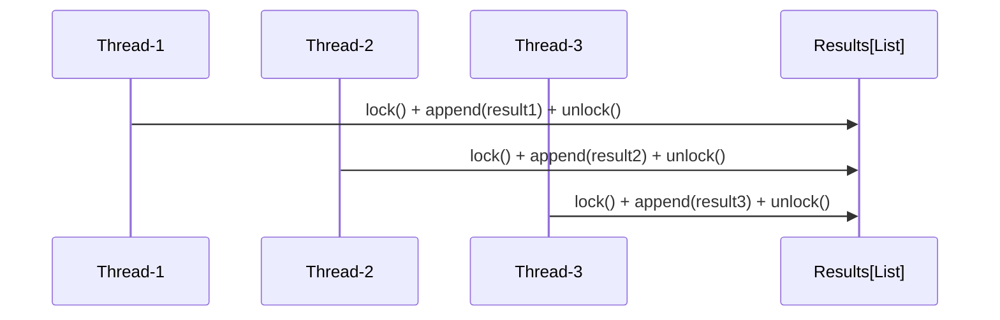
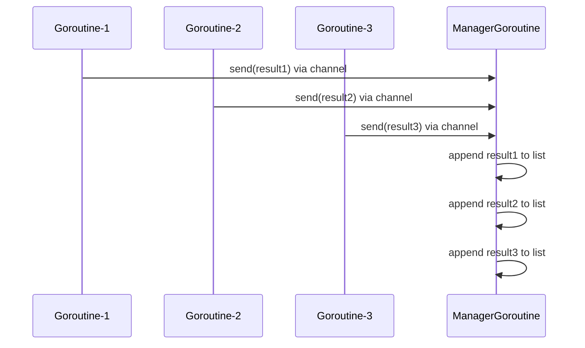

+++
title = 'Concurrent'
subtitle = ""
date = 2026-03-11T23:35:32+08:00
draft = true
toc = true
series = ["tech"]
+++

## 核心概念

并发 (Concurrency)：多个任务在同一时间段内交替执行（逻辑上同时），如单核 CPU 上的多线程。
并行 (Parallelism)：多个任务在同一时刻同时执行（物理上同时），如多核 CPU 上的多进程。

进程（Process）操作系统资源分配的基本单位，拥有独立的地址空间、内存、数据栈等. CPU密集型
线程（Thread）CPU 调度的基本单位，属于同一个进程，共享进程的内存空间. IO密集型
协程（Coroutine）IO密集型

异步 IO 的执行逻辑（通俗版）：
异步 IO 是「单线程里的事件循环」，所有协程（爬取 / 写入任务）都在同一个线程里执行，且同一时间只执行一个协程的代码—— 只有当某个协程遇到「IO 等待」（比如等网页响应、等 Redis 网络返回）时，才会主动把控制权交还给事件循环，切换到下一个协程。

## 安全问题

统一加锁
共享资源修改 = 串行；并行修改 = 数据竞态 = 不安全。

python

多人同时编辑文档，需要锁

go

只有一个人编辑，别人写信告诉他

结果管理者 goroutine 串行处理消息

**其余步骤是并发的,结果写入是串行**

