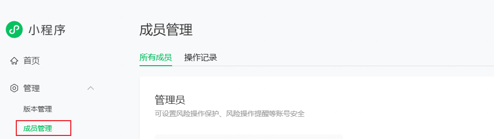

+++
title = 'Wechat App'
subtitle = "客户与开发者合作注册微信小程序流程"
date = 2026-03-31T00:21:10+08:00
draft = false
toc = true
series = ["web"]
+++

## 微信小程序注册限制

| 主体类型                  | 可注册小程序数量上限 | 备注                        |
| :------------------------ | :------------------- | :-------------------------- |
| 个人主体（身份证）        | 5 个                 | 每个邮箱只能申请 1 个小程序 |
| 个体工商户                | 5 个                 | 主管理员必须为法人          |
| 企业 / 政府 / 媒体 / 组织 | 50 个                | 适用于多业务线布局          |

**关键原则**：

- 一个小程序账号只能对应发布一个小程序
- 数量限制基于"主体"（营业执照或身份证）
- 每个小程序需要独立的、未被注册过的邮箱
- 2025年新规：每个小程序需独立完成备案

---

## 合作流程

### 阶段一：前期准备

#### 客户需要准备

- [ ] 营业执照（企业）或身份证（个人）
- [ ] 未注册过微信小程序的邮箱
- [ ] 企业对公账户信息（如需微信认证）
- [ ] 小程序名称、功能描述、类目

#### 开发者需要提供

- [ ] 开发需求清单（功能列表、页面设计）
- [ ] 开发周期预估
- [ ] 费用报价（开发费、认证费、服务器等）

---

### 阶段二：客户注册小程序账号

**建议**：由客户自行注册，确保所有权归属客户。

#### 注册步骤

1. 访问 [微信公众平台](https://mp.weixin.qq.com/)
2. 点击"立即注册"，选择"小程序"
3. 填写邮箱、密码、账号名称
4. 选择主体类型（个人/企业）
5. 填写主体信息并验证
6. 完成注册

#### 等待审核

- 企业：1-7个工作日
- 个人：通常即时或1-3个工作日

---

### 阶段三：设置开发者权限

#### 客户操作

1. 登录小程序后台
2. 进入"设置" → "人员设置"
3. 点击"绑定开发者"
4. 输入开发者的微信号/QQ号
5. 选择权限级别：
    - **开发者**：可开发、调试、提交代码
    - **体验者**：仅可体验测试版本
    - **项目成员**：拥有部分管理权限

#### 开发者操作

1. 收到邀请通知
2. 在微信中确认接受邀请
3. 登录 [微信开发者工具](https://developers.weixin.qq.com/miniprogram/dev/devtools/download.html) 验证权限

---

### 阶段四：备案（2025新规）

#### 客户操作

- [ ] 准备备案材料（营业执照、法人身份证等）
- [ ] 在小程序后台提交备案申请
- [ ] 等待管局审核（7-20个工作日）

**注意**：个人/个体户首次备案需逐个顺序提交，无法同时进行。

---

### 阶段五：开发与发布

#### 开发者工作

1. 使用开发者工具创建项目
2. 开发功能、调试代码
3. 提交代码审核
4. 协助客户通过审核

#### 客户配合

- 提供必要的设计素材、文案
- 测试体验版并反馈
- 审核通过后正式发布

---

## 权限管理说明

| 权限级别     | 可操作内容                   | 建议授予对象   |
| :----------- | :--------------------------- | :------------- |
| **开发者**   | 代码开发、提交审核、版本管理 | 核心开发人员   |
| **体验者**   | 体验测试版本                 | 测试人员、客户 |
| **项目成员** | 部分管理权限（可自定义）     | 长期合作伙伴   |

---

## 费用说明

| 费用项           | 金额     | 承担方 | 说明             |
| :--------------- | :------- | :----- | :--------------- |
| 微信认证费       | 300元/年 | 客户   | 企业小程序必需   |
| 服务器/域名      | 按需     | 客户   | 自行选择服务商   |
| 开发费用         | 协商确定 | 客户   | 一次性或分期支付 |
| 维护费用（可选） | 协商确定 | 客户   | 按年或按次收费   |

---

## 常见问题

### Q：为什么要客户自己注册账号？

**A**：确保小程序所有权归属客户，避免后续纠纷。

### Q：开发者可以用自己的账号注册吗？

**A**：不推荐。如果开发者账号注册，所有权属于开发者，后续转让手续复杂且有限制。

### Q：权限设置错了怎么办？

**A**：客户可在后台随时修改或取消开发者权限。

### Q：备案失败了怎么办？

**A**：查看驳回原因，修改后重新提交。个人主体备案相对严格。

### Q：开发完成后，开发者还需要保留权限吗？

**A**：如无后续维护需求，建议移除开发者权限，保障账号安全。

---

## 注意事项

1. **账号安全**：客户的账号密码、支付密钥等敏感信息不应由开发者保管
2. **代码交付**：开发完成后应向客户交付完整源代码
3. **文档移交**：提供操作手册、维护文档
4. **续费提醒**：提醒客户及时续费（认证、服务器等）
5. **合同约定**：建议签署书面合同，明确双方权责

---

## 相关链接

- [微信小程序官方文档](https://developers.weixin.qq.com/miniprogram/introduction/)
- [微信开发者工具下载](https://developers.weixin.qq.com/miniprogram/dev/devtools/download.html)
- [小程序备案指南](https://developers.weixin.qq.com/miniprogram/dev/framework/operation.html)
