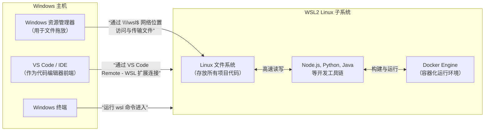

+++
title = 'Win Shell'
subtitle = ""
date = 2024-11-12T20:32:30+08:00
draft = false
toc = true
series = ['windows']
+++


## cmd

```cmd
# 环境变量的增删改查

set
set Path

set Path=xxx
set Path=%Path%;xxx

set Path=
```

## windows powershell 5

windows自带 shell
```powershell
$PSVersionTable 5.x.x
```

## powershell7

跨平台shell， 需要商店单独安装

```powershell
$PSVersionTable 7.x.x
```


```powershell
# 环境变量的增删改查

ls env:
ls env:MY_VAR*
$env:MY_VAR

$env:MY_VAR = "InitialValue"
$env:MY_VAR += ";new_value"

rm env:MY_VAR


```

### 查看自带缩写

```powershell
gal

位于命令管道位置 1 的 cmdlet Invoke-WebRequest
请为以下参数提供值:
Uri:
PS C:\Users\xxx> gal

CommandType     Name                                               Version    Source
-----------     ----                                               -------    ------
Alias           % -> ForEach-Object
Alias           ? -> Where-Object
Alias           ac -> Add-Content
Alias           asnp -> Add-PSSnapin
Alias           cat -> Get-Content
Alias           cd -> Set-Location
Alias           CFS -> ConvertFrom-String                          3.1.0.0    Microsoft.PowerShell.Utility
Alias           chdir -> Set-Location
Alias           clc -> Clear-Content
Alias           clear -> Clear-Host
Alias           clhy -> Clear-History
Alias           cli -> Clear-Item
Alias           clp -> Clear-ItemProperty
Alias           cls -> Clear-Host
Alias           clv -> Clear-Variable
Alias           cnsn -> Connect-PSSession
Alias           compare -> Compare-Object
Alias           copy -> Copy-Item
Alias           cp -> Copy-Item
Alias           cpi -> Copy-Item
Alias           cpp -> Copy-ItemProperty
Alias           curl -> Invoke-WebRequest
Alias           cvpa -> Convert-Path
Alias           dbp -> Disable-PSBreakpoint
Alias           del -> Remove-Item
Alias           diff -> Compare-Object
Alias           dir -> Get-ChildItem
Alias           dnsn -> Disconnect-PSSession
Alias           ebp -> Enable-PSBreakpoint
Alias           echo -> Write-Output
Alias           epal -> Export-Alias
Alias           epcsv -> Export-Csv
Alias           epsn -> Export-PSSession
Alias           erase -> Remove-Item
Alias           etsn -> Enter-PSSession
Alias           exsn -> Exit-PSSession
Alias           fc -> Format-Custom
Alias           fhx -> Format-Hex                                  3.1.0.0    Microsoft.PowerShell.Utility
Alias           fl -> Format-List
Alias           foreach -> ForEach-Object
Alias           ft -> Format-Table
Alias           fw -> Format-Wide
Alias           gal -> Get-Alias
Alias           gbp -> Get-PSBreakpoint
Alias           gc -> Get-Content
Alias           gcb -> Get-Clipboard                               3.1.0.0    Microsoft.PowerShell.Management
Alias           gci -> Get-ChildItem
Alias           gcm -> Get-Command
Alias           gcs -> Get-PSCallStack
Alias           gdr -> Get-PSDrive
Alias           ghy -> Get-History
Alias           gi -> Get-Item
Alias           gin -> Get-ComputerInfo                            3.1.0.0    Microsoft.PowerShell.Management
Alias           gjb -> Get-Job
Alias           gl -> Get-Location
Alias           gm -> Get-Member
Alias           gmo -> Get-Module
Alias           gp -> Get-ItemProperty
Alias           gps -> Get-Process
Alias           gpv -> Get-ItemPropertyValue
Alias           group -> Group-Object
Alias           gsn -> Get-PSSession
Alias           gsnp -> Get-PSSnapin
Alias           gsv -> Get-Service
Alias           gtz -> Get-TimeZone                                3.1.0.0    Microsoft.PowerShell.Management
Alias           gu -> Get-Unique
Alias           gv -> Get-Variable
Alias           gwmi -> Get-WmiObject
Alias           h -> Get-History
Alias           history -> Get-History
Alias           icm -> Invoke-Command
Alias           iex -> Invoke-Expression
Alias           ihy -> Invoke-History
Alias           ii -> Invoke-Item
Alias           ipal -> Import-Alias
Alias           ipcsv -> Import-Csv
Alias           ipmo -> Import-Module
Alias           ipsn -> Import-PSSession
Alias           irm -> Invoke-RestMethod
Alias           ise -> powershell_ise.exe
Alias           iwmi -> Invoke-WmiMethod
Alias           iwr -> Invoke-WebRequest
Alias           kill -> Stop-Process
Alias           lp -> Out-Printer
Alias           ls -> Get-ChildItem
Alias           man -> help
Alias           md -> mkdir
Alias           measure -> Measure-Object
Alias           mi -> Move-Item
Alias           mount -> New-PSDrive
Alias           move -> Move-Item
Alias           mp -> Move-ItemProperty
Alias           mv -> Move-Item
Alias           nal -> New-Alias
Alias           ndr -> New-PSDrive
Alias           ni -> New-Item
Alias           nmo -> New-Module
Alias           npssc -> New-PSSessionConfigurationFile
Alias           nsn -> New-PSSession
Alias           nv -> New-Variable
Alias           ogv -> Out-GridView
Alias           oh -> Out-Host
Alias           popd -> Pop-Location
Alias           ps -> Get-Process
Alias           pushd -> Push-Location
Alias           pwd -> Get-Location
Alias           r -> Invoke-History
Alias           rbp -> Remove-PSBreakpoint
Alias           rcjb -> Receive-Job
Alias           rcsn -> Receive-PSSession
Alias           rd -> Remove-Item
Alias           rdr -> Remove-PSDrive
Alias           ren -> Rename-Item
Alias           ri -> Remove-Item
Alias           rjb -> Remove-Job
Alias           rm -> Remove-Item
Alias           rmdir -> Remove-Item
Alias           rmo -> Remove-Module
Alias           rni -> Rename-Item
Alias           rnp -> Rename-ItemProperty
Alias           rp -> Remove-ItemProperty
Alias           rsn -> Remove-PSSession
Alias           rsnp -> Remove-PSSnapin
Alias           rujb -> Resume-Job
Alias           rv -> Remove-Variable
Alias           rvpa -> Resolve-Path
Alias           rwmi -> Remove-WmiObject
Alias           sajb -> Start-Job
Alias           sal -> Set-Alias
Alias           saps -> Start-Process
Alias           sasv -> Start-Service
Alias           sbp -> Set-PSBreakpoint
Alias           sc -> Set-Content
Alias           scb -> Set-Clipboard                               3.1.0.0    Microsoft.PowerShell.Management
Alias           select -> Select-Object
Alias           set -> Set-Variable
Alias           shcm -> Show-Command
Alias           si -> Set-Item
Alias           sl -> Set-Location
Alias           sleep -> Start-Sleep
Alias           sls -> Select-String
Alias           sort -> Sort-Object
Alias           sp -> Set-ItemProperty
Alias           spjb -> Stop-Job
Alias           spps -> Stop-Process
Alias           spsv -> Stop-Service
Alias           start -> Start-Process
Alias           stz -> Set-TimeZone                                3.1.0.0    Microsoft.PowerShell.Management
Alias           sujb -> Suspend-Job
Alias           sv -> Set-Variable
Alias           swmi -> Set-WmiInstance
Alias           tee -> Tee-Object
Alias           trcm -> Trace-Command
Alias           type -> Get-Content
Alias           wget -> Invoke-WebRequest
Alias           where -> Where-Object
Alias           wjb -> Wait-Job
Alias           write -> Write-Output
```


## 自动关联系统默认程序，快速打开

```cmd
start .
```


## windows 命令行安装工具

| 工具                                 | 安装方式        | 软件源                    | 主要优点           | 适合人群              | 官网                                                                    |
| ------------------------------------ | --------------- | ------------------------- | ------------------ | --------------------- | ----------------------------------------------------------------------- |
| **Chocolatey**                       | PowerShell 一行 | 社区仓库 + 官方           | 软件包最全、丰富   | 普通用户 / IT 管理员  |                                                                         |
| **Scoop**                            | PowerShell 一行 | 官方 bucket + 社区 bucket | 极简、无管理员权限 | 开发者 / 轻量使用者   | <https://github.com/ScoopInstaller/Scoop>                               |
| **winget (Windows Package Manager)** | 系统预装        | Microsoft + 社区          | Windows 官方支持   | Windows 用户 / 企业   | <https://learn.microsoft.com/zh-cn/windows/package-manager/winget/help> |
| **Ninite**                           | 安装器          | 官方精选                  | 最简单一次安装     | 新手 / 想一次安装应用 |                                                                         |
| **AppGet** *(已合并到 winget)*       | CLI             | —                         | 过去的独立方案     | 曾用用户              |                                                                         |
| **NuGet**                            | CLI             | .NET 包（专注库）         | .NET 生态专业依赖  | .NET 开发者           |                                                                         |


```cmd
scoop help
scoop install git

winget help
winget install git
```


## windows port

https://blog.csdn.net/zt15732625878/article/details/80904437


##  WSL2 当主开发环境

### 优势

秒级启动：比虚拟机快 10 倍，资源占用低

所有开发：全在 Linux 里跑

效果是：
- 系统炸的概率 直接腰斩
- 内存管理好很多
- 进程更可控

### 使用领域

无缝协作：Windows 跑 IDE/浏览器/微信，WSL 跑服务/构建，剪贴板/网络互通




### 安装

```powershell
# 设置默认版本为2
wsl --set-default-version 2
# 安装
wsl --install

sudo apt install -y git curl wget vim net-tools zip unzip

# uv
curl -LsSf https://astral.sh/uv/install.sh | sh

# nvm
curl -o- https://raw.githubusercontent.com/nvm-sh/nvm/v0.39.7/install.sh | bash
nvm install --lts

```

#### 开关

```powershell
# 查看
wsl -l -v

# 启动默认
wsl
#启动某一个发行版
wsl -d Ubuntu

# 只关掉某一个发行版
wsl --terminate Ubuntu-22.04
# 全部关掉
wsl --shutdown
```

#### 配置

# C:\Users\你的用户名\.wslconfig

```
[wsl2]
memory=12GB    # 限制最大占用内存，别给太多
processors=6  # 限制 CPU 核心数
swap=8GB      # 限制交换空间
guiApplications=false # 如果不需要 Linux GUI 软件，关掉它省资源
localhostForwarding=true
```
可以在 .wslconfig 中开启 networkingMode=mirrored。这样 WSL2 和 Windows 共享 IP 端口，彻底解决代理和 localhost 访问难题。


Linux 内创建 /etc/wsl.conf（启用 systemd）：
```
[boot]
systemd=true
```

重启 WSL 后，执行 systemctl status 验证可用性（MySQL/Redis 等服务可 systemctl 管理）

### 目录互通

从Windows访问Linux文件: \\wsl$
从Linux访问Windows文件: /mnt/c/

C 盘：/mnt/c
D 盘：/mnt/d

### 代码

安装 Windows Terminal → 添加 WSL 配置，设置为默认终端
```
# 里面有settings.json, 出问题可以删除，使用默认配置
C:\Users\xxxx\AppData\Local\Packages\Microsoft.WindowsTerminal_8wekyb3d8bbwe\LocalState
```

项目代码必须放在 WSL 内部路径（如 /home/user/projects），绝对不要放在 /mnt/c/ 下开发

在WSL2终端中，进入你的项目目录（例如 cd ~/projects/my-app），然后输入 code . 命令。这会在Windows端自动启动VS Code，并将整个开发环境“附加”到WSL2中，所有插件和终端都将在Linux环境下运行


### docker


用 Docker Desktop

点鲸鱼图标 → Settings（齿轮） → Resources → WSL Integration
点 Apply & Restart（它会重启 Docker 引擎，几秒钟）


不用 Docker Desktop

```bash
sudo apt install -y docker.io docker-compose-plugin
sudo usermod -aG docker $USER


curl -fsSL https://get.docker.com | sh

```

```bash
sudo usermod -aG docker $USER  # 退出重进生效
```

验证：docker run hello-world


### 导入导出

```powershell
# 导出到 tar 文件
wsl --export Ubuntu Ubuntu-backup.tar
# 导出为压缩格式（节省空间）
wsl --export Ubuntu Backup-ubuntu.tar.gz

# 恢复（换电脑/重装系统时）
wsl --import Ubuntu D:\WSL\Ubuntu D:\backup\ubuntu.tar
wsl --import MyDevEnv D:\wsl\MyDevEnv D:\backups\wsl-ubuntu-20240601.tar --version 2
```

导入后默认是root，需要设置用户
```powershell
# 进入 WSL
wsl -d Ubuntu-New

# 创建 /etc/wsl.conf
sudo nano /etc/wsl.conf

# 添加内容：
[user]
default=你的用户名

# 保存后退出 WSL，然后重启
wsl --terminate Ubuntu-New
```


### zsh

```bash
sudo apt install -y zsh
# 安装 oh-my-zsh（自动设置 zsh 为默认 shell）
sh -c "$(curl -fsSL https://raw.githubusercontent.com/ohmyzsh/ohmyzsh/master/tools/install.sh)"
```

```bash
# 可选：安装插件（语法高亮、自动补全）
git clone https://github.com/zsh-users/zsh-syntax-highlighting.git ${ZSH_CUSTOM:-~/.oh-my-zsh/custom}/plugins/zsh-syntax-highlighting
git clone https://github.com/zsh-users/zsh-autosuggestions.git ${ZSH_CUSTOM:-~/.oh-my-zsh/custom}/plugins/zsh-autosuggestions
# 编辑 .zshrc，启用插件
vim ~/.zshrc
plugins=(git zsh-syntax-highlighting zsh-autosuggestions)
```


```bash
# 修改默认shell
chsh -s /bin/bash
chsh -s /usr/bin/zsh


```
